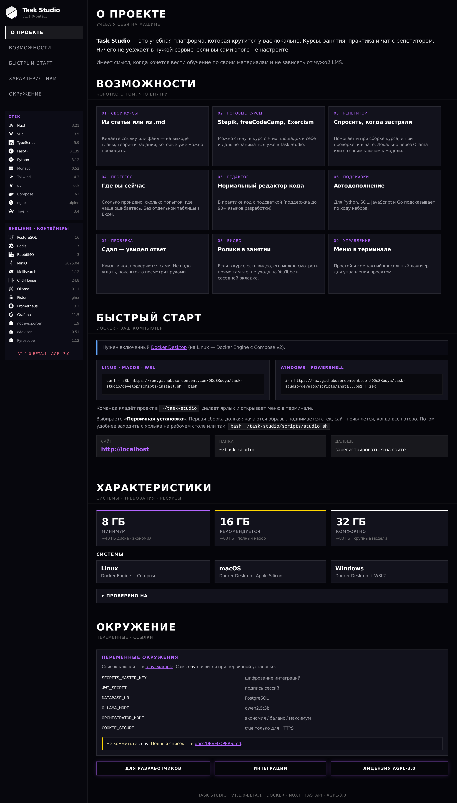

---

**Внимание:** на любой платформе (Linux, macOS, Windows, WSL) должен быть установлен и **уже запущен** Docker (Docker Desktop или Docker Engine + Compose v2). Без рабочего Docker Task Studio не запустится.

**Linux · macOS · WSL:**

```bash
curl -fsSL https://raw.githubusercontent.com/DDoSKudya/task-studio/develop/scripts/install.sh | bash
```

**Windows · PowerShell:**

```powershell
irm https://raw.githubusercontent.com/DDoSKudya/task-studio/develop/scripts/install.ps1 | iex
```

## Документация

- [Для разработчиков](docs/DEVELOPERS.md)
- [Превью / обзор продукта](docs/PREVIEW.md)
- [Интеграции](docs/integrations/authoring.md)
- [Переменные окружения](docs/env.md)

## Лицензия

Исходный код распространяется под **[GNU AGPL-3.0](LICENSE)** с дополнительными
[условиями использования](LICENSE-SUPPLEMENT.md) от автора.

- **Можно:** ставить себе, self-host для обучения (лично, в классе, в некоммерческой организации), изучать и улучшать код с соблюдением AGPL.
- **Нельзя без письменного разрешения:** монетизировать (платный доступ, SaaS, white-label), выдавать за свой продукт, убирать указание авторства.

Ранние версии под MIT остаются под MIT для тех, кто получил их до смены лицензии.
