# Task Studio — руководство разработчика

Краткая продуктовая инструкция для конечного пользователя — в [README.md](../README.md). Этот файл — карта системы для тех, кто читает и меняет код: зачем сервисы разделены, как запрос проходит от браузера до Postgres и обратно, где лежит UI, как устроены очереди, проверки ответов, импорт курсов и локальный запуск.

Ориентир при сомнениях — исходники сервисов, `deploy/docker-compose.yml` и `packages/contracts`. Документ описывает **текущее** дерево репозитория.

Диаграммы нарисованы в Mermaid. Внешний вид интерфейса показан PNG-снимками в [`assets/ui/`](assets/ui/) и макетом [`assets/readme-preview.png`](assets/readme-preview.png). Справочник переменных окружения — в [`env.md`](env.md), правила версий — в [`VERSIONING.md`](VERSIONING.md).


## Оглавление

1. [Назначение документа и аудитория](#section-1)
2. [Что такое Task Studio](#section-2)
3. [Стек и версии инфраструктуры](#section-3)
4. [Структура репозитория](#section-4)
5. [Архитектура: границы и принципы](#section-5)
6. [Край: nginx, Traefik, маршруты](#section-6)
7. [BFF studio-api](#section-7)
8. [Доменные сервисы по одному](#section-8)
9. [Общий Python: packages/python-common](#section-9)
10. [Контракты: packages/contracts](#section-10)
11. [Данные, тома, миграции](#section-11)
12. [Очереди RabbitMQ и события](#section-12)
13. [Потоки: сессия, submit, lab, импорт, tutor](#section-13)
14. [Проверка ответов (grading)](#section-14)
15. [Клиентское приложение apps/web](#section-15)
16. [Pack Studio](#section-16)
17. [Снимки интерфейса (PNG)](#section-17)
18. [Интеграции и runtime_modules](#section-18)
19. [ИИ: tutor, Ollama, cursor-proxy](#section-19)
20. [Установка пользователя и сценарии запуска](#section-20)
21. [Разработка на клоне: just и Compose](#section-21)
22. [Профили памяти и orchestrator](#section-22)
23. [Секреты и переменные окружения](#section-23)
24. [Версии продукта и сценариев запуска](#section-24)
25. [Качество: тесты, линтеры, CI](#section-25)
26. [Публикация образов](#section-26)
27. [Мониторинг](#section-27)
28. [Безопасность при развёртывании у себя](#section-28)
29. [Типовые задачи разработчика](#section-29)
30. [Диагностика](#section-30)
31. [Типичные ошибки (чего избегать)](#section-31)
32. [Глоссарий](#section-32)
33. [Лицензия и куда смотреть дальше](#section-33)

<a id="section-1"></a>

## 1. Назначение документа и аудитория

Документ рассчитан на разработчика, который уже умеет Python/TypeScript и Docker, но ещё не держал в голове всю карту Task Studio. Цель — сократить время от «клон репозитория» до «понимаю, куда класть правку».


### 1.1. Что здесь есть

- Границы сервисов и запрет на «случайные» зависимости между ними.
- Путь HTTP-запроса от браузера через nginx и BFF во внутренние API.
- Карточка каждого сервиса: ответственность, переменные окружения, очереди и основные HTTP-пути.
- Как устроены занятия, проверка ответов и импорт курсов с внешних платформ.
- Как устроено клиентское приложение и какие PNG показывают лицо продукта.
- Как поднимать стек локально и что делают сценарии `install`, `studio` и рецепты `just`.


### 1.2. Чего здесь нет

- Пошаговых руководств по Vue или FastAPI как языкам программирования.
- Маркетинговых обещаний вроде «запустите за две минуты».
- Секретов, реальных файлов `.env` и содержимого каталога `data/`.


### 1.3. Как читать

1. Разделы 2–6 дают общую картину системы и край сети (nginx, Traefik).
2. Разделы 7–14 разбирают серверную часть и потоки данных — это главное для доменных правок.
3. Разделы 15–19 описывают интерфейс, интеграции и роли ИИ.
4. Разделы 20–28 посвящены эксплуатации, CI и безопасности.
5. Разделы 29–32 собирают практические рецепты и глоссарий.

<a id="section-2"></a>

## 2. Что такое Task Studio

Task Studio — платформа обучения для развёртывания у себя. Курсы хранятся и отдаются как **пакеты** (pack): манифест плюс материалы шагов. Обучающийся проходит **сессию** (session) по пакету — теорию, практику и проверку ответов. Рядом работают поиск, личная аналитика, тьютор на LLM, практика в Docker-лабораториях и импорт курсов с внешних платформ.

Всё рассчитано на запуск у себя через Docker Compose. Облако не обязательно: данные и модели по умолчанию остаются локальными, а внешние LLM и Cursor подключаются только по явной настройке.


### 2.1. Три роли ИИ (не смешивать)

| Роль | Где в коде | Для кого |
|------|-----------|----------|
| Tutor обучающегося | `services/tutor`, тексты подсказок в `services/tutor/prompts/` | Подсказки и чат на шаге занятия |
| Cursor (IDE-агент) | `services/cursor-proxy` и настройки пользователя | Внешний агент Cursor Cloud через OpenAI-совместимый промежуточный слой |
| Помощник Pack Studio | `apps/pack-studio` и маршруты `/v1/studio/ai/*` | Автор пакета: suggest и course-from-article |

Тексты подсказок тьютора собираются из каталогов `shared`, `roles`, `skills` и `provider`. Обычно достаточно править файлы в `skills/`, а не переписывать `shared/core` целиком — иначе ломаются все роли сразу.


<a id="section-3"></a>

## 3. Стек и версии инфраструктуры


### 3.1. Слои

| Слой | Технологии |
|------|------------|
| UI | Nuxt 3, Vue 3, TypeScript (`apps/web`, `apps/pack-studio`) |
| BFF | FastAPI `studio-api` |
| Домен | FastAPI-сервисы (см. §8) |
| Данные | PostgreSQL 16, Redis 7, RabbitMQ 3, MinIO, Meilisearch 1.12, ClickHouse 24.8 |
| ИИ | Ollama 0.11.x (+ внешние OpenAI-совместимые URL) |
| Исполнение кода | Piston; lab через `lab-runner` + Docker socket |
| Edge | nginx (публичный `:80`), Traefik в Compose |
| Качество | ruff, basedpyright/mypy, pytest, vitest, Playwright, pre-commit |
| Сборка | Docker Buildx, `uv`, npm |


### 3.2. Образы инфраструктуры в Compose

Точные теги смотрите в `deploy/docker-compose.yml`. Типичные зафиксированные теги образов: `postgres:16-alpine`, `redis:7-alpine`, `rabbitmq:3-management-alpine`, `getmeili/meilisearch:v1.12`, `clickhouse/clickhouse-server:24.8-alpine`, `ollama/ollama:0.11.11` (через `OLLAMA_IMAGE`), MinIO RELEASE 2025-04-22, `prom/prometheus:v3.2.1`, `grafana/grafana:11.5.2`, `grafana/pyroscope:1.12.0`.

<a id="section-4"></a>

## 4. Структура репозитория

| Путь | Назначение |
|------|------------|
| `services/*` | Один каталог — один FastAPI-сервис (есть Dockerfile, часто также `tests/` и `alembic/`) |
| `apps/web` | Клиентское приложение для обучающегося |
| `apps/pack-studio` | Клиентское приложение автора пакетов; базовый путь `/pack-studio/` |
| `packages/python-common` | `studio_common`: JWT, логи, RabbitMQ, ops, crypto |
| `packages/contracts` | Pydantic-схемы API и pack, JSON Schema |
| `packages/editor-core` | Политики редактора / клиент LSP (TS) |
| `integration_modules/` | Импортёры Stepik, freeCodeCamp, Exercism |
| `runtime_modules/` | Заготовки сред выполнения (пока заглушки SoT) |
| `deploy/` | Compose, nginx, Traefik, LSP Dockerfiles, bake, Helm, profiles.json |
| `scripts/` | Установщик, сценарии `studio`, библиотеки `lib/*`, `docs-capture-ui.py` |
| `docs/` | Документация для людей (не для машин) |


### 4.1. Типичный каркас сервиса

Почти в каждом сервисе файл `app/main.py` создаёт приложение FastAPI через `studio_common.app.build_app`, подключает роутеры и регистрирует маршруты проверки готовности `/health`, `/ready` и `/metrics`. В Docker команда запуска обычно такая: `uvicorn app.main:app --host $HOST --port $PORT`. Доменная логика лежит в `app/domain/`, HTTP-обработчики — в `app/api/`. Внутренние пути вида `/internal/v1/<service>/...` снаружи через nginx не публикуются.

<a id="section-5"></a>

## 5. Архитектура: границы и принципы


### 5.1. Карта

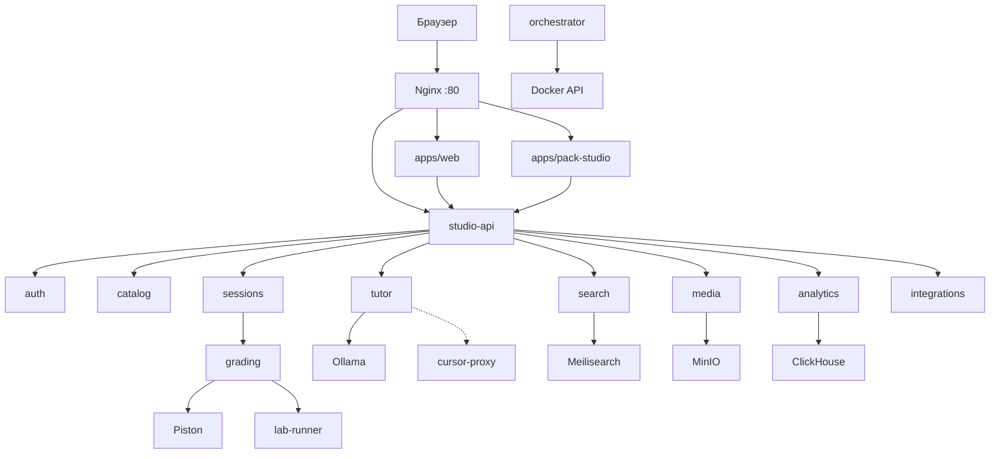


### 5.2. Правила границ

1. Бизнес-логика не живёт в nginx или Traefik: там только маршруты, лимиты и заголовки.
2. Публичный HTTP для интерфейса идёт через `studio-api` (префикс `/api/` превращается во внутренний `/v1/…`).
3. Каждый сервис владеет своими таблицами. В Compose один `DATABASE_URL` указывает на общий Postgres, но JOIN «чужих» таблиц запрещён — обмен только через API и очереди.
4. Браузер не вызывает grading напрямую. Отправка ответа (`submit`) идёт в sessions, а sessions уже обращаются к grading.
5. Orchestrator — диспетчер ресурсов хоста (запуск и остановка контейнеров), а не балансировщик HTTP.
6. Подтверждение (ack) в RabbitMQ выдаётся только после успешной обработки; неустранимые ошибки уходят в DLQ.


### 5.3. Синхронное vs асинхронное

| Взаимодействие | Механизм |
|----------------|----------|
| UI ↔ studio-api | HTTP JSON |
| UI ↔ studio-api | WebSocket LSP |
| UI ↔ studio-api | SSE tutor / course stream |
| studio-api ↔ домен | HTTP `/internal/v1/…` |
| grading ↔ Piston | HTTP |
| Импорт, lab, индекс, analytics events | RabbitMQ |

<a id="section-6"></a>

## 6. Край: nginx, Traefik, маршруты

Конфигурация лежит в [`deploy/nginx/nginx.conf`](../deploy/nginx/nginx.conf). Upstream-адреса в Docker-сети: `web:3000`, `pack-studio:3000`, `studio-api:8000`.

| Location | Куда | Заметки |
|----------|------|---------|
| `/api/` | `studio-api:8000` | Префикс `/api` срезается; дальше идёт `/v1/…` |
| `/` | `web:3000` | Клиентское приложение обучающегося |
| `/pack-studio/` | `pack-studio:3000` | Клиентское приложение автора пакетов |
| `/_nuxt/`, `/pack-studio/_nuxt/` | соответствующие приложения | Длинный срок кэширования статики |

В клиенте задано `NUXT_PUBLIC_API_BASE=/api` (`apps/web/nuxt.config.ts`). Браузер обращается к `/api/v1/...`. При серверном рендеринге внутри Compose можно ходить на `http://studio-api:8000` напрямую.

Traefik в Compose размечает сервисы через labels; для обычного локального входа через порт 80 достаточно nginx. Лимит тела запроса `client_max_body_size` на nginx равен 500m — это нужно для загрузки пакетов и медиа.

<a id="section-7"></a>

## 7. BFF studio-api

Сервис `services/studio-api` — единственная публичная HTTP-точка API для клиентских приложений. Своей доменной базы у него нет: он агрегирует ответы, проверяет JWT и cookie, проксирует запросы во внутренние сервисы, открывает шлюз LSP и проксирует SSE-поток тьютора.


### 7.1. Старт и проверка готовности

- В `app/main.py` собирается приложение и подключаются роутеры.
- Маршруты `GET /health`, `GET /ready` и `GET /metrics` приходят из `studio_common`.
- Uvicorn слушает порт 8000 внутри сети Compose.


### 7.2. Карта публичных префиксов и upstream

| Префикс | Upstream | Файлы |
|--------|----------|-------|
| `/v1/auth` | auth `/internal/v1/auth/…` | `app/api/auth_routes/` |
| `/v1/catalog` | catalog (+ side-effects на delete) | `app/api/catalog_routes/` |
| `/v1/media` | media | `app/api/media.py` |
| `/v1/sessions` | sessions | `app/api/session_routes/` |
| `/v1/integrations…` | integrations | `app/api/integrations_routes/` |
| `/v1/search` | search | `app/api/search.py` |
| `/v1/analytics` | analytics | `app/api/analytics_routes/` |
| `/v1/studio` validate/build | локально через contracts | `app/api/studio_routes/` |
| `/v1/studio/ai/*` | маршруты studio в tutor | `app/api/studio_routes/ai*.py` |
| `/v1/tutor` | tutor | `app/api/tutor_routes/` |
| `/v1/lsp/{language}` WS | LSP-контейнеры | `app/lsp_gateway/` |
| `/v1/editor/events` | orchestrator | lsp_gateway / editor events |


### 7.3. Важные переменные окружения BFF

- `AUTH_SERVICE_URL`, `CATALOG_SERVICE_URL`, `SESSIONS_SERVICE_URL`, `TUTOR_SERVICE_URL`, `INTEGRATIONS_SERVICE_URL`, `SEARCH_SERVICE_URL`, `ANALYTICS_SERVICE_URL`, `MEDIA_SERVICE_URL`, `ORCHESTRATOR_SERVICE_URL`.
- `JWT_SECRET`, `JWT_EXPIRE_HOURS`, `AUTH_COOKIE_NAME`, `COOKIE_SECURE`.
- `SECRETS_MASTER_KEY` — для операций, где BFF трогает шифрованные настройки.
- `LSP_PYRIGHT_HOST/PORT`, `LSP_TYPESCRIPT_*`, `LSP_GOPLS_*`, `LSP_SQLS_*`.


### 7.4. Аутентификация на краю BFF

После входа сервис auth выдаёт JWT. BFF ставит httpOnly-cookie (имя берётся из переменных окружения) и/или принимает заголовок Bearer. Во внутренние сервисы уходит идентификатор пользователя (например заголовок `X-User-Id`). Внутренние маршруты не доверяют «голым» запросам с хоста вне сети Compose.


### 7.5. Что BFF делает локально

Проверка и сборка пакета на маршрутах `/v1/studio` опираются на `packages/contracts` (разбор манифеста, сборка архива) и не обязаны ходить в отдельный «pack-service». Это сделано сознательно: контракт пакета один для Pack Studio, импорта и catalog.

<a id="section-8"></a>

## 8. Доменные сервисы по одному

Ниже — рабочая карточка каждого сервиса. Порты — договорённость Docker-сети. Точка входа везде `services/<name>/app/main.py`, если не сказано иное.


### 8.1. auth (порт 8001)

Сервис отвечает за регистрацию, вход, профиль, пользовательские настройки и шифрование учётных данных интеграций.


#### Код

- `app/domain/passwords.py`, `users.py`, `tutor_llm.py`
- `app/api/router.py`, `deps.py`, `user_views.py`


#### Переменные окружения (главное)

- `DATABASE_URL`
- `JWT_SECRET`, `JWT_EXPIRE_HOURS` (через common)
- `ALLOW_INSECURE_DEFAULTS`, `APP_ENV`


#### Фоновые процессы

Отдельного фонового процесса нет.


#### HTTP-маршруты

- `POST /internal/v1/auth/register`
- `POST …/login`
- `GET …/me`
- `PATCH …/me/settings`
- `GET …/tutor-llm/summary`

Есть Alembic (`services/auth/alembic/`).


### 8.2. catalog (порт 8002)

Сервис хранит метаданные пакетов и их версии, устанавливает пакет пользователю, принимает загрузку и регистрацию и держит файлы под `PACKS_ROOT`.


#### Код

- `app/domain/packs/`, `media/` (mirror/encode/io)
- `app/api/routes/` ingest, packs, packs_read


#### Переменные окружения (главное)

- `PACKS_ROOT`
- `PACK_MAX_UPLOAD_MB`
- `MEDIA_SERVICE_URL`


#### Фоновые процессы

Отдельного потребителя RabbitMQ нет; индексирование поиска инициируют другие сервисы.


#### HTTP-маршруты

- `GET /internal/v1/catalog/packs`
- `GET …/packs/{id}`
- `POST …/activate`
- `POST …/upload`
- `POST …/register`
- `DELETE …/packs/{id}`

Точка входа `docker-entrypoint.sh` сначала гоняет alembic, затем поднимает uvicorn от appuser после chown каталога packs.


### 8.3. sessions (порт 8003)

Сервис ведёт жизненный цикл занятия: старт сессии, текущий шаг, навигацию, ограничения перехода (gate), отправку ответа (`submit`), попытки и публикацию событий аналитики.


#### Код

- Много `app/domain/session_*.py`
- `app/api/routes/lifecycle.py`, `study.py`, `attempts.py`
- mappers step_view


#### Переменные окружения (главное)

- `CATALOG_SERVICE_URL`
- `GRADING_SERVICE_URL`
- `ANALYTICS_SERVICE_URL`
- `RABBITMQ_URL`, `ANALYTICS_EVENTS_QUEUE`
- `DATABASE_URL`


#### Фоновые процессы

Отдельного потребителя очереди нет; publisher + outbox flush в lifespan → `analytics.events` (fallback HTTP).


#### HTTP-маршруты

- `GET/POST /internal/v1/sessions`
- `GET …/{id}/step`
- `POST …/navigate`
- `POST …/submit`
- `POST …/attempts/{id}/complete`
- `POST …/abandon-by-pack-versions`

Миграции Alembic 001–005 добавляют индексы, уникальность активной сессии и outbox аналитики.


### 8.4. grading (порт 8004)

Сервис проверяет ответы типов quiz, code, sql, task и lab. Для кода использует Piston, лабораторные работы ставит в очередь, а при необходимости обращается к LLM через tutor как запасной стадии.


#### Код

- domain: check/, code/, quiz/, sql/, lab/, lab_jobs/, llm/, harness/, stepik_quiz/, piston/, pack/
- `app/api/check_route.py`, `router.py`


#### Переменные окружения (главное)

- `PISTON_URL`, `PISTON_TIMEOUT_SECONDS`
- `GRADING_JOBS_QUEUE`, `LAB_JOBS_QUEUE`
- `CATALOG/SESSIONS/AUTH/TUTOR/MEDIA_SERVICE_URL`
- `PACKS_ROOT`
- `LLM_GRADE_ENABLED`, `LLM_GRADE_MIN_CONFIDENCE`
- `SECRETS_MASTER_KEY`


#### Фоновые процессы

Фоновый обработчик читает `grading.jobs`; публикует сообщения в `lab.jobs`.


#### HTTP-маршруты

- `POST /internal/v1/grading/check`
- `POST …/lab`
- `POST …/lab/complete`

Каскад стадий берёт первый осмысленный исход (outcome); если ни одна стадия не смогла оценить ответ, результат помечается как ungradable. Подробности — в §14.


### 8.5. integrations (порт 8005)

Сервис держит реестр адаптеров внешних платформ, обслуживает discover, catalog, enroll и import, собирает pack и работает с зашифрованными учётными данными.


#### Код

- domain: cache/, jobs/, messaging/, pack/
- api routes: discover, catalog, enroll, jobs, jobs_upload


#### Переменные окружения (главное)

- `INTEGRATION_MODULES_ROOT`
- `PACKS_ROOT`
- `CATALOG_SERVICE_URL`, `AUTH_SERVICE_URL`
- `IMPORT_QUEUE`, `SEARCH_INDEX_QUEUE`
- `SECRETS_MASTER_KEY`


#### Фоновые процессы

Фоновый обработчик импорта читает очередь `import.jobs`, периодический sweeper подчищает зависшие задания, а после успешной сборки пакета публикуются сообщения в `search.index`.


#### HTTP-маршруты

- `GET /internal/v1/integrations`
- `GET …/discover`
- `GET …/{platform}/catalog`
- `POST …/enroll`
- `POST …/import`
- `GET …/jobs/{id}`

Адаптеры платформ лежат на диске в `integration_modules/<platform>/`.


### 8.6. tutor (порт 8006)

Сервис отвечает за чат и подсказки, оценку через LLM, прогрев Cursor, предложения в Pack Studio и сборку курса из статьи (в том числе потоком).


#### Код

- domain: chat/, course/, course_build/, course_from_article/, llm/, ollama/, prompt_compose/, grade/, …
- api routes learner* + studio


#### Переменные окружения (главное)

- `OLLAMA_URL`, `OLLAMA_MODEL`
- `TUTOR_DEFAULT_PROVIDER_URL`
- `TUTOR_RATE_LIMIT_PER_MINUTE`
- `AUTH_SERVICE_URL`, `SESSIONS_SERVICE_URL`
- `COURSE_BUILDS_ROOT`, `COURSE_BUILD_TTL_DAYS`
- `ARTICLE_FETCH_READER_URL`


#### Фоновые процессы

Фонового обработчика очереди RabbitMQ нет.


#### HTTP-маршруты

- `POST /internal/v1/tutor/chat`
- `GET …/hints/{step_id}`
- `POST …/grade`
- `POST …/warmup`
- `GET …/llm-status`
- `POST …/studio/course-from-article[/stream]`

Подсказки модели: `services/tutor/prompts/` — см. §19.


### 8.7. search (порт 8007)

Сервис строит индекс и выполняет гибридный поиск через Meilisearch; при необходимости подключает embeddings через Ollama.


#### Код

- domain: documents, indexing*, query, worker_handle
- api router + deps


#### Переменные окружения (главное)

- `MEILISEARCH_URL`, `MEILISEARCH_KEY`
- `SEARCH_INDEX_NAME`
- `SEARCH_INDEX_QUEUE`
- `CATALOG_SERVICE_URL`
- `OLLAMA_URL`


#### Фоновые процессы

Фоновый обработчик индексации слушает `search.index`.


#### HTTP-маршруты

- `GET /internal/v1/search`
- `POST …/unindex-pack`

Search не является источником правды по пакетам — это только индекс.


### 8.8. analytics (порт 8008)

Сервис принимает события обучения, пишет их в ClickHouse и отдаёт сводки progress, skips и attempts.


#### Код

- domain: aggregates/, queries/, events, progress_query, attempts_timeline
- api ingest + router


#### Переменные окружения (главное)

- `CLICKHOUSE_HOST/PORT/USER/PASSWORD/DATABASE`
- `ANALYTICS_EVENTS_QUEUE`
- `RABBITMQ_URL`


#### Фоновые процессы

Фоновый обработчик событий слушает `analytics.events`.


#### HTTP-маршруты

- `POST /internal/v1/analytics/events`
- `GET …/progress`
- `GET …/skips`
- `GET …/attempts`

При наличии сводок в Postgres у сервиса есть Alembic.


### 8.9. media (порт 8009)

Сервис загружает, отдаёт и удаляет объекты в MinIO; ключи объектов лежат в пространстве конкретного пользователя.


#### Код

- `app/storage.py`
- api: media_upload, router, asset_ids


#### Переменные окружения (главное)

- `MINIO_ENDPOINT`, `MINIO_ACCESS_KEY`, `MINIO_SECRET_KEY`
- `MINIO_BUCKET`
- `MINIO_SECURE`
- `MINIO_PRESIGN_TTL_SECONDS` (clamp 60–900)


#### Фоновые процессы

Фонового обработчика нет.


#### HTTP-маршруты

- `POST /internal/v1/media/upload`
- `GET/DELETE …/{asset_id}`

Объекты в хранилище лежат под префиксом `users/{user_id}/…`.


### 8.10. lab-runner (порт 8010)

Сервис исполняет Docker-лаборатории по сообщениям из очереди и вызывает обратный HTTP-запрос в grading по завершении.


#### Код

- domain: runner.py, runner_execute.py, compose_exec.py
- нет app/api — только операции готовности и фоновый обработчик


#### Переменные окружения (главное)

- `LAB_JOBS_QUEUE`
- `GRADING_SERVICE_URL`
- `LAB_RUNNER_DRY_RUN`
- `LAB_DEFAULT_TIMEOUT_SECONDS`
- docker.sock


#### Фоновые процессы

Потребитель очереди `lab.jobs` после исполнения вызывает HTTP complete на grading.


#### HTTP-маршруты

- Только `/health`, `/ready`, `/metrics`

Privileged-доступ к Docker на хосте — зона риска; см. §28.


### 8.11. orchestrator (порт 8011)

Сервис выбирает режимы ресурсов, опрашивает метрики, запускает и останавливает управляемые контейнеры и принимает события редактора.


#### Код

- domain: controller*, docker.py, policies, metrics*, redis_flags, state
- api router


#### Переменные окружения (главное)

- `ORCHESTRATOR_MODE`
- `ORCHESTRATOR_POLICIES_PATH`
- `COMPOSE_PROJECT_NAME`
- `DOCKER_SOCKET`
- `PROMETHEUS_URL`, `NODE_EXPORTER_URL`, `PYROSCOPE_URL`
- `REDIS_URL`
- `ORCHESTRATOR_SYSTEM_TOKEN`


#### Фоновые процессы

Управляющий цикл (не через RabbitMQ): периодический вызов `controller.tick`.


#### HTTP-маршруты

- `GET /internal/v1/orchestrator/status`
- `GET/PUT …/mode`
- `POST …/editor-events`

Режимы balancing, maximum и power_saving описаны в §22.


### 8.12. cursor-proxy (порт 8015)

Сервис предоставляет OpenAI-совместимый промежуточный слой над Cursor Cloud Agents: маршруты `/v1/models` и `/v1/chat/completions`.


#### Код

- domain: cursor/, openai/
- api openai_api/


#### Переменные окружения (главное)

- `CURSOR_API_BASE`
- `CURSOR_PROXY_TIMEOUT_SECONDS`
- `CURSOR_PROXY_CLEANUP_AGENTS`
- `PORT`


#### Фоновые процессы

Отдельного фонового обработчика очереди нет.


#### HTTP-маршруты

- `GET /v1/models`
- `POST /v1/chat/completions`

В настройках интерфейса base URL указывает на этот сервис, когда пользователь выбирает Cursor.


### 8.13. Сводная таблица портов

| Сервис | Порт |
|--------|------|
| auth | 8001 |
| catalog | 8002 |
| sessions | 8003 |
| grading | 8004 |
| integrations | 8005 |
| tutor | 8006 |
| search | 8007 |
| analytics | 8008 |
| media | 8009 |
| lab-runner | 8010 |
| orchestrator | 8011 |
| cursor-proxy | 8015 |
| studio-api | 8000 |

<a id="section-9"></a>

## 9. Общий Python: packages/python-common

Пакет `studio_common` подключают почти все сервисы. Сюда нельзя класть доменную логику конкретного сервиса — только поперечные утилиты, которыми пользуются несколько процессов.

| Модуль | Назначение |
|--------|------------|
| `app.py` | Фабрика FastAPI, порт сервиса |
| `ops_routes.py` | `/health`, `/ready` (+ проверка БД) |
| `db.py` | async SQLAlchemy engine/session из `DATABASE_URL` |
| `jwt_tokens.py` | выпуск/разбор access JWT |
| `internal.py` | `X-User-Id` → зависимость internal user |
| `crypto.py` / `secrets_*` | AES-GCM, merge credentials, platform secrets |
| `rabbitmq.py` | connect, declare+DLQ, publish/consume JSON |
| `logging.py` / `log_redact.py` | structlog + редакция секретов |
| `middleware.py` | `X-Request-Id` |
| `migrations.py` | `ensure_schema` / `upgrade_head` |
| `system_auth.py` | system token для межсервисных callback |
| `orchestrator_flags.py` | Redis-флаги паузы import/search |
| `otel.py` | OpenTelemetry wiring |
| `lsp_framing.py` | Content-Length framing LSP |

<a id="section-10"></a>

## 10. Контракты: packages/contracts

Любой новый публичный или экранный контракт начинают здесь, затем проводят через BFF и клиент. Идея простая: один источник схем и меньше расхождений вида «поле есть в клиенте, а в сервисе забыли».


### 10.1. `*_schemas.py`

| Файл | Примеры моделей |
|------|-----------------|
| `analytics_schemas` | `AnalyticsEventMessage`, `ProgressResponse`, `AttemptsTimelineResponse` |
| `catalog_schemas` | `PackSummary`, `PackDetail`, `RegisterImportedPackRequest` |
| `session_schemas` | `StartSessionRequest`, `SessionState`, `StepContent`, `SubmitResult` |
| `grading_schemas` | `GradingCheckRequest/Response`, lab submit/complete |
| `integration_schemas` | `AdapterInfo`, `ImportJobResponse`, `StartImportRequest` |
| `tutor_schemas` | `TutorChatRequest`, `TutorHintResponse`, `TutorGradeRequest` |
| `studio_schemas` | validate/build, course-from-article, course build summaries |
| `search_schemas` | `SearchHit`, `SearchResponse` |
| `orchestrator_schemas` | status/mode, managed services |
| `editor_schemas` | autocomplete/LSP settings |


### 10.2. Pack

- `pack-schema-v1.json` — JSON Schema манифеста.
- `pack.py` — parse/validate/build archive.
- `pack_content.py`, `pack_integrity.py`, `step_dependencies.py`.
- `manifest.py`, `normalized_pack.py`, `validate_pack.py`.

Из корня репозитория схемы проверяют рецептами `just validate-pack`, `just validate-schemas` и `just validate-integrations`.


### 10.3. Типичное содержимое pack на диске

Пакет лежит по пути вида `data/packs/{user_id}/{pack_id}/{version}/`: рядом с `manifest.json` лежат материалы шагов. Крупные медиафайлы могут жить в MinIO, а в манифесте или контенте остаются только ссылки. Импортёр и Pack Studio обязаны сходиться в одной схеме — иначе catalog, search и интерфейс разъедутся.

<a id="section-11"></a>

## 11. Данные, тома, миграции


### 11.1. Кто чем пользуется

| Ресурс | Кто |
|--------|-----|
| PostgreSQL | Почти все серверные сервисы (общий URL) |
| Redis | Кэш и флаги; orchestrator |
| RabbitMQ | integrations, grading, lab-runner, search, analytics; sessions публикует события |
| MinIO | media |
| Meilisearch | search |
| ClickHouse | analytics |
| `data/packs` | catalog, grading, integrations, lab-runner |
| `data/course-builds` | tutor |
| Том Ollama | tutor и search |
| Пакеты Piston | grading |


### 11.2. Тома на хосте

Функция `ops_prepare_dirs` создаёт подкаталоги под `data/`. В Compose данные монтируются с хоста в `../data/postgres`, `redis`, `rabbitmq`, `packs`, `meilisearch`, `clickhouse`, `minio`, `ollama`, `piston/packages` и `course-builds`. Grafana и Prometheus часто используют именованные тома Docker. Каталог `data/` указан в `.gitignore` — его нельзя коммитить.


### 11.3. Сущности (логически)

**Auth:** таблицы `users`, `user_settings` (JSONB с URL тьютора, лимитами и LSP) и `encrypted_credentials` (AES-GCM по платформе).

**Catalog:** цепочка `packs` → `pack_versions` (manifest JSONB и disk_path) → `user_packs` (установленная версия).

**Sessions:** таблица `sessions` (фаза study|practice|assess и текущий шаг), `attempts`, phase progress и outbox аналитики.

**Grading/lab:** результаты проверок и lab_runs (см. модели сервисов).

**Analytics:** события живут в ClickHouse; сводки могут дублироваться в Postgres.

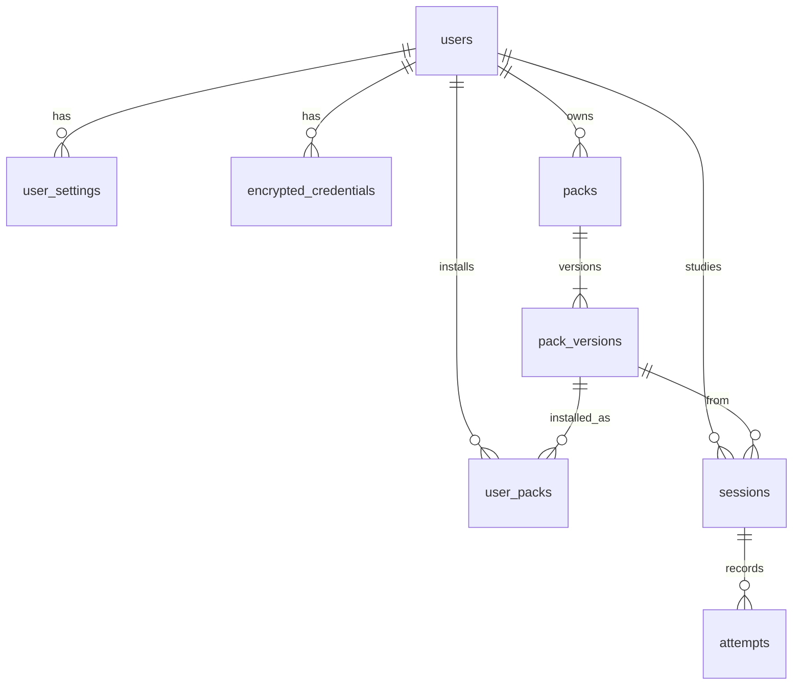


### 11.4. Alembic

| Сервис | Путь |
|--------|------|
| auth | `services/auth/alembic/` |
| catalog | `services/catalog/alembic/` |
| sessions | `services/sessions/alembic/` |
| integrations | `services/integrations/alembic/` |
| grading | `services/grading/alembic/` |
| lab-runner | `services/lab-runner/alembic/` |
| analytics | `services/analytics/alembic/` |

У studio-api, tutor, search, media, orchestrator и cursor-proxy своих alembic-деревьев нет: либо нет ORM-схемы, либо состояние лежит вне Postgres.


### 11.5. Изоляция пользователя

- JWT несёт `user_id`; BFF прокидывает идентификатор во внутренние запросы.
- В MinIO объекты лежат под префиксом `users/{user_id}/`.
- Поиск и аналитика дополнительно фильтруют данные по пользователю на уровне сервиса.

<a id="section-12"></a>

## 12. Очереди RabbitMQ и события


### 12.1. Очереди

| Очередь | Producer | Consumer | Смысл |
|---------|----------|----------|-------|
| `import.jobs` | integrations API | integrations worker | Импорт курса |
| `grading.jobs` | grading | grading фоновый обработчик | Фоновая оценка |
| `lab.jobs` | grading | lab-runner | Поднять Docker-lab |
| `analytics.events` | sessions (outbox) и др. | analytics фоновый обработчик | События обучения |
| `search.index` | integrations/catalog path | search фоновый обработчик | Переиндекс |


### 12.2. Правила

1. Подтверждение (ack) отправляется только после успешной обработки сообщения.
2. Операции должны быть идемпотентными: импорт — по ключам платформы и внешнего идентификатора, аналитика — по `event_id`.
3. Неустранимые ошибки (битый JSON, нарушение схемы) уходят в DLQ с ack; временные ошибки повторяют с отступом (backoff).
4. В сообщении передают идентификаторы и пути, а не многомегабайтные двоичные вложения.
5. Prefetch ограничивает число неподтверждённых сообщений на одном потребителе.


### 12.3. Диаграмма

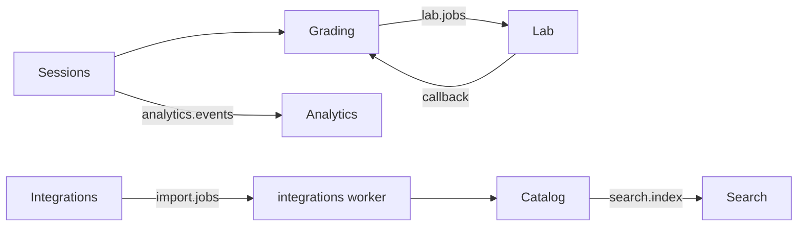

<a id="section-13"></a>

## 13. Потоки: сессия, submit, lab, импорт, tutor


### 13.1. Создание сессии

Клиент вызывает `useSessions().startSession`, запрос уходит как `POST /v1/sessions` через BFF в `sessions.start_session` / `create_new_session`. Если у пользователя уже есть активная сессия на этот pack, обычно возвращают её (дубликаты могут помечаться как abandoned). Иначе catalog отдаёт нужную версию пакета, берётся первая позиция манифеста, создаются записи Session и PhaseProgress.

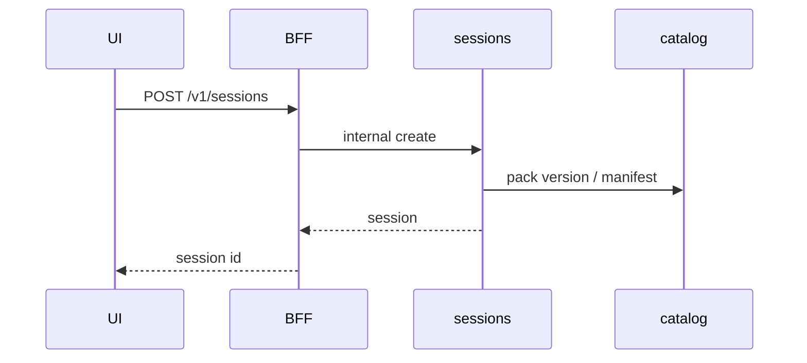


### 13.2. Навигация и gate

Логика лежит в `session_navigation.py`, `session_gate_leave.py`, `session_gating.py` и API `routes/study.py`.

Правила в упрощённом виде такие. Фаза assess без пройденной practice может быть закрыта. Если в пакете включено `require_pass_to_advance`, нельзя уйти вперёд с шагов quiz, code, lab или task без успешной сдачи — клиент обычно получает 403. Исчерпанный лимит попыток в assess даёт 409. На клиенте это отражается через `canAdvanceToNext` и сообщения вроде `session.passToContinue`.


### 13.3. Отправка ответа обычного шага

Клиент собирает тело запроса по типу шага (выбор в quiz, исходник code, текст task) через `useSessionGradeSubmit`, отправляет `POST …/submit`, sessions вызывает `submit_step`, затем `call_grading` и `apply_grading_result`, после чего публикуется событие аналитики.

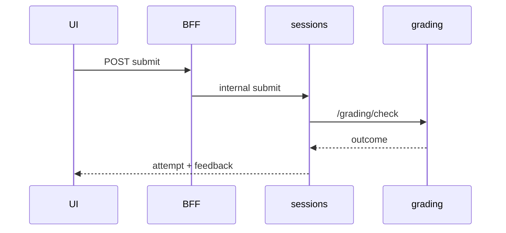


### 13.4. Лабораторная работа

Лабораторная работа может идти синхронным LLM-путём (решение принимает sessions через `lab_should_sync_llm`) или асинхронно: sessions вызывает grading `/lab`, тот ставит задачу в `lab.jobs`, lab-runner выполняет `compose_exec`, затем приходит обратный вызов `/grading/lab/complete` и sessions закрывает попытку через `/attempts/{id}/complete`. Панель `SessionLabPanel` опрашивает attempt, пока статус остаётся pending.


### 13.5. Импорт курса

Клиент вызывает `/v1/integrations/…/import`. Сервис integrations создаёт задание и кладёт его в `import.jobs`. Фоновый обработчик вызывает адаптер (`import_course`), регистрирует пакет в catalog и публикует сообщение в `search.index`. Статус задания клиент читает по маршруту `jobs/{id}`.


### 13.6. Tutor

Чат и подсказки идут через `/v1/tutor/…`; где нужен поток, используется SSE. Прогрев Cursor — отдельный вызов со страницы сессии. Сборка курса из статьи идёт через маршруты studio AI, а прогресс на экране показывают `CourseBuildProgress` и `utils/studio/courseStream.ts`.


### 13.7. Фазы занятия

Логические фазы занятия идут в порядке `study` → `practice` → `assess`. Тип шага в пакете может быть theory, video, quiz, code, lab или task. Страница `sessions/[id].vue` переключает панели по значению `step.kind`.

<a id="section-14"></a>

## 14. Проверка ответов (grading)

Входная точка — `services/grading/app/domain/check/service.py` и функция `check_submission(kind)`. Каскад стадий описан в `check/cascade.py`: `run_chain` берёт первый осмысленный outcome, отличный от `None`, иначе результат считается ungradable.


### 14.1. Quiz

`domain/quiz/grade.py` + `quiz/stages.py`: локальный answer key (`choice_index == step.answer`) → Stepik choice (`stepik_quiz/grade_choice.py`) → LLM → ungradable.


### 14.2. Code

`domain/code/grade.py`: наличие source → Stepik code → SQL local (если похоже на SQL) → local harness через Piston (`code/harness.py`, `harness/resolve.py`) → LLM → ungradable.


### 14.3. SQL

`domain/sql/grade.py` `stage_sql_local`: seed + query через Piston `language=sql`. Без oracle результат может не считаться финальным pass — цепочка идёт дальше.


### 14.4. Task (свободный текст)

`domain/check/task.py`: извлечь текст → LLM grade → ungradable.


### 14.5. LLM fallback

`domain/llm/grade.py` ходит в tutor `/internal/v1/tutor/grade`. Включается флагами `LLM_GRADE_ENABLED` и порогом `LLM_GRADE_MIN_CONFIDENCE`.


### 14.6. Stepik как внешний оракул

Пакет `domain/stepik_quiz/`: detect, auth, http, poll. Нужны расшифрованные credentials пользователя (SECRETS_MASTER_KEY на пути).


### 14.7. Piston

Контейнер `piston` в Compose, privileged. Grading шлёт HTTP на `PISTON_URL`. Таймауты — `PISTON_TIMEOUT_SECONDS`. Пакеты языков на томе `data/piston/packages`; удобная установка: `just piston-install`.

<a id="section-15"></a>

## 15. Клиентское приложение (`apps/web`)


### 15.1. Маршруты страниц

| Маршрут | Файл | Поведение |
|---------|------|-----------|
| `/` | `pages/index.vue` | Редирект на `/catalog` |
| `/search` | `pages/search.vue` | Редирект на `/catalog` |
| `/auth` | `pages/auth.vue` | Редирект на `/login` |
| `/register` | `pages/register.vue` | Редирект на `/login?mode=register` |
| `/login` | `pages/login.vue` | Login/register в одном UI |
| `/catalog` | `pages/catalog/index.vue` | Библиотека + external discover/import + create course |
| `/catalog/[id]` | `pages/catalog/[id].vue` | Карточка курса, старт сессии |
| `/sessions/[id]` | `pages/sessions/[id].vue` | Занятие |
| `/analytics` | `pages/analytics.vue` | Progress/skips/attempts |
| `/settings` | `pages/settings.vue` | Интеграции, tutor LLM, editor |


### 15.2. Страница занятия — анатомия

Экран состоит из трёх колонок: оглавление слева, основная область по центру и панель тьютора справа (если она включена).

Центральная область переключает `SessionStudyBody`, `SessionVideoPlayer`, `SessionCodeEditor`, `SessionLabPanel`, `SessionQuiz` или текстовое поле для task. В панели действий есть Prev, Skip study, Submit|Run и Next (`complete_current`).


### 15.3. Composables

`useApi`, `useAuth`, `useSessions`, `useSessionGradeSubmit`, `useCatalog`, `useCatalogDownloads`, `useSearch`, `useAnalytics`, `useStudio`, `useTutor`, `useTutorSessionChat`, `useEditor`, `useSettingsPage`, `useAppVersion`, `useAppPageTitle`, `useToasts`, `useConfirm`, `useElapsedTimer`, `useDiscoverCache`, `useCredentialAutofill`.


### 15.4. utils по доменам

`apps/web/utils/{api,catalog,session,settings,studio,study,tutor,media,analytics,search}/`. Study sanitize: `sanitizeHtml.ts` → mojibake repair, strip опасного, таблицы, markdown/mermaid → `purifyStudyHtml.ts` (DOMPurify whitelist).


### 15.5. Стили и i18n

CSS: `assets/css/studio.css`, `op-skin.css`, `catalog.css`, `transitions.css`, … Локали: `i18n/locales/en.json`, `ru.json`.


### 15.6. Режим разработки интерфейса

- `just web-dev` поднимает горячую перезагрузку в Docker на http://localhost.
- `just web-local` запускает Nuxt на порту 3000, а API остаётся в Docker.
- Не запускайте полный `just up` на каждое мелкое изменение интерфейса.

<a id="section-16"></a>

## 16. Pack Studio

Приложение лежит в `apps/pack-studio` и открывается по публичному пути `/pack-studio/`. На `index.vue` автор редактирует manifest JSON, проверяет пакет, собирает zip, загружает его, запрашивает подсказки и запускает поток «статья → курс»; вход — на `login.vue`. Из composables используются `useApi`, `useAuth`, `useCatalog` и `useStudio`. Прогресс сборки показывает `CourseBuildProgress.vue`, а подписи стадий локализует `utils/studio/localizeProgress.ts`.

<a id="section-17"></a>

## 17. Снимки интерфейса (PNG)

Ниже — кадры **живого** интерфейса Nuxt/Vue из `apps/web` и `apps/pack-studio`, снятые через Playwright на поднятом стеке. Это не макет из [`PREVIEW.md`](PREVIEW.md). Векторный снимок страницы Playwright не делает, поэтому в документации лежат PNG.

Снимки сняты в английской локали интерфейса: рядом с подписями с кадра в скобках — перевод из `apps/web/i18n/locales/ru.json` (для Pack Studio — из `apps/pack-studio/i18n/locales/ru.json`).

Перед сохранением кадра скрипт `scripts/docs-capture-ui.py` маскирует почту и инициалы в боковой панели, очищает поля паролей, токенов и секретов клиента и подменяет пользовательские названия курсов и тем на нейтральные (`Example course …`, `Example step …`). На экранах входа поля пустые. Не коммитьте PNG с реальными учётными данными.

### 17.1. Вход и регистрация

**Экран входа** (`/login`)

Точка входа в учебное приложение: без сессии каталог, занятия и настройки недоступны. Пользователь вводит **Email** и **Password** (Пароль); после **SIGN IN** (Войти) сервис auth выдаёт токен, клиент сохраняет сессию и открывает каталог. Подзаголовок на кадре — «SIGN IN TO ACCESS YOUR COURSES AND SESSIONS» (в русской локали: «Войдите, чтобы открыть курсы и сессии.»). Ссылка **NEED AN ACCOUNT?** (Нет аккаунта?) ведёт к регистрации. На снимке поля пустые — пароль в документацию не попадает.


**Экран регистрации** (`/login?mode=register`)

Создание новой учётки через сервис auth: те же **Email** / **Password** (Пароль), кнопка создания аккаунта (**Создать аккаунт** в русской локали). После успеха пользователь сразу входит и может наполнять библиотеку. Подзаголовок в русской локали: «Создайте аккаунт, чтобы начать обучение.» Ссылка «Уже есть аккаунт?» возвращает на вход. На снимке нет заполненных секретов.


### 17.2. Каталог: библиотека, поиск и сборка курса

**Моя библиотека** (`/catalog`)

Домашний экран после входа: здесь лежат **уже скачанные или собранные локально** учебные пакеты (паки), с которыми можно учиться офлайн. Вкладка **MY LIBRARY** (Моя библиотека) показывает счётчик курсов; фильтр **SOURCES** (Источники) сужает список по происхождению — **ALL SOURCES** (Все источники), **LOCAL** (Локальные / «Созданные и собранные здесь»), **STEPIK** и др. («Скачано в библиотеку»).

Каждая карточка — один пак в каталоге: метки типа контента (**THEORY** / Теория, **QUESTIONS** / Вопросы, **VIDEO** / Видео, **TASKS** / Задания), прогресс прохождения в процентах (хранится в сессиях и отдаётся аналитикой), **CONTINUE** (Продолжить) — открыть или возобновить сессию, корзина — удалить пак из локальной библиотеки (не с внешней платформы). На docs-снимках заголовки заменены на `Example course N`; реальные названия курсов учётки в репозиторий не кладём. Слева в навигации: **Catalog** (Каталог), **Analytics** (Аналитика), **Settings** (Настройки).

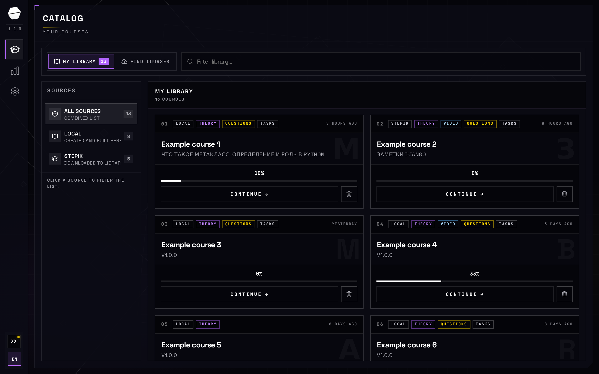

**Поиск внешних курсов** (`/catalog?tab=discover`)

Вкладка **FIND COURSES** (Найти курсы): не ваша библиотека, а **удалённые каталоги** Exercism, freeCodeCamp, Stepik. Цель — найти курс на платформе и **DOWNLOAD** (Скачать) его в локальную библиотеку; дальше он доступен офлайн (подзаголовок в русской локали: «Скачайте в библиотеку — дальше курс доступен офлайн.»).

Рельс **SOURCES** (Источники) показывает, сколько курсов отдаёт каждый адаптер и статус (**READY** / Готово; жёлтая/красная точка — нужна авторизация в настройках). Строка поиска и теги тем фильтруют выдачу. Кнопка **CREATE FROM ARTICLES** (Создать из статей) открывает мастер локальной сборки курса из URL/`.md` без импорта с платформы. Публичные каталоги Exercism/freeCodeCamp работают без ключей; Stepik без OAuth в настройках отдаст пусто или ошибку «нужен вход».

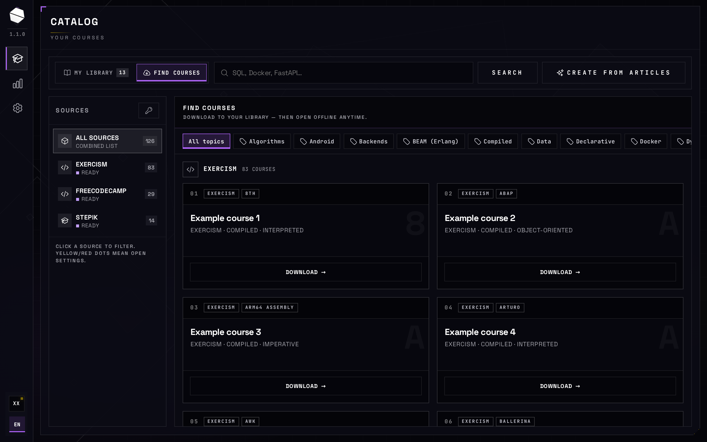

**Форма «создать курс из статей»**

Окно **AI COURSE AUTHOR** / **ARTICLES → LOCAL COURSE** (ИИ-автор курса / Статьи → локальный курс). Это не импорт Stepik, а **генерация локального пака** через studio и tutor: из одной или нескольких статей получается программа из теории, вопросов и заданий по коду.

Что заполняется и уходит в цепочку сборки:

| Поле на кадре | В русской локали | Зачем |
|---|---|---|
| **COURSE TITLE** | Название курса | Заголовок будущего пака в библиотеке |
| **AUDIENCE** | Аудитория | Уровень/профиль читателя для тона ИИ |
| **LOCALE** | Язык | Язык генерируемого контента (`ru` / `en` …) |
| URL / **ADD** (Добавить), перетаскивание `.md` | Ссылки на статьи / Выбрать .md | Источники текста (в интерфейсе есть лимит числа источников) |
| Заголовок и тело источника | — | Текст, по которому строится программа |

**NEXT** (Далее) запускает следующие шаги мастера/сборки, когда есть название и непустой источник. Результат после успешной генерации появляется в **Моей библиотеке** как локальный пак; незавершённую сборку можно возобновить оттуда. На снимке форма пустая — в docs нет чужих URL и черновиков.

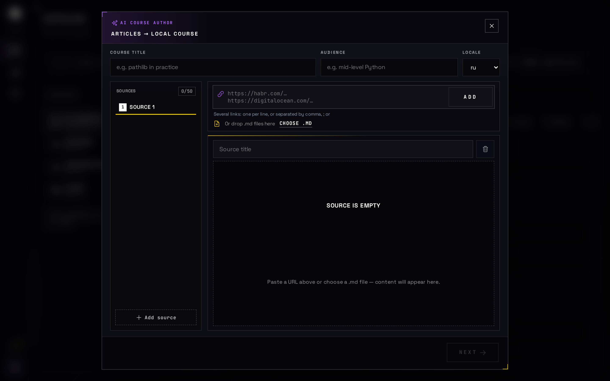

**Карточка курса** (`/catalog/{id}`)

Карточка **уже лежащего в библиотеке** пака: что внутри, прежде чем учиться. В шапке — идентификатор/версия пака; **REMOVE** (Удалить) стирает локальную копию; **BACK TO CATALOG** (Назад в каталог) возвращает к списку.

Блок программы курса (**Программа курса** в русской локали): краткое описание, метки источника (**LOCAL** / Локальный и т.п.), число тем и шагов. **START SESSION** (Начать сессию) создаёт или продолжает запись в сервисе sessions: текущий шаг, прогресс по темам, ответы. Ниже — оглавление модулей и уроков в форме, близкой к Stepik (иконки **T**/Теория, **Q**/Вопрос, **C**/Задания). На docs-снимке названия модулей и уроков нейтрализованы.

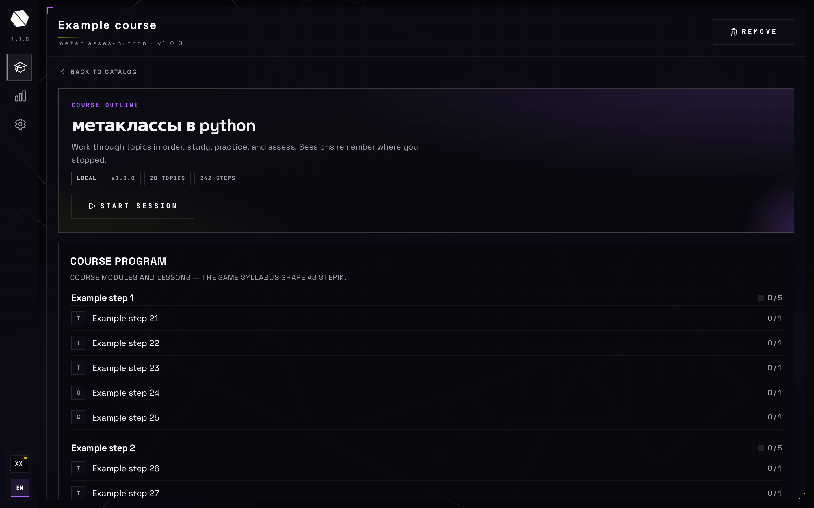

### 17.3. Занятие и аналитика

**Экран сессии** (`/sessions/{id}`)

Рабочее место обучения по одному паку. Слева **COURSE PROGRAM** (Программа курса) — дерево тем и шагов с прогрессом; клик меняет текущий шаг в сессии. Центр — содержимое шага: тип (**THEORY** / Теория, **QUIZ** / Вопрос, **CODE** / Задания и т.д.), текст, медиа или редактор кода; ответ уходит на проверку в сервис grading. Внизу — навигация по шагам (см. следующий кадр). Справа **ASSISTANT AI CHAT** (Помощник / ИИ чат): вопросы по текущему шагу уходят в tutor с контекстом курса; история чата привязана к сессии и шагу, ключи модели берутся из настроек, не с этого экрана.

Фаза в шапке (**STUDY** и др.) в русской локали: Теория / Задание / Вопрос. Прогресс и попытки пишутся в sessions и дальше попадают в аналитику.

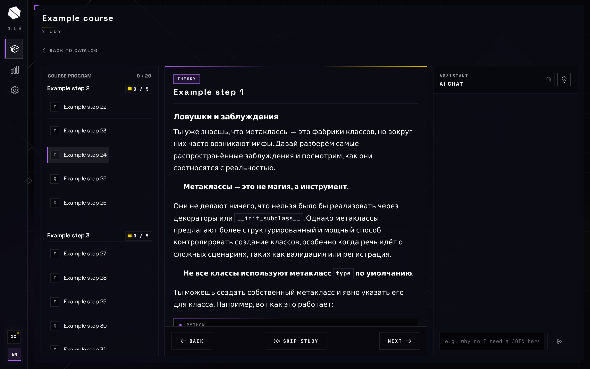

**Область действий на шаге**

Крупный кадр нижней панели шага — не отдельный экран, а те же действия сессии: **BACK** (Назад) — предыдущий шаг; **SKIP STUDY** (Пропустить теорию) — уйти с теоретической фазы без полного чтения (учитывается в аналитике пропусков); **NEXT** (Далее) — следующий шаг, когда шаг пройден или его можно пропустить. На фазах задания и вопроса вместо «далее» часто нужны **Запустить и проверить** / **Отправить ответ** — они сохраняют попытку и результат проверки.


**Аналитика обучения** (`/analytics`)

Сводка **по попыткам и сессиям текущего пользователя** (не по чужим курсам и не по секретам интеграций). Откуда данные: события и агрегаты из sessions в сервис analytics (хранилище аналитики по плану сервиса).

| Блок на кадре | В русской локали | Что означает |
|---|---|---|
| **PASS RATE** | Доля зачётов | Доля успешных проверенных ответов |
| **STEPS COMPLETED** | Пройдено шагов | Сколько шагов закрыто за период |
| **DAY STREAK** | Серия дней | Подряд дней с активностью |
| **30-DAY RHYTHM** | Ритм за 30 дней | График сессий и шагов по дням |
| **PASSES VS MISSES** | Зачёты vs ошибки | Кольцо качества попыток |
| **WHERE YOU FAIL MOST** | Где чаще провал | Темы/курсы с наибольшим числом непройденных попыток |
| **RECENT ATTEMPTS** | Последние попытки | Лента с статусом **PASSED** (Зачёт) / не зачёт |

На docs-снимках названия курсов и тем заменены на `Example course …` / `TOPIC: EXAMPLE-…`. Цифры на карточках — пример живой учётки, не «эталон» для всех установок.

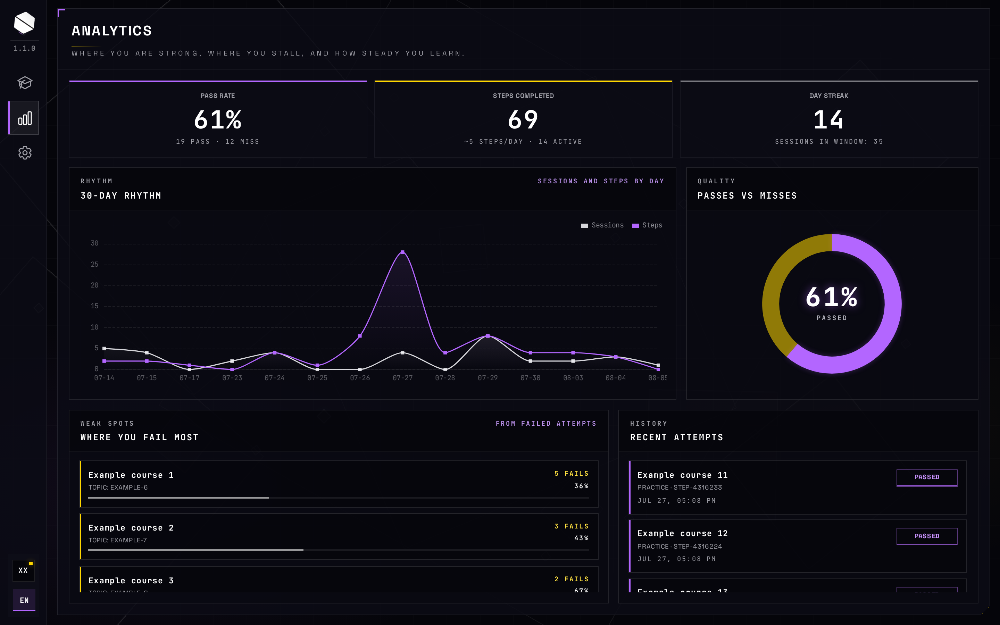

### 17.4. Настройки: интеграции, ИИ и редактор

**Общий экран настроек** (`/settings`)

Здесь хранятся **предпочтения рабочей области и доступы к внешним платформам**, не сами курсы. Левая колонка **PLATFORMS / COURSE INTEGRATIONS** (Платформы / Интеграции курсов): сводка подключений («N из M с учётками · K публичных»), карточки Exercism и freeCodeCamp как **PUBLIC CATALOG** (Публичный каталог — учётки не нужны), Stepik с **CREDENTIALS SAVED** (Учётные данные сохранены), когда OAuth уже записан. **BROWSE** / каталог (Каталог) открывает внешний сайт платформы.

Правая колонка **WORKSPACE / PREFERENCES** (Рабочая область / Параметры): раскрывающиеся блоки источников курсов и **TOOLS** (Инструменты) — **AI AGENT** (ИИ-агент) и **EDITOR** (Редактор). **SAVE CHANGES** (Сохранить изменения) / **CANCEL** (Отмена) записывают настройки пользователя на сервер. Без сохранённых ключей Stepik вкладка «Найти курсы» для Stepik не заработает полноценно.

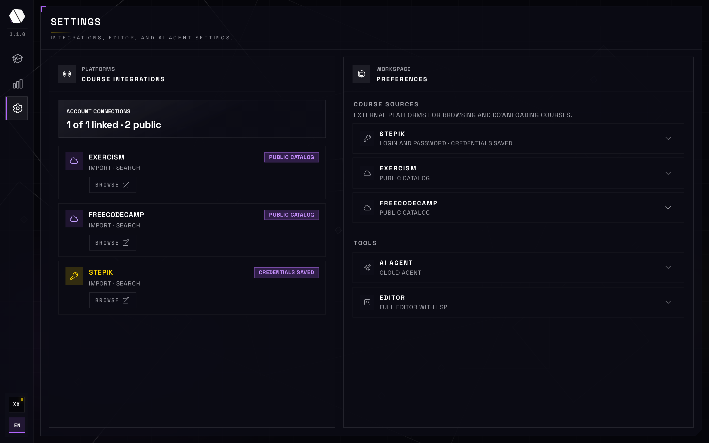

**Форма учётных данных интеграции**

Раскрытый блок платформы (на кадре — Stepik). Сюда вводят то, что сервис integrations использует для OAuth и входа при поиске и скачивании:

- **Client ID** — идентификатор OAuth-приложения на stepik.org;
- **Client Secret** (Секрет клиента) — секрет приложения; на сервере хранится скрыто, на снимке поле пустое, подсказка как в локали: «Секрет уже сохранён. Введите новый, чтобы заменить.»

Могут быть и другие поля в зависимости от способа входа (логин и пароль, API-токен) — см. `settings.integrations.fields` в локалях. Сохранение обновляет статус «Учётные данные сохранены» и разблокирует импорт частных курсов. Публичные Exercism и freeCodeCamp эту форму не требуют.


**Параметры ИИ-агента**

Блок **AI AGENT** (ИИ-агент): куда ходит tutor при генерации курсов, подсказках и чате в сессии. Выбор провайдера:

| На кадре | В русской локали | Смысл |
|---|---|---|
| **Local Agent** | Локальный агент | Модели на этой машине (например Ollama) |
| **Cloud Agent** | Облачный агент | OpenAI, Mistral, Groq или свой совместимый API |
| **Cursor SDK** | Cursor SDK | Доступ через прокси Cursor |

Ниже **CONNECTION** (Подключение): URL провайдера, API-ключ (на снимке пустой; «Ключ уже сохранён…»), модель, дневной лимит. Эти значения сохраняются в настройках пользователя и **не** показываются в каталоге/аналитике.


**Параметры редактора / LSP**

Блок **EDITOR** (Редактор): как выглядит редактор кода на шагах задания и вопроса.

- **FULL EDITOR WITH LSP** (Полный редактор с LSP) — language server, диагностика и автодополнение;
- **SYNTAX HIGHLIGHTING ONLY** (Только подсветка синтаксиса) — облегчённый режим без language server;
- **ENABLE AUTOCOMPLETE** (Включить автодополнение) и переключатели по языкам (Python, JavaScript, Go, SQL).

Это только вид редактора в сессии; проверка решений по-прежнему идёт через grading, а не через LSP.


### 17.5. Pack Studio

**Вход в Pack Studio** (`/pack-studio/login`)

Отдельное мини-приложение автора паков (не учебный каталог). Та же учётка через auth: **Email**, **Password** (Пароль), **Войти**. Без входа нельзя проверить манифест и загрузить пак в каталог от имени пользователя. На снимке поля пустые.


**Редактор пакета**

Рабочее место автора: собрать `.studio-pack` и положить его в каталог. Три зоны (подписи из русской локали Pack Studio):

1. **Статья → курс** (на английском кадре: Article → Course): название курса, аудитория, язык, файл `.md` или текст статьи → **Собрать курс через ИИ**. На выходе — заполненный манифест (теория, вопросы, задания по коду) в соседней панели.
2. **Manifest JSON**: ручное редактирование контракта пака (`id`, `version`, `title`, `topics`, `phases`, `steps`…). Это то, что реально уйдёт в сервис catalog после сборки.
3. **ИИ-подсказка** (на кадре: AI suggest): короткий запрос «Опишите нужный шаг» — фрагмент для вставки в манифест, без полной пересборки курса.

В шапке — маскированная почта и **Log out** (Выйти).


**Кнопки действий над манифестом**

Порядок работы с уже готовым JSON:

1. **Validate** (Проверить) — проверка контракта studio без записи в каталог; показывает ошибки манифеста.
2. **Build .studio-pack** (Собрать `.studio-pack`) — упаковка файла пака.
3. **Upload to catalog** (Загрузить в каталог) — отправка пака в сервис catalog; после успеха курс появляется в **Моей библиотеке** у этого пользователя (как локальный или загруженный пак).

Кнопка загрузки обычно неактивна, пока нет успешной проверки и сборки. На docs-кадре секреты и чужие манифесты не показываем — в редакторе виден нейтральный пример JSON.


<a id="section-18"></a>

## 18. Интеграции и runtime_modules


### 18.1. Контракт адаптера

Типичный адаптер умеет `health`, `list_catalog`, `search_remote` и `import_course` с результатом `(pack, report)`. У каждой платформы есть каталог `integration_modules/<id>/` с `importer.py`, `integration.json` и наборами fixtures.


### 18.2. Stepik

1. Аутентификация идёт через OAuth или token, либо через fixture в тестах.
2. В живом импорте курс обходится сверху вниз: course → sections → units → lessons → steps (с лимитом глубины или числа шагов).
3. Шаг платформы преобразуется в theory, code, quiz или video и получает фазу study, practice или assess.
4. На выходе собирается pack с `platform=stepik` и отчёт (full, partial или truncated).
5. Запись на курс (enroll) выполняется отдельно через API enrollments.


### 18.3. freeCodeCamp

1. Каталог читается через GraphQL-поле `curriculum.superblocks`.
2. Импорт идёт по цепочке superblock → blocks → challenges.
3. Page-data подгружается параллельно.
4. Challenge преобразуется в asserts и starter; отдельно предупреждаем про проверки, завязанные на DOM или браузер.


### 18.4. Exercism

1. Каталог берётся из `/tracks`, затем читаются упражнения выбранного трека.
2. Файлы instructions, template и tests подтягиваются с GitHub параллельно.
3. Intro идёт в фазу study, код — в practice; на один трек обычно один topic.


### 18.5. runtime_modules

По `runtime_modules/README.md` сервисы пока не считают этот каталог единственным источником истины. Уже есть каркасы `python/`, `javascript/`, `go/`, `sql/` и `docker-lab/templates/minimal/`.

<a id="section-19"></a>

## 19. ИИ: tutor, Ollama, cursor-proxy


### 19.1. Подсказки модели tutor

```
services/tutor/prompts/
  shared/     core.md, chat_context.md
  roles/      study_chat, practice_chat, contextual_hints, pack_studio,
              grade_check, course_from_article, article_from_url
  skills/     socratic, kind-*, grade-*, domain-*, …
  provider/   ollama-quality.md, ollama-polish.md, external.md
```

Сборка системной подсказки модели — `app.domain.prompts`. Контуры ролей не должны смешивать историю чата как попало (см. `ROLES.md` в каталоге prompts).


### 19.2. Ollama

В Compose поднимается контейнер Ollama с томом `data/ollama`. Модель по умолчанию берётся из `OLLAMA_MODEL` (часто `qwen2.5:3b`). Сценарий `studio` умеет скачивать модель (pull) и подключать GPU-профиль из `deploy/docker-compose.ollama-gpu.yml`, если он доступен.


### 19.3. Внешний LLM и Cursor

Если `TUTOR_DEFAULT_PROVIDER_URL` пуст, тьютор ходит в Ollama. Иначе используется указанный OpenAI-совместимый base URL. Для Cursor в настройках интерфейса указывают URL `cursor-proxy`, который дальше говорит с Cloud Agents. Это нельзя путать с тьютором обучающегося на шаге занятия.


### 19.4. Ограничение роли

Тьютор в study/practice не заменяет grading как источник истины для «сдал/не сдал», хотя LLM-grade может быть стадией каскада при включённых флагах.

<a id="section-20"></a>

## 20. Установка пользователя и сценарии запуска


### 20.1. Первичная подготовка ≠ полный стек

Скрипты `scripts/install.sh` и `install.ps1` делают одноразовую первичную подготовку: скачивают дерево в `~/task-studio` (или `TASK_STUDIO_DIR`), ставят ярлыки и запускают сценарий `studio`. Полный Docker-стек они **сами** не поднимают.

Скрипты `scripts/studio.sh`, `studio.ps1` и `studio.cmd` — это консоль пользователя: меню зависит от состояния `missing`, `stopped` или `running`, а команды включают `install`, `start`, `heal`, `stop`, `restart`, `open`, `update` и `uninstall`.


### 20.2. Первичная установка стека

`ops_install` готовит каталоги, проверяет `.env`, собирает и поднимает Compose (профиль `full` и связанные), дожидается готовности UI, скачивает модель Ollama и создаёт ярлыки. Это долгий путь: образы, миграции и загрузка модели.


### 20.3. Самообновление consumer

Самообновление включается только при маркере `.studio-consumer` (или `TASK_STUDIO_ALLOW_SELF_UPDATE=1`). Сценарий читает манифест `studio-version.json` по HTTP с учётом TTL; при новой версии скачивает архив, проверяет content-sha256 и делает поэтапную замену с сохранением `data/` и `.env`. PET-checkout разработчика сценарии запуска сами не перетирают.


### 20.4. Ключевые ops_*

| Функция | Роль |
|---------|------|
| `ops_need_docker` / `ops_try_start_docker` | Docker |
| `ops_ensure_repo` / `ops_ensure_env` / `ops_prepare_dirs` | дерево и data |
| `ops_compose` / `ops_compose_up` | compose |
| `ops_install` / `ops_start` / `ops_stop` / `ops_restart` | жизненный цикл |
| `ops_update_check` / `ops_update_apply` | обновление |
| `ops_uninstall_*` | удаление |
| `ops_configure_ollama_profile` / `ops_pull_ollama` | модель/GPU |


### 20.5. Переменные установщика

| Переменная | По умолчанию |
|------------|--------------|
| `TASK_STUDIO_DIR` | `$HOME/task-studio` |
| `TASK_STUDIO_BRANCH` | `develop` |
| `TASK_STUDIO_MIN_RAM_GB` | `8` |
| `OLLAMA_MODEL` | `qwen2.5:3b` |
| `ORCHESTRATOR_MODE` | авто по RAM |
| `TASK_STUDIO_UI_URL` | `http://localhost` |
| `TASK_STUDIO_UPDATE_TTL_SEC` | `3600` |
| `TASK_STUDIO_ALLOW_SELF_UPDATE` | `0` |
| `TASK_STUDIO_UNINSTALL_YES` | `0` |


### 20.6. Язык консоли

Только по локали ОС (`ru*` → русский, иначе английский). Палитра близка к веб-токенам. Меню на стрелках без внешних TUI-зависимостей.

<a id="section-21"></a>

## 21. Разработка на клоне: just и Compose


### 21.1. Подготовка

```bash
cp .env.example .env
# SECRETS_MASTER_KEY: Base64 → ровно 32 байта
# JWT_SECRET: длинная случайная строка
just up   # или just start
```


### 21.2. Рецепты just

| Команда | Действие |
|---------|----------|
| `just up` | Пересборка + старт |
| `just start` | Старт без пересборки |
| `just down` | Остановка |
| `just rebuild` / `rebuild-svc` / `rebuild-web` | Пересборки |
| `just web-dev` / `web-local` | горячая перезагрузка UI |
| `just logs` | Логи |
| `just test` / `lint` / `fmt` / `ci` | Проверки |
| `just e2e` | Playwright |
| `just hooks` / `hooks-run` | pre-commit |
| `just validate-pack` / `validate-schemas` / `validate-integrations` | Контракты |
| `just piston-install` | Языки Piston |
| `just build-images` / `publish` | Registry |


### 21.3. Compose profiles

| Profile | Содержание |
|---------|------------|
| `full` | Ядро + данные + tutor/ollama + observability |
| `editor` | LSP pyright/typescript/gopls/sqls |
| `host-metrics` | node-exporter, cAdvisor |

Сценарий `studio` обычно включает всегда `--profile full`, + `editor` если не power_saving, + `host-metrics` на подходящем Linux (`scripts/lib/profiles.sh`).


### 21.4. depends_on (смысл)

- Серверная часть ждут healthy postgres/redis/rabbitmq.
- grading ждёт piston + tutor/media; lab-runner ждёт grading + docker.sock.
- tutor ждёт ollama; search — meilisearch; media — minio; analytics — clickhouse.
- nginx ждёт healthy web, pack-studio, studio-api.

<a id="section-22"></a>

## 22. Профили памяти и orchestrator


### 22.1. profiles.json ≠ compose profile

`deploy/profiles.json` задаёт классы памяти (`db`, `cache`, `heavy_ml`, …), `compose_env` лимиты и логические наборы `minimal` / `study` / `full`. Это SoT для матрицы/оркестрации (`scripts/launcher-matrix.json`), а не прямая замена `docker compose --profile`.


### 22.2. Режимы

| Режим | Идея |
|-------|------|
| `balancing` | Держать нужное, остальное можно снять |
| `maximum` | Максимум сервисов |
| `power_saving` | Экономия RAM: shed Ollama/LSP/lab |

При нехватке RAM orchestrator снимает тяжёлые контейнеры, стараясь сохранить ядро: auth, studio-api, sessions, grading и данные.

<a id="section-23"></a>

## 23. Секреты и переменные окружения

Полный справочник: [`env.md`](env.md). Шаблон: [`.env.example`](../.env.example).


### 23.1. Обязательные

| Переменная | Требование |
|------------|------------|
| `SECRETS_MASTER_KEY` | Base64 → ровно 32 байта |
| `JWT_SECRET` | Непредсказуемая строка |
| `DATABASE_URL` | asyncpg URL |
| `REDIS_URL` | Redis |
| `RABBITMQ_URL` | RabbitMQ |


### 23.2. Cookies / JWT

- `JWT_EXPIRE_HOURS` — в `.env.example` обычно `12`; сессия продлевается на `/v1/auth/me` и refresh.
- `COOKIE_SECURE=true` только за HTTPS (сценарий `studio` выставляет это значение, если URL интерфейса начинается с https).


### 23.3. Группы из env.md

- ИИ/Tutor: `OLLAMA_*`, `TUTOR_*`, `LLM_GRADE_*`, `CURSOR_*`.
- Интеграции: `STEPIK_CLIENT_*`, URL integrations.
- Хранилище/поиск: `MINIO_*`, `MEILISEARCH_*`, `CLICKHOUSE_*`, `ANALYTICS_EVENTS_QUEUE`.
- Оркестрация/lab: `ORCHESTRATOR_MODE`, `DOCKER_GID`, `LAB_*`, `PISTON_URL`.
- CI publish: `DOCKER_REGISTRY`, `DOCKER_USERNAME`/`PASSWORD`.


### 23.4. Packs ownership

Catalog entrypoint делает chown `PACKS_ROOT` на appuser (uid 10001). Старые файлы на хосте иногда нужно поправить вручную.

<a id="section-24"></a>

## 24. Версии продукта и сценариев запуска

| Артефакт | Файл |
|----------|------|
| Web/продукт | `apps/web/app-version.json` |
| Сценарии запуска | `scripts/launcher-version.json` |
| Consumer update channel | `studio-version.json` |

Каналы SemVer и формула integer build — [`VERSIONING.md`](VERSIONING.md). Скрипт: `scripts/compute-build-number.py`.

<a id="section-25"></a>

## 25. Качество: тесты, линтеры, CI


### 25.1. Локально

```bash
just test
just lint
just e2e   # стек запущен; npx playwright install chromium
```


### 25.2. Слои тестов

- В `packages/contracts/tests` проверяют схемы и pack.
- В `services/*/tests` проверяют домен и API с имитацией внешних границ.
- В `apps/web` unit-тесты utils идут через vitest, сквозные сценарии — через Playwright.


### 25.3. CI: `.github/workflows/ci.yml`

- Задание `lint` гоняет ruff, mypy, basedpyright, shellcheck и проверки launcher/compose/modules.
- Задания `launcher-unix` и `launcher-windows` делают дымовую проверку первичной подготовки и обновления.
- Задание `test` валидирует fixtures и запускает pytest по packages и всем services.
- Задание `web` выполняет `npm ci`, lint и тесты.
- Задание `secrets-scan` ищет секреты через gitleaks.


### 25.4. publish-images.yml

На теги `v*` или ручной `workflow_dispatch` выполняется buildx bake по `deploy/docker-bake.hcl` с публикацией в GHCR. Пустой tag и значение `latest` при ручном запуске отвергаются.

<a id="section-26"></a>

## 26. Публикация образов

```bash
just build-images
just publish tag=v1.0.0
```

Bake собирает образы для amd64 и arm64. После публикации consumer можно перевести на compose только с `image:` без `build:` (имена образов bake — `task-studio-*`).

<a id="section-27"></a>

## 27. Мониторинг

| Сервис | Адрес |
|--------|-------|
| Сайт | http://localhost |
| Grafana | http://localhost:3001 |
| Prometheus | http://localhost:9090 |
| Pyroscope | в Compose (full) |

Orchestrator читает Prometheus, node-exporter и Pyroscope, чтобы решать, какие контейнеры снять или оставить. Сервисы отдают метрики на `/metrics`.

<a id="section-28"></a>

## 28. Безопасность при развёртывании у себя

- Не публикуйте `.env`, ключи и содержимое `data/`.
- Ограничьте доступ к Docker socket для orchestrator, lab-runner и Traefik.
- Контейнер Piston работает privileged — изолируйте хост.
- За обратным прокси включайте TLS и `COOKIE_SECURE=true`.
- Наружу открывайте только nginx на портах 80 и 443, а не порты внутренних сервисов.
- Системные обратные вызовы (например lab complete) должны идти с system token.
- HTML шагов проходит sanitize и DOMPurify на клиенте; не отключайте это без крайней нужды.

<a id="section-29"></a>

## 29. Типовые задачи разработчика


### 29.1. Добавить поле в ответ сессии

1. Добавьте поле в схему `packages/contracts` (`session_schemas`).
2. Обновите преобразователь в sessions (`app/api/mappers`).
3. Если BFF не агрегирует ответ, он проксирует поле как есть.
4. Обновите типы и utils в `apps/web`, затем страницу сессии.
5. Добавьте тест на sessions и при необходимости vitest для util.


### 29.2. Новый kind шага

1. Обновите pack schema и валидаторы.
2. При необходимости поправьте импортёры внешнего источника.
3. Добавьте step view в sessions и ветку проверки в grading.
4. Сделайте панель в интерфейсе и тело запроса для отправки ответа.


### 29.3. Новая интеграция

1. Создайте каталог `integration_modules/<id>/` с importer, `integration.json` и fixtures.
2. Зарегистрируйте адаптер в сервисе integrations.
3. Прогоните `just validate-integrations` и тесты конвейера.
4. Опишите адаптер в `docs/integrations/`.


### 29.4. Узкая пересборка

```bash
just rebuild-svc grading sessions
just rebuild-web
```


### 29.5. Только клиентское приложение

```bash
just start
just web-dev
```

<a id="section-30"></a>

## 30. Диагностика


### 30.1. Интерфейс не открывается

- Проверьте `docker compose … ps`: nginx, web и studio-api должны быть healthy.
- Смотрите логи nginx и studio-api.
- Откройте `http://localhost/api/…` (маршруты health/ready).


### 30.2. Отправка ответа всегда даёт ungradable

- Смотрите логи grading и Piston.
- Есть ли tests/harness внутри пакета?
- Включён ли LLM grade и доступны ли tutor/Ollama?
- Для Stepik проверьте учётные данные и сеть.


### 30.3. Импорт завис

- Проверьте очередь `import.jobs` и DLQ.
- Смотрите логи фонового обработчика integrations.
- Убедитесь, что orchestrator не поставил паузу импорта.


### 30.4. Лабораторная работа не завершается

- Смотрите логи lab-runner, доступ к docker.sock и флаг `LAB_RUNNER_DRY_RUN`.
- Доходит ли обратный вызов на grading complete?
- Опрашивает ли интерфейс attempt до терминального статуса?


### 30.5. Ollama медленный или модели нет

- Запустите `ops_pull_ollama` или вручную `docker exec … ollama pull`.
- Режим power_saving мог снять контейнер Ollama.
- При необходимости подключите GPU overlay Compose.

<a id="section-31"></a>

## 31. Типичные ошибки (чего избегать)

| Не делать | Почему |
|-----------|--------|
| Вызывать grading из клиентского приложения | Ломаются attempts, analytics и gate в sessions |
| Класть бизнес-правила в nginx | Край сети должен оставаться «тупым» |
| Делать JOIN чужих таблиц | Нарушается граница сервиса; позже больно при разделении БД |
| Класть большие файлы в RabbitMQ | В сообщениях должны быть только идентификаторы и пути |
| Делать ack до записи в БД | При рестарте возможны потеря или дубль |
| Путать compose profile `full` с `profiles.json` full | Это разные словари понятий |
| Переписывать tutor `shared/core` оптом | Ломаются все роли сразу |
| Считать, что `install.sh` уже значит «сайт готов» | Первичная подготовка ≠ установка стека |
| Коммитить `.env` и `data/` | Там секреты и пользовательские данные |
| Открывать порты auth/grading наружу | Обходится BFF и контроль доступа |

<a id="section-32"></a>

## 32. Глоссарий

| Термин | Смысл |
|--------|-------|
| Pack | Учебный пакет: манифест и материалы шагов |
| Session | Прохождение пакета конкретным пользователем |
| Attempt | Одна попытка сдачи шага |
| BFF | `studio-api`, публичный промежуточный слой API |
| Gate | Правило «нельзя идти дальше без успешной сдачи» |
| Cascaded grading | Цепочка стадий проверки до первого outcome |
| Consumer install | Установка через `install.sh` в `~/task-studio` |
| PET checkout | Рабочая копия разработчика с git |
| Lab | Шаг с практикой на Docker Compose |
| Piston | Песочница исполнения кода |

<a id="section-extra-a"></a>

## Приложение A. Подробности sessions

Доменный вход лежит в `services/sessions/app/domain/sessions.py`. Создание сессии идёт через `session_lifecycle.py` → `session_create.py`. Отправка ответа (`submit`) — в `session_submission.py`; ветка лабораторной работы — в `session_lab_route.py` и `session_lab_submit.py`. Оценка завязана на `session_grade_submit.py` и `session_grading_client.py`. Аналитика живёт в `analytics_events.py` и `messaging.py`; сброс outbox выполняется в lifespan `main`.

Представление шага для интерфейса собирают преобразователи в `app/api/mappers/step_view.py` с учётом содержимого catalog и media URL.

Уникальность активной сессии и индексы описаны в миграциях 003–005. При удалении пакета catalog инициирует abandon связанных сессий через BFF и sessions.


### A.1. Состояния сессии

Типичные статусы — `active`, `completed`, `abandoned` (точные enum смотрите в моделях и схемах). Phase progress хранит прохождение фаз study, practice и assess. Идентификаторы текущего шага и топика задают позицию оглавления в интерфейсе.


### A.2. Клиентский composable

`useSessions` обращается к `/v1/sessions` для list, start, get, step, navigate, submit и attempts. Метод `listPackProgress` питает карточки каталога. Ошибки gate и лимита попыток всплывают через `useToasts` и ключи i18n.

<a id="section-extra-b"></a>

## Приложение B. Подробности catalog и media

Размер загружаемого пакета ограничен `PACK_MAX_UPLOAD_MB`. После сборки integrations вызывает register imported pack. Activate переключает активную версию для пользователя. Delete чистит метаданные и запускает побочные действия (abandon sessions, unindex search) через оркестрацию BFF в `catalog_routes`.

Модули media mirror/encode в домене catalog при необходимости готовят медиа внутри пакета; байты пользователю отдаёт media service через MinIO. TTL presigned URL ограничен сверху (900 секунд), чтобы не раздавать вечные ссылки.


### B.1. Карточка курса в интерфейсе

Страница `catalog/[id].vue` читает detail, строит оглавление из manifest, стартует сессию, умеет удалять пакет и перекачивать сломанный external. Кэш discover держит `useDiscoverCache`.

<a id="section-extra-c"></a>

## Приложение C. Подробности фонового обработчика integrations

Жизненный цикл задания: создать запись, опубликовать сообщение, выполнить конвейер в фоновом обработчике, обновить статус и отчёт. Конвейер идёт так: credentials → `adapter.import_course` → normalize pack → `catalog.register` → сообщение в `search.index`. Sweeper подбирает зависшие задания. Orchestrator может выставлять Redis-флаги паузы импорта, когда не хватает RAM.


### C. Платформа stepik

Самый тяжёлый importer: дерево курса Stepik, лимиты шагов, partial reports, video steps, enroll.


### C. Платформа freecodecamp

GraphQL curriculum; browser/DOM asserts могут не переноситься 1:1 в Piston — report предупреждает.


### C. Платформа Exercism

Импорт идёт от track к exercises, обогащает материалы с GitHub, держит один topic на трек и использует fixture fallback для id=1.

<a id="section-extra-d"></a>

## Приложение D. Подробности lab-runner

Модуль `compose_exec.py` поднимает compose-проект лаборатории по спецификации из сообщения. `runner_execute.py` управляет сроками ожидания и сбором результата. Режим dry-run (`LAB_RUNNER_DRY_RUN`) удобен в CI и отладке без реального Docker. После завершения lab-runner шлёт HTTP-обратный вызов в grading с идентификаторами lab_run и attempt. Ошибку сети на обратном вызове нужно видеть в логах — иначе интерфейс будет опрашивать attempt бесконечно.

<a id="section-extra-e"></a>

## Приложение E. Подробности управляющего цикла orchestrator

`controller.tick` читает метрики Prometheus, node-exporter и Pyroscope, сверяет их с политикой и режимом и решает, какие управляемые сервисы оставить или снять (ollama, lsp-*, lab-runner и другие). События редактора с BFF сообщают, что пользователю нужен LSP — в режиме balancing orchestrator может поднять нужный контейнер. Управляющие вызовы защищает `ORCHESTRATOR_SYSTEM_TOKEN`.

<a id="section-extra-f"></a>

## Приложение F. Подробности analytics

Ingest принимает пакеты и сообщения событий. Фоновый обработчик пишет их в ClickHouse. Query API отдаёт агрегаты для страницы `analytics.vue`: progress, skips и timeline попыток. Sessions предпочитает outbox и очередь, чтобы не терять события при падении analytics. В ClickHouse нельзя хранить секреты и сырые JWT.

<a id="section-extra-g"></a>

## Приложение G. Подробности search

Документы индекса строятся из метаданных и содержимого пакета (модули indexing*). Запрос может быть гибридным: текст Meilisearch плюс сигнал embeddings. Unindex вызывается при удалении пакета. Индекс не заменяет catalog: при расхождении источником правды остаётся Postgres catalog.

<a id="section-extra-h"></a>

## Приложение H. Страница settings

`useSettingsPage` держит форму интеграций (Stepik client id/secret и другие поля), URL и ключ провайдера тьютора, лимиты, а также настройки autocomplete и LSP по языкам. Секреты уходят в зашифрованные настройки auth и после сохранения не должны возвращаться клиенту в открытом виде — только маски или флаги «задан». `useCredentialAutofill` помогает не ломать работу браузерного менеджера паролей.

<a id="section-extra-i"></a>

## Приложение I. Каталог в интерфейсе (library и external)

Страница `catalog/index.vue` совмещает локальную библиотеку пакетов и внешний поиск. Есть вкладки library и external, создание курса из статьи (`LibraryCourseCreate`), прогресс AI-сборки, скачивания (`useCatalogDownloads`), удаление и отмена сборок. Строки и отображение собирают `utils/catalog/courseRows.ts`, `display.ts` и `learning.ts`.

<a id="section-extra-j"></a>

## Приложение J. Путь LSP

Клиент редактора открывает WebSocket `/api/v1/lsp/{language}`; запрос идёт через nginx в lsp_gateway studio-api и дальше в TCP/stdio контейнера lsp-*. В профиле editor доступны pyright, typescript, gopls и sqls. Без профиля editor WebSocket не к чему подключить — в режиме power_saving это ожидаемо.


## Приложение K. Как устроен submit на клиенте

Файл `useSessionGradeSubmit.ts` централизует ветвление по kind, чтобы страница сессии не разрасталась копипастой.

Для quiz передаётся choice_index из SessionQuiz; для code — актуальный source из SessionCodeEditor; для task — текст textarea.

Лабораторная работа не отправляет тело решения так же: `SessionLabPanel` инициирует submit с пустым payload и дальше опрашивает `getAttempt` до терминального статуса.

Ошибки сети и 4xx/5xx превращаются в toast; 403 gate показывает ключ про необходимость сдать шаг.

Next с complete_current сообщает sessions, что можно зафиксировать прогресс текущего шага при уходе вперёд — точная семантика на сервере в session_navigation.


## Приложение L. Санитизация учебного HTML

Конвейер `studyBodyToHtml` нормализует содержимое в форматах markdown, html и plain в одну HTML-строку.

sanitizeStudyHtml чинит mojibake, вырезает script и обработчики on*, javascript: URL, нормализует pre/code, помогает с таблицами.

purifyStudyHtml — финальный DOMPurify с белым списком тегов/атрибутов; это последний рубеж XSS в SessionStudyBody.

Mermaid fences и подсветка кода живут рядом (mermaid.ts, highlightCode.ts) и не должны исполнять пользовательский JS.

Сервер тоже не должен отдавать «сырой» HTML из недоверенных импортов без осознания риска — sanitize на клиенте обязателен, но не единственная линия защиты.


## Приложение M. Course-from-article

Пользователь передаёт URL или текст; запрос идёт через BFF `/v1/studio/ai/...` в tutor, тот загружает и собирает материал, пишет сборку на диск под `COURSE_BUILDS_ROOT` и стримит прогресс в интерфейс.

TTL сборок (`COURSE_BUILD_TTL_DAYS`) чистит старые артефакты.

На web и pack-studio компонент `CourseBuildProgress` показывает стадии, а `localizeProgress` переводит сообщения.

Готовый результат регистрируется как pack в catalog и появляется в библиотеке.

Это нагрузка на Ollama и CPU: на слабых машинах включайте адекватный `ORCHESTRATOR_MODE` и меньшую модель.


## Приложение N. Docker socket и угрозы

lab-runner, orchestrator и иногда traefik видят docker.sock — фактически root на хосте с точки зрения контейнерной изоляции.

Развёртывание у себя рассчитано на доверенных пользователей машины; не выставляйте эти сервисы в открытый интернет.

LAB_RUNNER_DRY_RUN снижает риск в отладке, но не заменяет изоляцию.

Piston privileged нужен движку исполнения; держите его во внутренней сети Compose.


## Приложение O. Логирование и request id

Middleware проставляет `X-Request-Id`; по возможности передавайте его дальше во внутренних вызовах httpx.

`log_redact` вычищает секреты из логов — не обходите его отладочным `print` токенов.

`LOG_FORMAT` выбирает JSON или console; в Compose удобнее JSON для сбора логов.

При расследовании отправки ответа сначала сверьте request id между studio-api, sessions и grading.


## Приложение P. Идемпотентность импорта

Повторная доставка сообщений RabbitMQ — нормальное явление. Импорт должен ключиться так, чтобы второй проход не плодил дубликаты pack без нужды.

Отчёт partial/truncated помогает интерфейсу объяснить, почему курс обрезан лимитом шагов.

Fixture-режимы в тестах (`course_id=1` и подобные) не должны попадать в продакшен-конфиг как единственный рабочий путь.


## Приложение Q. Работа с pack schema

Любое новое поле манифеста сначала появляется в `pack-schema-v1.json` и тестах `validate_pack`.

Затем обновляют importers, ожидания редактора Pack Studio, преобразователь шага в sessions и клиентский интерфейс.

`step_dependencies` описывает зависимости шагов; не реализуйте вторую произвольную графовую схему в интерфейсе.

Рецепт `just validate-pack` должен быть зелёным до слияния изменений.


## Приложение R. Редактор кода в сессии

`SessionCodeEditor` использует политики `packages/editor-core` и настройки из user settings.

Autocomplete и LSP включаются по языку; без профиля editor LSP просто недоступен.

Beacon и editor events сообщают orchestrator об активности — не отправляйте событие на каждое нажатие клавиши без debounce на клиенте.

Сброс кода возвращает starter из шага pack, а не «последний успешный attempt», если иное не реализовано явно.


## Приложение S. Видео и media URL

`SessionVideoPlayer` получает URL через media API, а не через прямой публичный endpoint MinIO с ключами.

Срок жизни presign конечен: длинное видео на медленной сети может упереться в истечение ссылки; при жалобах смотрите `MINIO_PRESIGN_TTL_SECONDS`.

Модули catalog `media_pack_*` при импорте могут перекладывать и кодировать ассеты.


## Приложение T. Интерфейс аналитики

Страница `analytics.vue` использует `useAnalytics` для progress, skips и attempts за выбранный период.

Компоненты `AnalyticsProgressChart` и `AnalyticsPassRing` — только визуализация, не источник правды.

Пустая аналитика на свежей установке нормальна: нет событий — нет графиков.

Если сессии есть, а графики пусты, проверяйте outbox sessions и потребителя analytics.


## Приложение U. Проходка: логин

Пользователь открывает `/login`, вводит email и пароль, `useAuth.login` отправляет `POST /api/v1/auth/login` через BFF в auth, тот выставляет cookie, затем следует редирект на `/catalog`. Регистрация устроена так же с `mode=register`. Ошибки валидации и 401 показываются через toast и i18n. На `http://localhost` значение `COOKIE_SECURE` должно быть false, иначе браузер не сохранит cookie.


## Приложение V. Проходка: старт курса

Из каталога пользователь открывает карточку, вызывает `startSession`, sessions создаёт сессию, клиент переходит на `/sessions/{id}`. Оглавление строится из topics, lessons и steps манифеста. Первый шаг загружается через GET step; значение kind определяет панель. Если пакет повреждён (нет файлов), интерфейс предлагает redownload для external.


## Приложение W. Проходка: сдача quiz

В `SessionQuiz` пользователь выбирает вариант и нажимает Submit; sessions передаёт ответ в каскад quiz grading (локальный ключ, Stepik или LLM), сохраняет attempt и возвращает обратную связь в интерфейс. При `require_pass_to_advance` кнопка Next блокируется до успешной сдачи.


## Приложение X. Проходка: code и Piston

Пользователь отправляет исходник из редактора; grading проходит каскад code через harness и Piston, кладёт stdout/stderr в outcome, sessions сохраняет attempt, интерфейс показывает результат. Если Piston не прогрет или нет нужного языка, ошибка видна в логах grading — помогает `just piston-install`.


## Приложение Y. Проходка: lab

`SessionLabPanel` инициирует submit, создаётся асинхронное lab-задание, lab-runner поднимает compose, внутри лаборатории проходят проверки, приходит обратный вызов, attempt завершается, интерфейс успешно дочитывает статус. Срок ожидания задаёт `LAB_DEFAULT_TIMEOUT_SECONDS`; превышение должно давать terminal failure, а не вечный pending.


## Приложение Z. Почему BFF, а не прямые вызовы из Nuxt

Браузерный код не должен знать внутренние URL вроде auth:8001 и sessions:8003: это утечка топологии и усложнение CORS и cookie. BFF держит одну cookie-сессию, один JWT secret на краю, единый request id и точку для будущих экранных агрегаций. Доменные сервисы остаются узкими и тестируемыми. Исключение — форма OpenAI API у cursor-proxy для клиентов, которые ждут `/v1/chat/completions`; даже тогда доступ обычно остаётся во внутренней сети.


## Приложение AA. Почему отправка ответа только через sessions

Attempt — сущность sessions. Если клиент ударит в grading напрямую, легко потерять запись попытки, события analytics, лимиты assess и gate. Sessions применяет результат grading атомарно с точки зрения учебного прогресса. Завершение lab тоже возвращается в sessions, а не «теряется» в grading.


## Приложение AB. Почему один Postgres URL сейчас

Логически сервисы владеют таблицами отдельно; физически один инстанс упрощает локальный Compose и резервное копирование. Не используйте это как разрешение на SQL между доменами. При будущем разделении миграции пойдут по границам, которые код уже соблюдает.


## Приложение AC. Почему RabbitMQ, а не только HTTP

Импорт и лабораторные работы длятся дольше HTTP-тайм-аута интерфейса. Очередь даёт буфер, повторы, DLQ и независимое масштабирование фоновых обработчиков. События analytics не должны блокировать отправку ответа: outbox и очередь отделяют этот путь.


## Приложение AD. Соглашения по ошибкам API

Ориентир — JSON в духе RFC7807: type, title, status, code, detail. Интерфейс показывает пользователю безопасное сообщение; детали остаются в логах с request id. Не протаскивайте внутренний stack trace в ответ BFF.


## Приложение AE. Тестирование каскада grading

Пишите юнит-тесты стадий с имитацией Piston, Stepik и tutor. Проверяйте порядок cascade: более дешёвая и локальная стадия раньше LLM. Отдельно тестируйте ungradable, когда все стадии вернули None. В CI без Ollama ставьте `LLM_GRADE_ENABLED=false`, чтобы тесты не мигали.


## Приложение AF. Тестирование gate в sessions

Соберите фикстуру сессии с `require_pass_to_advance`. Переход вперёд без успешной сдачи должен давать 403; после pass — 200. Assess без practice должен блокироваться. Лимит попыток даёт 409. Не завязывайте тест на точные строки detail — проверяйте code и status.


## Приложение AG. Стратегия тестов клиентского приложения

Через vitest проверяйте чистые utils (catalog rows, sanitize, courseStream mapStage). Сквозные e2e держите на критичных путях: login и открытие каталога (нужен поднятый стек). Не подменяйте внутренности composable хрупкими spy без нужды — проверяйте поведение.


## Приложение AH. Работа с i18n

Ключи в `en.json` и `ru.json` нужно держать синхронно. Консоль сценария `studio` переводит сообщения отдельно (`scripts/lib/i18n`). Сообщения прогресса studio локализуются через `localizeProgress`, а не хардкодом в компоненте.


## Приложение AI. Производительность каталога в интерфейсе

На крупных списках пакетов не тащите полный manifest в list-маршрут без нужды. Кэш discover снижает повторные удары в integrations. Переходы фильтра library оформляйте через Transition с ключом фильтра (уже есть переход page-cyber).


## Приложение AJ. Резервное копирование при развёртывании у себя

Минимум нужно сохранить том Postgres, `data/packs`, `data/minio` и `.env` (секреты храните отдельно). ClickHouse и Meilisearch можно пересобрать ценой пересчёта и переиндексации. Модели Ollama качаются долго — включайте их в резервную копию, если сеть дорогая.

<a id="section-33"></a>

## 33. Лицензия и куда смотреть дальше

- Код: [GNU AGPL-3.0](../LICENSE)
- Доп. условия: [LICENSE-SUPPLEMENT.md](../LICENSE-SUPPLEMENT.md)


### Куда смотреть

| Вопрос | Куда |
|--------|------|
| Контракты | `packages/contracts` |
| Env | [`env.md`](env.md) |
| Версии | [`VERSIONING.md`](VERSIONING.md) |
| Интеграции | [`integrations/`](integrations/) |
| Превью | [`PREVIEW.md`](PREVIEW.md) |
| Код сервиса | `services/<name>/app/` |
| Compose | `deploy/docker-compose.yml` |

Конец руководства разработчика. Обновляйте этот файл вместе с архитектурными изменениями кода.

## 34. Полный каталог публичного HTTP API (BFF)

Ниже — пути, которые видит браузер как `/api` + path (nginx срезает `/api`).
Источник: роутеры `services/studio-api/app/api/**` и `lsp_gateway`.

### 34.1. Auth — `/v1/auth`

| Метод | Путь | Назначение |
|-------|------|------------|
| POST | `/v1/auth/register` | Регистрация → cookie + профиль |
| POST | `/v1/auth/login` | Вход |
| POST | `/v1/auth/logout` | Выход, сброс cookie |
| POST | `/v1/auth/refresh` | Продление сессии |
| GET | `/v1/auth/me` | Текущий пользователь + settings |
| PATCH | `/v1/auth/me/settings` | Обновление settings (в т.ч. секреты интеграций/tutor) |

Файлы: `app/api/auth_routes/router.py` (+ session/settings helpers рядом).

### 34.2. Sessions — `/v1/sessions`

| Метод | Путь | Назначение |
|-------|------|------------|
| GET | `/v1/sessions` | Список сессий |
| GET | `/v1/sessions/pack-progress` | Прогресс по пакам для каталога |
| POST | `/v1/sessions` | Старт / возврат active |
| GET | `/v1/sessions/{id}` | Состояние |
| GET | `/v1/sessions/{id}/step` | Контент текущего шага |
| POST | `/v1/sessions/{id}/navigate` | Переход по syllabus |
| POST | `/v1/sessions/{id}/skip-study` | Skip study-фазы |
| POST | `/v1/sessions/{id}/submit` | Сдача шага |
| GET | `/v1/sessions/{id}/attempts` | История попыток |
| GET | `/v1/sessions/{id}/attempts/{attempt_id}` | Одна попытка (poll lab) |

Файлы: `session_routes/router.py`, `study.py`, `attempts.py`.

### 34.3. Catalog / media / search / analytics

Catalog (см. `catalog_routes/`): список паков, detail, activate, upload, register, delete —
публичные обёртки над internal catalog.

Media: upload и получение asset через `/v1/media/…` (`app/api/media.py`).

Search:

| Метод | Путь | Назначение |
|-------|------|------------|
| GET | `/v1/search` | Hybrid search |
| POST | `/v1/search/import` | Импорт через search/import facade |

Analytics: progress / skips / attempts — `analytics_routes/`.

### 34.4. Integrations

| Метод | Путь | Назначение |
|-------|------|------------|
| GET | `/v1/integrations` | Список адаптеров |
| GET | `/v1/integrations/discover` | Discover внешнего каталога |
| GET | `/v1/integrations/{platform_id}/catalog` | Курсы платформы |
| POST | `/v1/integrations/{platform_id}/enroll` | Enroll (Stepik и т.п.) |
| POST | `/v1/integrations/{platform_id}/import` | Старт import job |
| POST | `/v1/integrations/{platform_id}/upload` | Upload-вариант |
| GET | `/v1/integrations/jobs/{job_id}` | Статус job |

### 34.5. Tutor и Studio AI

Tutor (`tutor_routes/`):

| Метод | Путь | Назначение |
|-------|------|------------|
| POST | `/v1/tutor/chat` | Чат (SSE/stream по реализации) |
| GET | `/v1/tutor/hints/{step_id}` | Подсказка |
| GET | `/v1/tutor/llm-status` | Статус LLM |
| POST | `/v1/tutor/warmup` | Warmup (в т.ч. Cursor) |
| POST | `/v1/tutor/llm-test` | Проверка конфигурации |

Studio (`studio_routes/`):

| Метод | Путь | Назначение |
|-------|------|------------|
| POST | `/v1/studio/validate` | Валидация pack локально |
| POST | `/v1/studio/build` | Сборка архива |
| POST | `/v1/studio/ai/suggest` | Suggest фрагмента |
| POST | `/v1/studio/ai/fetch-article-from-url` | Статья по URL |
| POST | `/v1/studio/ai/fetch-articles-from-urls` | Несколько URL |
| GET | `/v1/studio/ai/course-builds` | Список сборок |
| GET | `/v1/studio/ai/course-builds/{id}` | Детали |
| DELETE | `/v1/studio/ai/course-builds/{id}` | Удаление |
| POST | `/v1/studio/ai/course-from-article` | Сборка курса |
| POST | `/v1/studio/ai/course-from-article/stream` | То же со stream |

### 34.6. Editor / LSP

| Метод | Путь | Назначение |
|-------|------|------------|
| WS | `/v1/lsp/{language}` | Прокси к LSP-контейнеру |
| POST | `/v1/editor/events` | Сигнал orchestrator (нужен LSP) |


## 35. Рецепты `just` — подробно

Файл: [`justfile`](../justfile). Использует `docker compose -f deploy/docker-compose.yml --env-file .env`.

### 35.1. `just up` / `just start`

Оба поднимают `--profile full`. Если `ORCHESTRATOR_MODE` не `power_saving`, добавляют `--profile editor`.
Создают каталоги `data/*` и `chmod` на packs.
`up` делает `build` + `up -d --force-recreate`; `start` — только `up -d` без обязательной пересборки.
Параметр `mode=` прокидывает `ORCHESTRATOR_MODE`.

### 35.2. `rebuild-svc` и `rebuild-web`

`rebuild-svc grading sessions` — точечная пересборка образов и recreate контейнеров.
`rebuild-web` — только `web` + recreate `web` и `nginx`; напоминает hard-refresh.
Для ежедневной вёрстки предпочтителен `web-dev`.

### 35.3. `web-dev` и `web-local`

`web-dev` подключает overlay `deploy/docker-compose.web-dev.yml` (HMR).
`web-local` запускает `npm run dev` на хосте `:3000` с `NUXT_PUBLIC_API_BASE=/api`
(прокси на стек `:80`).

### 35.4. `test`

1. `uv sync --all-packages`
2. pytest `packages/python-common` + `packages/contracts` (без DATABASE_URL)
3. цикл по сервисам с `tests/`
4. при наличии `apps/web/node_modules` — `npm run test`

PYTHONPATH включает `packages/python-common/src`, `packages/contracts`, `packages/integration-sdk`.

### 35.5. `lint` / `fmt` / `hooks`

ruff check/format, mypy на python-common, shell-скрипты `check-launcher`, `check-compose`,
`check-tracked-modules`, npm lint web.
`hooks` ставит pre-commit; `hooks-run` гоняет на всех файлах.

### 35.6. validate-*

`validate-pack path` — `packages/contracts/validate_pack.py`.
`validate-schemas` — `scripts/validate_pack_schema.py`.
`validate-integrations` — `scripts/validate_integration_fixtures.py`.
`ci` = lint + validate-schemas + validate-integrations + test.

### 35.7. `piston-install`

Поднимает piston, копирует `scripts/install_piston_packages.py` в grading,
exec установки пакетов языков на `http://piston:2000`.

### 35.8. `build-images` / `publish`

bake `deploy/docker-bake.hcl`. publish требует `DOCKER_REGISTRY` и пушит.


## 36. Переменные окружения — развёрнуто

См. также [`env.md`](env.md) и [`.env.example`](../.env.example).
Если значения расходятся — **`.env.example` и Compose** важнее устаревшей строки в тексте.

### 36.1. Обязательные

| Переменная | Назначение |
|------------|------------|
| `SECRETS_MASTER_KEY` | Base64 → 32 байта; AES-GCM credentials |
| `JWT_SECRET` | Подпись JWT |
| `DATABASE_URL` | PostgreSQL async |
| `REDIS_URL` | Redis |
| `RABBITMQ_URL` | RabbitMQ |

Установщик и сценарий `studio` заполняют секреты при первичной установке.

### 36.2. Cookies

| Переменная | Заметка |
|------------|---------|
| `COOKIE_SECURE` | `true` только HTTPS |
| `JWT_EXPIRE_HOURS` | Срок access-токена; смотрите актуальное значение в `.env.example` |

### 36.3. Внутренние URL сервисов

В Compose хосты = имена сервисов. Примеры:

- `AUTH_SERVICE_URL=http://auth:8001`
- `CATALOG_SERVICE_URL=http://catalog:8002`
- `SESSIONS_SERVICE_URL=http://sessions:8003`
- `GRADING_SERVICE_URL=http://grading:8004`
- `INTEGRATIONS_SERVICE_URL=http://integrations:8005`
- `TUTOR_SERVICE_URL=http://tutor:8006`
- `SEARCH_SERVICE_URL=http://search:8007`
- `ANALYTICS_SERVICE_URL=http://analytics:8008`
- `MEDIA_SERVICE_URL=http://media:8009`
- `ORCHESTRATOR_SERVICE_URL=http://orchestrator:8011`

studio-api читает этот набор, чтобы проксировать.

### 36.4. ИИ

| Переменная | Назначение |
|------------|------------|
| `OLLAMA_URL` | URL Ollama в сети Compose |
| `OLLAMA_MODEL` | Модель по умолчанию |
| `TUTOR_DEFAULT_PROVIDER_URL` | Пусто = Ollama |
| `TUTOR_RATE_LIMIT_PER_MINUTE` | Rate limit |
| `LLM_GRADE_ENABLED` | LLM-стадия в grading |
| `LLM_GRADE_MIN_CONFIDENCE` | Порог confidence |
| `CURSOR_API_BASE` / `CURSOR_PROXY_*` | Cursor через proxy |

### 36.5. Интеграции и данные

| Переменная | Назначение |
|------------|------------|
| `STEPIK_CLIENT_ID` / `SECRET` | OAuth-приложение развёртывания (не пароль обучающегося) |
| `MINIO_*` | S3 медиа |
| `MEILISEARCH_URL` / `KEY` | Поиск |
| `CLICKHOUSE_*` | Analytics |
| `ANALYTICS_EVENTS_QUEUE` | Имя очереди событий |
| `ORCHESTRATOR_MODE` | Режимы balancing, maximum или power_saving |
| `DOCKER_GID` | Доступ к Docker socket на Linux |
| `LAB_RUNNER_DRY_RUN` | Без реального Docker lab |
| `LAB_DEFAULT_TIMEOUT_SECONDS` | Срок ожидания лабораторной работы |
| `PISTON_URL` | URL Piston |

### 36.6. CI publish

`DOCKER_REGISTRY`, `DOCKER_USERNAME`, `DOCKER_PASSWORD` — только для публикации образов, не для обычного `compose up`.


## 37. Подсказки модели тьютора — карта ролей

Источник правды: `services/tutor/prompts/ROLES.md` и дерево `prompts/`.

### 37.1. Идея harness

Тексты подсказок модели собираются как **roles + skills + provider** внутри harness (модель, сборка контекста, стадии и верификаторы). Правило простое: сначала чините context и skills, потом effort, и только потом меняйте модель. Полная замена `shared/core` разрушительна.

### 37.2. Стадии tutor chat

1. Context build — role + skills + provider + outline/page в XML-делимитерах.
2. Draft — completion (Ollama буфер / external stream).
3. Polish (Ollama) — язык/скрипт.
4. Quality gate — ещё один polish при проблемах.
5. Emit — SSE.

Hints / Pack Studio пропускают polish; Pack Studio — JSON-only контракт.
Grade / article / course — format forcing + JSON repair-pass.

### 37.3. Article → course (расписание)

Analyze (+ book_spine) последовательно → theory chapters 1–2 serial →
середина parallel только на external (Ollama serial) → book polish →
quizzes∥code parallel на external. Multi-item стадии — **один item на LLM call**,
чтобы не резать JSON. Multi-article может останавливаться на consistency_gate.

### 37.4. Контуры продукта (не смешивать историю чата)

Learner study/practice chat, contextual hints, pack studio, grade_check,
course_from_article, article_from_url — изолированные harness-вызовы с разными
`LlmTaskKind`. Не тащите transcript study-чата в grade_check.

### 37.5. Composer в коде

`app.domain.prompts.build_system_prompt(PromptRequest)`.
Оборот learner turn: `format_learner_turn` с `<learner_message>` и `<response_contract>`.


## 38. Инвентарь Compose-сервисов

Проект Compose: `task-studio`. Файл: `deploy/docker-compose.yml`.

### 38.1. Инфраструктура (image)

| Сервис | Image (тип) | Том данных |
|--------|-------------|------------|
| postgres | postgres:16-alpine | data/postgres |
| redis | redis:7-alpine | data/redis |
| rabbitmq | rabbitmq:3-management-alpine | data/rabbitmq |
| traefik | traefik:v3.4 | configs + docker.sock |
| nginx | nginx:alpine | configs |
| piston | ghcr.io/engineer-man/piston (override) | data/piston/packages |
| meilisearch | getmeili/meilisearch:v1.12 | data/meilisearch |
| clickhouse | clickhouse-server:24.8-alpine | data/clickhouse |
| ollama | ollama/ollama:0.11.x | data/ollama |
| minio | minio RELEASE.2025-04-22… | data/minio |
| prometheus | prom/prometheus:v3.2.1 | named volume |
| grafana | grafana/grafana:11.5.2 | named volume |
| pyroscope | grafana/pyroscope:1.12.0 | — |
| node-exporter | profile host-metrics | — |
| cadvisor | profile host-metrics | — |

### 38.2. Приложения (build)

studio-api, auth, catalog, sessions, grading, integrations, tutor, cursor-proxy,
search, analytics, media, lab-runner, orchestrator, web, pack-studio,
lsp-pyright, lsp-typescript, lsp-gopls, lsp-sqls (profile editor).

### 38.3. Критичные depends_on

- Backend-ядро → healthy postgres/redis/rabbitmq.
- grading → piston + tutor/media; packs volume.
- lab-runner → grading + docker.sock + packs:ro.
- tutor → ollama; course-builds volume.
- search → meilisearch; media → minio; analytics → clickhouse.
- nginx → healthy web, pack-studio, studio-api.
- orchestrator → redis, prometheus, auth + docker.sock.


## 39. Внутренние API доменных сервисов (шпаргалка)

### 39.1. grading

- `POST /internal/v1/grading/check` — синхронная проверка.
- `POST /internal/v1/grading/lab` — постановка lab.
- `POST /internal/v1/grading/lab/complete` — callback от lab-runner.

### 39.2. sessions (кроме уже перечисленного через BFF)

Internal зеркала тех же операций; плюс `abandon-by-pack-versions`,
`attempts/{id}/complete` для lab.

### 39.3. catalog

packs list/detail/activate/upload/register/delete, pack-versions get.

### 39.4. integrations

list, discover, catalog, enroll, import, upload, jobs get.

### 39.5. tutor internal

chat, hints, grade, warmup, llm-status, llm-test, studio suggest,
course-from-article(+stream), course-builds.

### 39.6. analytics / search / media / orchestrator / auth

См. §8 карточки сервисов — таблицы HTTP.


## 40. Детальный разбор каскада grading (ещё раз с файлами)

Точка входа: `services/grading/app/domain/check/service.py`.

### 40.1. Quiz chain

`quiz/stages.py`: answer key → Stepik choice → LLM → ungradable.
Локальный ключ сравнивает `choice_index` с `step.answer`.

### 40.2. Code chain

require source → Stepik code → SQL local → Piston harness → LLM → ungradable.
Harness: `domain/code/harness.py` + `harness/resolve.py` / `harness/io/build.py`.

### 40.3. Когда включать LLM

Только если предыдущие стадии не дали вердикт и `LLM_GRADE_ENABLED`.
Tutor `/internal/v1/tutor/grade` + confidence ≥ `LLM_GRADE_MIN_CONFIDENCE`.

### 40.4. Lab async state machine

1. sessions создаёт attempt pending.
2. grading публикует lab.jobs.
3. lab-runner исполняет.
4. complete → grading → sessions attempt complete.
5. UI poll GET attempt.

Сбой на любом шаге должен оставлять attempt в терминальном failed/error,
а не silent pending — проверяйте логи callback.


## 41. Детальный разбор sessions create/submit/gate

### 41.1. Create

`session_lifecycle.start_session` → `session_create.create_new_session`.
Active на том же pack возвращается; иначе catalog pack version + first_position(manifest).

### 41.2. Submit

`session_submission.submit_step`:
- lab → lab route;
- иначе grade submit: лимит assess → attempt → call_grading → apply → analytics.

### 41.3. Gate

`session_navigation` + `session_gate_leave` + `session_gating`:
- assess blocked без practice;
- require_pass_to_advance → 403;
- max attempts assess → 409.

Клиент дублирует UX-блокировку, но сервер — авторитет.


## 42. Страницы web — поведение по коду

### 42.1. Редиректы

`/`, `/search` → `/catalog`. `/auth` → `/login`. `/register` → `/login?mode=register`.

### 42.2. login.vue

Единая форма login/register. useAuth + toasts + app page title.
Успех → `/catalog`.

### 42.3. catalog/index.vue

Библиотека и external. LibraryCourseCreate, CourseBuildProgress, downloads,
discover cache, pack progress, delete/discard builds.
Утилиты `utils/catalog/*`.

### 42.4. catalog/[id].vue

Outline из manifest, startSession, delete, redownload broken external.

### 42.5. sessions/[id].vue

Syllabus + main по kind + tutor dock. Submit через useSessionGradeSubmit.
Warmup Cursor при монтировании при необходимости.

### 42.6. analytics.vue

useAnalytics: progress, skips, attempts; графики PassRing/ProgressChart.

### 42.7. settings.vue

useSettingsPage + credential autofill: интеграции, tutor LLM, editor runtimes.


## 43. Pack Studio — сценарии автора

1. Login → cookie как у learner (тот же auth).
2. Редактор JSON manifest.
3. Validate через `/v1/studio/validate`.
4. Build zip через `/v1/studio/build`.
5. Upload в catalog.
6. Suggest — AI fragment.
7. Article→course stream + CourseBuildProgress.
8. localizeProgress переводит стадии.

Утилиты: `apps/pack-studio/utils/studio/*`.
Health: `server/routes/health.get.ts`.


## 44. Импортёры — контрольные точки качества

### 44.1. Общее

Каждый importer должен быть детерминирован на fixtures и устойчив к лимитам live API.
Report обязан честно говорить full/partial/truncated.

### 44.2. Stepik

Токен, дерево курса, map step kinds, enroll отдельно от import.
Partial при обрезании шагов — не маскировать под full.

### 44.3. freeCodeCamp

GraphQL curriculum; DOM asserts могут не работать в Piston — предупреждение в report.

### 44.4. Exercism

Импортёр опирается на Tracks API и файлы с GitHub; держит один topic и использует fixture id=1 в тестах.


## 45. runtime_modules — статус заглушки

По `runtime_modules/README.md` сервисы **не** читают эту папку как источник истины для execute и LSP.
Есть манифесты python, javascript, go, sql и шаблон docker-lab.
Не подключайте каталог «вслепую». Импортёры живут только в
`integration_modules/{stepik,exercism,freecodecamp}`.


## 46. Сценарии запуска: состояния меню и heal

`ops_stack_state` возвращает одно из состояний: missing, stopped или running.
Команда `heal` восстанавливает частично поднятый стек (см. реализацию в `ops.sh` / `Ops.ps1`).
Команда `open` открывает `TASK_STUDIO_UI_URL` в браузере.
Язык консоли берётся из локали ОС; палитра близка к токенам веб-интерфейса.


## 47. Самообновление — алгоритм content-sha256

1. Выполните HTTP GET `studio-version.json` с учётом TTL-кэша.
2. Сравните version с локальным `.studio-state.json`.
3. Скачайте архив по указанному URL.
4. Посчитайте content-sha деревьев, исключая `data/`, `.env`, `node_modules`, `.git`, `.cursor` и подобные каталоги.
5. При отличии сделайте поэтапную замену и сохраните пользовательские данные.
6. Пересоберите и перезапустите стек по политике `ops_update_apply`.

PET-checkout без маркера `.studio-consumer` не обновляется, пока не выставлен
`TASK_STUDIO_ALLOW_SELF_UPDATE=1` (на рабочей копии это опасно).


## 48. Безопасность HTML и XSS

Sanitize на клиенте обязателен для theory/html из пакета и импортов.
Цепочка такая: `studyBodyToHtml` → `sanitizeStudyHtml` → `purifyStudyHtml` (DOMPurify).
Не добавляйте `v-html` мимо этой цепочки.
Серверные импортёры тоже не должны вставлять script в контент шагов.


## 49. Наблюдаемость запросов

На BFF проставляется `X-Request-Id`. При ошибке отправки ответа ищите этот id в логах studio-api, sessions и grading.
Структурные логи даёт `studio_common.logging`; секреты режет `log_redact`.
Сервисы отдают `/metrics`; Grafana и Prometheus нужны человеку, а orchestrator использует метрики для авто-снятия контейнеров.


## 50. Чеклист перед PR

1. Граница сервиса не нарушена (нет SQL между доменами).
2. Если трогали API или pack, контракт обновлён в `packages/contracts`.
3. Есть тесты на новый или изменённый путь.
4. `just lint` и затронутые pytest зелёные.
5. Документация обновлена: этот файл или `env.md`, если менялись публичные поведения.
6. В git нет секретов.
7. Для нового контейнера учтены Compose и проверки готовности.


## 51. Частые ошибки новичков в репозитории

1. Править только web, забыв gate в sessions — интерфейс врёт, сервер отвечает 403.
2. Добавить поле в StepContent только в клиенте без схемы в contracts.
3. Класть бизнес-логику в studio-api «на минутку».
4. Вызывать Piston из sessions напрямую.
5. Коммитить `data/packs` с чужими курсами.
6. Открывать порты Rabbit management и Postgres в LAN «для удобства».
7. Ждать, что `runtime_modules` уже подключены к execute/LSP.
8. Путать `studio-version.json` с `app-version.json`.


## 52. Расширенные проходки пользователя

### 52.1. Первый день на consumer-установке

Запускают `install.sh`, получают ярлык, открывают меню `studio`, делают первичную установку (это долго), открывают сайт, регистрируются, видят пустой catalog, импортируют или создают курс, стартуют session и отправляют ответ.

### 52.2. Разработчик правит sanitize

Меняет `utils/study/*`, гоняет vitest `sanitizeHtml.spec`, проверяет theory-шаг через `web-dev` и при наличии — e2e.

### 52.3. Разработчик правит quiz cascade

Пишет тест quiz stages, прогоняет ручной pack с answer key через session submit без LLM.
Затем отдельно тестирует ветки Stepik и LLM с имитациями границ.

### 52.4. Разработчик добавляет analytics event

Добавляет событие в sessions `analytics_events`, обновляет схему, проверяет потребителя analytics и график в интерфейсе.
Обязательно проверяет flush outbox при недоступности RabbitMQ.


## 53. Таблица соответствия UI-компонент ↔ API

| Компонент / страница | API |
|----------------------|-----|
| login.vue | `/v1/auth/login|register` |
| catalog/index | `/v1/catalog/*`, `/v1/integrations/*`, `/v1/search`, `/v1/studio/ai/*` |
| catalog/[id] | catalog detail, `/v1/sessions` POST |
| sessions/[id] | sessions step/navigate/submit/attempts, `/v1/tutor/*` |
| SessionLabPanel | submit + GET attempt |
| SessionCodeEditor | submit source; WS LSP |
| settings.vue | PATCH `/v1/auth/me/settings`, llm-test/warmup |
| analytics.vue | `/v1/analytics/*` |
| pack-studio index | `/v1/studio/*`, catalog upload |


## 54. Таблица соответствия доменных файлов sessions

| Файл | Роль |
|------|------|
| `session_create.py` | Создание |
| `session_lifecycle.py` | start/list facade |
| `session_submission.py` | submit entry |
| `session_grade_submit.py` | sync grade path |
| `session_lab_submit.py` / `session_lab_route.py` | lab |
| `session_navigation.py` | navigate |
| `session_gate_leave.py` / `session_gating.py` | gate |
| `session_completion.py` | завершение |
| `session_attempts.py` | attempts |
| `analytics_events.py` / `messaging.py` | события |
| `catalog_client.py` / `session_grading_client.py` | HTTP клиенты |


## 55. Таблица соответствия grading domain dirs

| Каталог | Роль |
|---------|------|
| `check/` | вход, task, cascade |
| `quiz/` | quiz stages |
| `code/` | code grade + stepik + harness |
| `sql/` | sql local |
| `llm/` | LLM fallback |
| `lab/` + `lab_jobs/` | lab sync/async |
| `stepik_quiz/` | внешний оракул Stepik |
| `piston/` | клиент Piston |
| `pack/` | materialize pack для проверки |
| `harness/` | сборка harness IO |
| `executable/` | executable fixtures |


## 56. Как читать код сервиса `auth`

1. Начните с `api/router.py` — все внутренние auth-пути рядом.
2. Хеширование паролей лежит в `domain/passwords.py`; не тащите свой bcrypt в другой сервис.
3. Patch настроек проходит через secrets merge в `studio_common` для encrypted fields.
4. При смене модели User/Settings Alembic обязателен.


## 56. Как читать код сервиса `catalog`

1. Модули `packs/store` (upload/delete) отвечают и за диск, и за метаданные.
2. `media_*` готовят медиа пакета; это не то же самое, что отдача байтов в `services/media`.
3. Entrypoint делает chown packs — типичный симптом PermissionError на upload после ручного копирования от root.


## 56. Как читать код сервиса `sessions`

1. Сначала смотрите `session_schemas` в contracts — это контракт интерфейса.
2. Затем читайте domain `session_*`; `api/routes` должны оставаться тонкими.
3. Outbox analytics важен: не удаляйте flush loop из lifespan без замены.


## 56. Как читать код сервиса `grading`

1. Начните с `check/service.py` — там карта kind.
2. Добавляя стадию, впишите её в cascade явно и покройте тестом порядка.
3. `worker_jobs.py` и связанные модули — фоновый обработчик очереди `grading.jobs`.


## 56. Как читать код сервиса `integrations`

1. Сердце импорта — `jobs/execute_pipeline.py`.
2. Модули лежат на диске под `INTEGRATION_MODULES_ROOT`; в Docker смонтирован каталог modules репозитория.
3. Расшифровывайте credentials только на время вызова адаптера.


## 56. Как читать код сервиса `tutor`

1. Смотрите `prompts/` и `prompt_compose` — не хардкодьте system prompt в route.
2. `course_from_article` и chat — разные контуры, их нельзя смешивать.
3. Каталоги `ollama/` и `llm/` задают границу провайдера.


## 56. Как читать код сервиса `search`

1. Модули indexing* строят документы; query читает Meilisearch.
2. `worker_handle` на очереди `search.index` делает идемпотентный upsert/delete.


## 56. Как читать код сервиса `analytics`

1. HTTP ingest и фоновый обработчик должны сходиться в одну запись событий.
2. ClickHouse schema boot — clickhouse_boot.py.


## 56. Как читать код сервиса `media`

1. storage.py — единственное место говорить с MinIO.
2. asset_ids кодируют владельца; не принимайте чужой key от клиента как есть.


## 56. Как читать код сервиса `lab-runner`

1. Публичного API нет — только фоновый обработчик.
2. compose_exec изоляция сетей lab; чистка после timeout обязательна.


## 56. Как читать код сервиса `orchestrator`

1. policies/policy_* — читаемые правила shed/keep.
2. redis_flags — паузы import/search под давлением.
3. Не используйте orchestrator как HTTP load balancer приложений.


## 56. Как читать код сервиса `cursor-proxy`

1. openai_api/stream.py — SSE/chunk совместимость.
2. cursor_client/agents — Cloud Agents API.
3. Таймауты CURSOR_PROXY_TIMEOUT_SECONDS на длинных агентах.


## 56. Как читать код сервиса `studio-api`

1. main.py include_router — карта поверхности.
2. Не добавляйте SQLAlchemy models сюда.
3. lsp_gateway держит WS; проверка auth на handshake.


## 57. Словарь статусов и кодов (практика)

Точные enum смотрите в contracts/моделях; ниже — смысл для отладки.

- Session active — можно продолжать.
- Session completed — курс/сессия завершена.
- Session abandoned — снята (удаление пака / замена).
- Attempt pending — lab или долгая проверка ещё идёт.
- Attempt passed/failed — терминал для gate.
- HTTP 403 на navigate — gate require_pass.
- HTTP 409 — конфликт лимита попыток / состояния.
- Import job running/succeeded/failed — UI опрашивает jobs/{id}.
- Orchestrator mode power_saving — LSP/Ollama могут отсутствовать.


## 58. Что обновить в этом файле при изменениях

| Изменение | Секции |
|-----------|--------|
| Новый сервис | §8, §38, §6/7 если публичный | 
| Новый BFF path | §34 |
| Новая очередь | §12 |
| Новый kind шага | §13–15, §40, contracts |
| Новая интеграция | §18, §44 |
| Новый env | §36, env.md, .env.example |
| Новый just рецепт | §35 |
| UI экран | §17 (снимки), §42 |


## 59. Заключение

Task Studio устроен как набор узких сервисов за общим BFF. Единый контракт курса — пакет (pack); источник правды по прогрессу обучающегося — сессия; проверка ответов — каскад стадий в grading. Читайте код по границам из этого документа и дополняйте сам документ проверяемыми фактами, а не общими лозунгами.

Предпросмотр «лица» продукта для README лежит в [`assets/readme-preview.png`](assets/readme-preview.png) и собран из макета [`PREVIEW.md`](PREVIEW.md):

```bash
python scripts/docs-capture-preview.py
```

Снимки живого интерфейса Nuxt/Vue и способ их переснять описаны в §17 и в скрипте `scripts/docs-capture-ui.py`.


## 60. Напоминание про иллюстрации

Если нужна картинка реального приложения, смотрите §17: там лежат снимки входа, регистрации, библиотеки и поиска курсов, формы сборки из статей, карточки курса, сессии, аналитики, настроек (включая интеграции и ИИ) и Pack Studio. Макет README к работающему интерфейсу приложения не относится.


## 61. Pack schema v1 — ключи верхнего уровня

Схема пакета описана в `packages/contracts/pack-schema-v1.json`.

Обязательные поля (**required**): `schema_version`, `id`, `version`, `title`, `topics`, `steps`.

Имена свойств верхнего уровня (**properties**): `schema_version`, `id`, `version`, `title`, `locale`, `source`, `defaults`, `policies`, `topics`, `course_assess`, `steps`.

Если схему меняете, держите согласованность по всей цепочке:

1. Обновите JSON Schema и Python-валидаторы (`pack.py` и тесты).
2. Подтяните импортёры платформ и Pack Studio под новые поля.
3. Обновите отображение шага в sessions и клиентском приложении.
4. Прогоните `just validate-schemas` и `just validate-pack`.


## 62. Файлы domain sessions (полный список модулей)

Каталог `services/sessions/app/domain/`:

- `analytics_events.py`
- `catalog_client.py`
- `messaging.py`
- `session_attempts.py`
- `session_completion.py`
- `session_create.py`
- `session_errors.py`
- `session_gate_leave.py`
- `session_gating.py`
- `session_grade_apply.py`
- `session_grade_submit.py`
- `session_grading_client.py`
- `session_lab_policy.py`
- `session_lab_route.py`
- `session_lab_submit.py`
- `session_lifecycle.py`
- `session_navigation.py`
- `session_pack_progress.py`
- `session_passed.py`
- `session_progress.py`
- `session_queries.py`
- `session_skip.py`
- `session_submission.py`
- `session_submit_analytics.py`
- `sessions.py`

Читайте их парами с `app/api/routes/*` и `packages/contracts/studio_contracts/session_schemas.py`.


## 63. Дерево подсказок модели tutor (имена на диске)

### shared/
- `chat_context.md`
- `core.md`

### roles/
- `article_from_url.md`
- `contextual_hints.md`
- `course_from_article.md`
- `grade_check.md`
- `pack_studio.md`
- `practice_chat.md`
- `study_chat.md`

### provider/
- `external.md`
- `ollama-polish.md`
- `ollama-quality.md`

### skills/ (фрагмент списка)
- `anti-hallucination-source.md`
- `article-consistency.md`
- `article-dechrome.md`
- `attempt-review.md`
- `atypical-cases.md`
- `book-polish.md`
- `code-task-ladder.md`
- `course-stage-json.md`
- `curriculum-synthesis.md`
- `diagram-craft.md`
- `domain-business.md`
- `domain-data.md`
- `domain-general.md`
- `domain-humanities.md`
- `domain-language-learning.md`
- `domain-programming.md`
- `domain-science.md`
- `expand-dense-prose.md`
- `few-shot-hints-compact.md`
- `few-shot-hints.md`
- `grade-code.md`
- `grade-duty.md`
- `grade-evidence.md`
- `grade-json-contract.md`
- `grade-lab.md`
- `grade-quiz.md`
- `grade-task.md`
- `ground-on-page.md`
- `instructional-design.md`
- `kind-code.md`
- `kind-lab.md`
- `kind-quiz.md`
- `kind-task.md`
- `kind-theory.md`
- `kind-video.md`
- `light-cot.md`
- `negative-constraints.md`
- `open-task-ladder.md`
- `pack-manifest-contract.md`
- `quiz-assessment-design.md`

Полный список смотрите в файловой системе; новые skill-файлы подключайте через composer, не копируя текст в route handlers.


## 64. apps/web/utils — карта доменов


### 64.analytics

Файлы: `chartTheme.ts`, `index.ts`, `stats.spec.ts`, `stats.ts`


### 64.api

Файлы: `error.ts`, `index.ts`


### 64.catalog

Файлы: `courseRows.spec.ts`, `courseRows.ts`, `display.spec.ts`, `display.ts`, `download.spec.ts`, `download.ts`, `index.ts`, `learning.spec.ts`, `learning.ts`, `outline.ts`, `outlineTypes.ts`, `packStatus.spec.ts`


### 64.media

Файлы: `index.ts`, `player.spec.ts`, `player.ts`, `url.spec.ts`, `url.ts`


### 64.search

Файлы: `index.ts`, `types.ts`


### 64.session

Файлы: `feedback.spec.ts`, `feedback.ts`, `index.ts`, `learningProgress.ts`, `stepView.spec.ts`, `stepView.ts`, `types.ts`


### 64.settings

Файлы: `credentialAutofill.spec.ts`, `credentialAutofill.ts`, `dirty.spec.ts`, `dirty.ts`, `editorSettings.ts`, `index.ts`, `integrationCopy.ts`, `integrationFields.spec.ts`, `integrationFields.ts`, `llmModelCatalog.ts`, `tutorForm.spec.ts`, `tutorForm.ts`


### 64.studio

Файлы: `courseStream.mapStage.spec.ts`, `courseStream.spec.ts`, `courseStream.ts`, `index.ts`, `libraryCourseCreate.spec.ts`, `libraryCourseCreate.ts`, `localizeProgress.spec.ts`, `localizeProgress.ts`, `localizeProgressPatterns.ts`


### 64.study

Файлы: `highlightCode.spec.ts`, `highlightCode.ts`, `index.ts`, `mermaid.spec.ts`, `mermaid.ts`, `purifyStudyHtml.ts`, `sanitizeEncoding.ts`, `sanitizeHtml.spec.ts`, `sanitizeHtml.ts`


### 64.tutor

Файлы: `chatHtml.spec.ts`, `chatHtml.ts`, `index.ts`, `types.ts`


## 65. Назначение ключевых web utils (по именам файлов)

### catalog
`courseRows.ts` — строки таблицы/карточек библиотеки; `display.ts` — подписи и бейджи;
`learning.ts` — прогресс/обучение; `types.ts` — типы каталога.

### session
`stepView.ts` — проекция шага для UI; `types.ts` — типы сессии на клиенте.

### study
`sanitizeHtml.ts`, `purifyStudyHtml.ts`, `sanitizeEncoding.ts`, `mermaid.ts`, `highlightCode.ts` —
безопасный рендер теории.

### studio
`courseStream.ts` — разбор SSE/прогресса сборки курса; `libraryCourseCreate.ts` —
форма создания; `localizeProgress.ts` / `localizeProgressPatterns.ts` — i18n стадий.

### tutor
Формы и хелперы чата/настроек тьютора на клиенте.

### api
Общие fetch/error helpers для `useApi`.

### media / analytics / search / settings
Узкие хелперы соответствующих экранов.


## 66. Пример integration.json (Stepik)

Содержимое `integration_modules/stepik/integration.json` (фрагмент/факт наличия):

```json
{
  "id": "stepik",
  "version": "1.1.0",
  "display_name": "Stepik",
  "capabilities": {
    "import_course": true,
    "search_catalog": true,
    "requires_auth": true,
    "import_without_auth": true,
    "content_types": ["quiz", "code", "theory", "video"]
  },
  "auth": {
    "type": "password",
    "settings_fields": ["username", "password"],
    "optional_settings_fields": ["client_id", "client_secret"]
  },
  "entrypoints": {
    "health": "importer:health",
    "import": "importer:import_course",
    "search": "importer:search_remote",
    "list_catalog": "importer:list_catalog",
    "enroll": "importer:enroll_course"
  }
}

```

Поля манифеста интеграции описывают id платформы, display name, capabilities
(discover/import/enroll) — точный набор сверяйте с файлом и с `integration_schemas`.


## 67. nginx proxy.conf

Файл `deploy/nginx/proxy.conf` подключается в location’ах. Содержимое:

```
proxy_set_header Host $host;
proxy_set_header X-Real-IP $remote_addr;
proxy_set_header X-Forwarded-For $proxy_add_x_forwarded_for;
proxy_set_header X-Forwarded-Proto $scheme;
proxy_http_version 1.1;
proxy_buffering off;
# Course SSE + Ollama can sit quiet between stage events for many minutes.
proxy_read_timeout 3600s;
proxy_send_timeout 3600s;
proxy_connect_timeout 30s;
```

Это общие proxy_set_header / buffering настройки; не дублируйте бизнес-логику здесь.


## 68. deploy/profiles.json — структура

- `version`: 1
- Ключи верхнего уровня: `version`, `memory_mb`, `service_class`, `compose_env`, `profiles`
- Профили логические: `minimal`, `study`, `full`
- Классы memory_mb: `db`, `cache`, `broker`, `app`, `search`, `analytics_db`, `heavy_ml`, `code_runner`, `lsp`

Сервис → class (фрагмент): 
- `postgres` → `db`
- `redis` → `cache`
- `rabbitmq` → `broker`
- `meilisearch` → `search`
- `clickhouse` → `analytics_db`
- `ollama` → `heavy_ml`
- `piston` → `code_runner`
- `lsp-pyright` → `lsp`
- `lsp-typescript` → `lsp`
- `lsp-gopls` → `lsp`
- `lsp-sqls` → `lsp`

Помните: bash-сценарий `studio.sh` всё равно поднимает compose profile `full` (+ editor/host-metrics по условиям).


## 69. Выжимка VERSIONING.md

Ниже — пересказ для разработчика; канон — [`VERSIONING.md`](VERSIONING.md).


# Versioning


Task Studio uses [Semantic Versioning 2.0.0](https://semver.org/spec/v2.0.0.html) for the **public version string** and a derived **integer build** for installers, menus, and manifests.


## Public version (SemVer)


```
MAJOR.MINOR.PATCH[-PRERELEASE][+BUILD_META]
```


| Piece | Meaning |
| --- | --- |
| `MAJOR` | Breaking product/API surface |
| `MINOR` | Backward-compatible features |
| `PATCH` | Backward-compatible fixes |
| `PRERELEASE` | Stability channel (see below) |
| `BUILD_META` | Optional SemVer build metadata (ignored for precedence) |


### Channels (`PRERELEASE`)


| Label | SemVer examples | When |
| --- | --- | --- |
| `alpha` | `1.0.0-alpha.1` | First public cut; expected rough edges |
| `beta` | `1.1.0-beta.1` | Feature-complete for the minor; polish / bugfix |
| `rc` | `1.1.0-rc.1` | Release candidate; ship blockers only |
| _(none)_ | `1.1.0` | General availability (GA) |


The trailing `.n` is the **iteration** within that channel for the same `MAJOR.MINOR.PATCH` (starts at `1`).


Develop / nightlies stay on the consumer manifest as `0.0.0-develop` (see `studio-version.json`) and are not changelog releases.


## Integer build number


Installers and update checks need a single monotonically useful integer. Compute it as:


```
build = MAJOR * 100_000_000
      + MINOR *   1_000_000
      + PATCH *      10_000
      + C     *       1_000
      + n
```


| Symbol | Source |
| --- | --- |
| `MAJOR`, `MINOR`, `PATCH` | SemVer core |
| `C` | Channel code: `alpha=1`, `beta=2`, `rc=3`, `ga=9` |
| `n` | Iteration `1…999` for that `X.Y.Z` + channel |


### Examples


| Version | C | n | Build |
| --- | --- | --- | --- |
| `1.0.0-alpha.1` | 1 | 1 | `100001001` |
| `1.0.0-alpha.2` | 1 | 2 | `100001002` |
| `1.1.0-beta.1` | 2 | 1 | `101002001` |
| `1.1.1-beta.1` | 2 | 1 | `101012001` |
| `1.1.0-rc.1` | 3 | 1 | `101003001` |
| `1.1.0` (GA) | 9 | 1 | `101009001` |
| `1.1.1` (GA) | 9 | 1 | `101019001` |


Within one product line this ordering grows with major → minor → patch → channel → iteration, so `1.0.0-alpha.2` < `1.1.0-beta.1` < `1.1.0` as integers as well as SemVer.


### Web UI source


The sidebar reads [`apps/web/app-version.json`](../apps/web/app-version.json) (overridable with `NUXT_PUBLIC_APP_VERSION` / `NUXT_PUBLIC_APP_BUILD` / `NUXT_PUBLIC_APP_CHANNEL`). Keep that file in sync when cutting a changelog release.


### Launcher source


The terminal launcher (bash / PowerShell) reads [`scripts/launcher-version.json`](../scripts/launcher-version.json). Chrome title shows SemVer (`Task Studio Launcher · 1.0.0-beta.1`); the footer appends `build …`. Launcher versioning is independent of the web app and of the consumer tip in `studio-version.json`.


| Artifact | Role | Example |
| --- | --- | --- |
| `apps/web/app-version.json` | Web UI sidebar | `1.1.1-beta.1` / `101012001` |
| `scripts/launcher-version.json` | Installer / TUI chrome | `1.0.0-beta.1` / `100002001` |
| `studio-version.json` | Consumer update channel | `0.0.0-develop` on develop tip |


### Compute helper


```bash
python3 scripts/compute-build-number.py 1.1.0-beta.1
# → version=1.1.0-beta.1 build=101002001 channel=beta n=1
```


## Release checklist


1. Bump SemVer + iteration in `CHANGELOG.md` (Keep a Changelog section).
2. Run `scripts/compute-build-number.py` and paste **Build** into the changelog entry.
3. Sync `apps/web/app-version.json` (and, when releasing the launcher chrome, `scripts/launcher-version.json`) with the same SemVer / build / channel.
4. For a consumer release channel, update `studio-version.json` `version` / `channel` / `ref` / archive URLs (leave `0.0.0-develop` on the develop tip).
5. Tag git as `v{version}` (example: `v1.1.0-beta.1`).
6. Optionally set SemVer build metadata to the same integer: `1.1.0-beta.1+101002001`.


## 70. Пошагово: регистрация и первая сессия

1. Открыть http://localhost/register или /login?mode=register.
2. POST /api/v1/auth/register через форму.
3. Получить cookie; попасть в /catalog.
4. Импортировать курс или создать из статьи.
5. Дождаться job/build.
6. Открыть /catalog/{id}, нажать старт.
7. POST /api/v1/sessions; редирект /sessions/{id}.
8. Пройти study → practice; сдать quiz/code.
9. При gate сдать обязательный шаг.
10. Завершить assess; проверить analytics.


## 71. Пошагово: отладка 403 на Next

1. Открыть DevTools Network: navigate или UI next.
2. Найти 403 и body code/detail.
3. Проверить require_pass_to_advance в step/session state.
4. Проверить последний attempt — passed ли.
5. Смотреть sessions логи session_gate_leave.
6. Не «чините» только клиент, если сервер отвергает запрос.


## 72. Пошагово: отладка lab pending

1. GET attempt на UI — статус pending?
2. Логи grading: lab enqueue.
3. rabbitmq: очередь lab.jobs растет?
4. Логи lab-runner: compose up / timeout.
5. Был ли POST lab/complete?
6. sessions attempts complete применён?
7. DRY_RUN случайно включён?


## 73. Пошагово: добавить skill тьютора

1. Создать файл в prompts/skills/.
2. Подключить в composer/role mapping.
3. Не трогать shared/core без нужды.
4. Прогнать llm-test / ручной chat на шаге.
5. Документировать skill в ROLES.md при необходимости.


## 74. Пошагово: новый маршрут API в BFF

1. Схема в contracts.
2. Internal route в доменном сервисе.
3. Прокси в studio-api router.
4. useApi/composable на web.
5. Тесты service + при необходимости e2e.
6. Строка в §34 этого файла.


## 75. Компоненты занятия — ответственность

### SessionStudyBody
Рендерит sanitized HTML теории; не ходит в API сам.

### SessionCodeEditor
Держит текст программы, reset к starter, LSP beacon; submit делает родитель.

### SessionQuiz
UI выбора; отдаёт choice_index наверх.

### SessionLabPanel
Старт lab submit, индикатор pending, poll attempt, показ логов/результата.

### SessionTutorPanel
Чат/hints через useTutor / useTutorSessionChat; не оценивает за grading.

### SessionVideoPlayer
Воспроизведение media URL; compact theory рядом возможна.

### CourseBuildProgress
Отображение стадий AI build; не владеет сетью — получает события сверху.

### LibraryCourseCreate
Форма создания курса из статьи/URL на каталоге.


## 76. packages/editor-core

TypeScript-пакет политик редактора (autocomplete modes, language toggles).
Используется web SessionCodeEditor/settings. Не путать с серверными LSP-контейнерами:
editor-core — клиентские правила; lsp-* — процессы языковых серверов.


## 77. system_auth и межсервисные вызовы

`studio_common.system_auth` — проверка `X-System-Token` / `ORCHESTRATOR_SYSTEM_TOKEN`
для callback’ов вроде lab complete и управляющих оркестратором операций.
Не используйте пользовательский JWT там, где нужен system token, и наоборот.
`resolve_jwt_secret` + insecure defaults — только для контролируемых dev-сценариев.


## 78. RabbitMQ declare и DLQ

`studio_common.rabbitmq` объявляет очередь и схему DLQ. При добавлении новой очереди:
объявите её на producer и consumer, опишите payload только с идентификаторами, обновите §12,
продумайте идемпотентность и классификацию ошибок на transient и permanent.


## 79. MinIO ключи и префиксы

Объекты пользователя лежат под `users/{user_id}/…`. Media API не должен отдавать
объект другого user_id даже при угадывании asset id — проверяйте владельца в storage/deps.
TTL presign ограничен диапазоном 60–900 секунд.


## 80. ClickHouse и Postgres в analytics

Сырые события пишутся в ClickHouse из-за объёма. Postgres держит метаданные, сводки и миграции сервиса.
Не пишите поток событий высокого объёма только в Postgres.
Схему ClickHouse поднимает boot при старте analytics (`clickhouse_boot`).


## 81. launcher-matrix.json

```json
{
  "description": "Launcher command matrix SoT for Win/Unix parity (P015/P018). Shells remain thin wrappers; CI may diff keys.",
  "version": 1,
  "commands": [
    "install",
    "status",
    "up",
    "down",
    "logs",
    "update",
    "profiles",
    "health"
  ],
  "shared_libs": {
    "unix": ["scripts/lib/ops.sh", "scripts/lib/profiles.sh", "scripts/lib/health.sh"],
    "windows": ["scripts/lib/Ops.ps1", "scripts/lib/Profiles.ps1", "scripts/lib/Health.ps1"]
  },
  "profiles_sot": "deploy/profiles.json"
}
```

Поля указывают SoT для profiles и связанные артефакты сценариев запуска — не дублируйте
расходящиеся списки сервисов в трёх местах без нужды.


## 82. Текущие JSON версий (факт файлов)

### apps/web/app-version.json
```json
{
  "version": "1.1.0-beta.1",
  "build": 101002001,
  "channel": "beta"
}
```

### scripts/launcher-version.json
```json
{
  "version": "1.0.0-beta.1",
  "build": 100002001,
  "channel": "beta"
}
```


## 83. Тесты grading (файлы)

- `test_attempt_id.py`
- `test_cascade_llm.py`
- `test_code_harness.py`
- `test_code_stepik.py`
- `test_executable.py`
- `test_lab_callback.py`
- `test_llm_grade.py`
- `test_pack_materialize.py`
- `test_piston_errors.py`
- `test_quiz.py`
- `test_sql_local.py`

Запуск: `PYTHONPATH=services/grading:… uv run pytest services/grading/tests -q` (как в just test).


## 84. Vitest specs web (фрагмент)

- `app.spec.ts`
- `e2e/settings-ollama-models.spec.ts`
- `e2e/smoke.spec.ts`
- `editor-policy.spec.ts`
- `lsp-client.spec.ts`
- `node_modules/comment-parser/tests/unit/block-parser.spec.ts`
- `node_modules/comment-parser/tests/unit/inspect.spec.ts`
- `node_modules/comment-parser/tests/unit/parser.spec.ts`
- `node_modules/comment-parser/tests/unit/source-parser.spec.ts`
- `node_modules/comment-parser/tests/unit/spacer-description-joiner.spec.ts`
- `node_modules/comment-parser/tests/unit/spec-description-tokenizer.spec.ts`
- `node_modules/comment-parser/tests/unit/spec-name-tokenizer.spec.ts`
- `node_modules/comment-parser/tests/unit/spec-parser.spec.ts`
- `node_modules/comment-parser/tests/unit/spec-tag-tokenizer.spec.ts`
- `node_modules/comment-parser/tests/unit/spec-type-tokenizer.spec.ts`
- `node_modules/comment-parser/tests/unit/stringifier.spec.ts`
- `node_modules/comment-parser/tests/unit/transforms-align.spec.ts`
- `node_modules/comment-parser/tests/unit/transforms-crlf.spec.ts`
- `node_modules/comment-parser/tests/unit/transforms-indent.spec.ts`
- `node_modules/comment-parser/tests/unit/transforms.spec.ts`
- `node_modules/comment-parser/tests/unit/util-rewire.spec.ts`
- `node_modules/comment-parser/tests/unit/util.spec.ts`
- `node_modules/parse5/node_modules/entities/src/decode.spec.ts`
- `node_modules/parse5/node_modules/entities/src/encode.spec.ts`
- `node_modules/parse5/node_modules/entities/src/escape.spec.ts`
- `node_modules/parse5/node_modules/entities/src/index.spec.ts`
- `node_modules/ts-dedent/src/__tests__/index.spec.ts`
- `utils/analytics/stats.spec.ts`
- `utils/catalog/courseRows.spec.ts`
- `utils/catalog/display.spec.ts`
- `utils/catalog/download.spec.ts`
- `utils/catalog/learning.spec.ts`
- `utils/catalog/packStatus.spec.ts`
- `utils/media/player.spec.ts`
- `utils/media/url.spec.ts`
- `utils/session/feedback.spec.ts`
- `utils/session/stepView.spec.ts`
- `utils/settings/credentialAutofill.spec.ts`
- `utils/settings/dirty.spec.ts`
- `utils/settings/integrationFields.spec.ts`


## 85. Тесты contracts

- `test_course_build_summary.py`
- `test_editor_schemas.py`
- `test_manifest.py`
- `test_pack_build.py`
- `test_pack_content.py`
- `test_pack_integrity.py`
- `test_step_dependencies.py`
- `test_tutor_schemas.py`
- `test_validate_pack.py`


## 86. PREVIEW.md vs реальный Nuxt

`docs/PREVIEW.md` — статичный HTML-макет «лица» продукта для README.
Он **не** является runtime UI. Реальный UI — Nuxt pages/components в `apps/web` и `apps/pack-studio`.

| Артефакт | Источник |
|----------|----------|
| `assets/readme-preview.png` | макет PREVIEW |
| `assets/ui/01-login.png`, `11-catalog.png`, … | живой Nuxt (Playwright) |

Не правьте PREVIEW вместо бага в Vue — и наоборот.


## 87. Соглашение по веткам и коммитам (кратко)

Ветки: `feature/*`, `fix/*`, `chore/*`, … Conventional Commits, сообщения на английском.
Коммит только по просьбе владельца репозитория в чате с агентом.
Не коммитьте `.env`, `data/`, артефакты sourcery lock.


## 88. Helm / Traefik / bake — где лежит

- `deploy/helm/task-studio/` — chart (опциональный контур выкладки).
- `deploy/traefik/` — статический конфиг Traefik в Compose.
- `deploy/docker-bake.hcl` — матрица образов для CI publish.
- `deploy/docker-compose.web-dev.yml` — HMR overlay.
- `deploy/docker-compose.ollama-gpu.yml` — GPU overlay для Ollama.

Основной локальный путь разработчика — Compose + just, не Helm.


## 89. Что делает packages/integration-sdk (если есть в PYTHONPATH)

just test добавляет `packages/integration-sdk` в PYTHONPATH. Это общий слой для
адаптеров импорта (контракты/утилиты). Импортёры в `integration_modules/` должны
оставаться тонкими: SDK — общее, модуль — специфика платформы.


## 90. Dockerfile сервисов — CMD/ENTRYPOINT (факт)


### analytics

`CMD python -c "import os,urllib.request; urllib.request.urlopen('http://127.0.0.1:%s/health' % os.environ['PORT'])"`
`CMD ["sh", "-c", "exec uvicorn app.main:app --host \"${HOST}\" --port \"${PORT}\""]`


### auth

`CMD python -c "import os,urllib.request; urllib.request.urlopen('http://127.0.0.1:%s/health' % os.environ['PORT'])"`
`CMD ["sh", "-c", "exec uvicorn app.main:app --host \"${HOST}\" --port \"${PORT}\""]`


### catalog

`CMD python -c "import os,urllib.request; urllib.request.urlopen('http://127.0.0.1:%s/health' % os.environ.get('PORT','8002'), timeout=4)"`
`ENTRYPOINT ["/bin/sh", "/app/services/catalog/docker-entrypoint.sh"]`


### cursor-proxy

`CMD python -c "import os,urllib.request; urllib.request.urlopen('http://127.0.0.1:%s/health' % os.environ['PORT'])"`
`CMD ["sh", "-c", "exec uvicorn app.main:app --host \"${HOST}\" --port \"${PORT}\""]`


### grading

`CMD python -c "import os,urllib.request; urllib.request.urlopen('http://127.0.0.1:%s/health' % os.environ['PORT'])"`
`CMD ["sh", "-c", "exec uvicorn app.main:app --host \"${HOST}\" --port \"${PORT}\""]`


### integrations

`CMD python -c "import os,urllib.request; urllib.request.urlopen('http://127.0.0.1:%s/health' % os.environ['PORT'])"`
`CMD ["sh", "-c", "exec uvicorn app.main:app --host \"${HOST}\" --port \"${PORT}\""]`


### lab-runner

`CMD python -c "import os,urllib.request; urllib.request.urlopen('http://127.0.0.1:%s/health' % os.environ['PORT'])"`
`CMD ["sh", "-c", "exec uvicorn app.main:app --host \"${HOST}\" --port \"${PORT}\""]`


### media

`CMD python -c "import os,urllib.request; urllib.request.urlopen('http://127.0.0.1:%s/health' % os.environ['PORT'])"`
`CMD ["sh", "-c", "exec uvicorn app.main:app --host \"${HOST}\" --port \"${PORT}\""]`


### orchestrator

`CMD python -c "import os,urllib.request; urllib.request.urlopen('http://127.0.0.1:%s/health' % os.environ['PORT'])"`
`CMD ["sh", "-c", "exec uvicorn app.main:app --host \"${HOST}\" --port \"${PORT}\""]`


### search

`CMD python -c "import os,urllib.request; urllib.request.urlopen('http://127.0.0.1:%s/health' % os.environ['PORT'])"`
`CMD ["sh", "-c", "exec uvicorn app.main:app --host \"${HOST}\" --port \"${PORT}\""]`


### sessions

`CMD python -c "import os,urllib.request; urllib.request.urlopen('http://127.0.0.1:%s/health' % os.environ['PORT'])"`
`CMD ["sh", "-c", "exec uvicorn app.main:app --host \"${HOST}\" --port \"${PORT}\""]`


### studio-api

`CMD python -c "import os,urllib.request; urllib.request.urlopen('http://127.0.0.1:%s/health' % os.environ['PORT'])"`
`CMD ["sh", "-c", "exec uvicorn app.main:app --host \"${HOST}\" --port \"${PORT}\""]`


### tutor

`CMD python -c "import os,urllib.request; urllib.request.urlopen('http://127.0.0.1:%s/health' % os.environ['PORT'])"`
`CMD ["sh", "-c", "exec uvicorn app.main:app --host \"${HOST}\" --port \"${PORT}\""]`


## 91. Файлы alembic versions


### auth

- `001_initial_auth.py`


### catalog

- `001_initial_catalog.py`
- `002_pack_version_object_key.py`


### sessions

- `001_initial_sessions.py`
- `002_completed_step_ids.py`
- `003_session_indexes.py`
- `004_unique_active_and_attempts.py`
- `005_analytics_outbox.py`


### integrations

- `001_initial_integrations.py`


### grading

- `001_initial_grading.py`


### lab-runner

- `001_initial_lab_runner.py`


### analytics

- `001_initial_analytics.py`
- `002_drop_topic_assess_scores.py`


## 92. Playwright e2e specs

- `settings-ollama-models.spec.ts`
- `smoke.spec.ts`

## 93. Файлы scripts/ (верхний уровень)

- `compute-build-number.py`
- `docs-capture-ui.py`
- `install.ps1`
- `install.sh`
- `install_piston_packages.py`
- `launcher-matrix.json`
- `launcher-version.json`
- `setup-shell.sh`
- `studio.cmd`
- `studio.ps1`
- `studio.sh`
- `validate_integration_fixtures.py`
- `validate_pack_schema.py`

## 94. scripts/lib

- `DesktopShortcuts.ps1`
- `Health.ps1`
- `I18n.ps1`
- `OpenApp.ps1`
- `Ops.ps1`
- `Profiles.ps1`
- `ProgressWorker.ps1`
- `Ui.ps1`
- `desktop.sh`
- `health.sh`
- `i18n.sh`
- `ops.sh`
- `profiles.sh`
- `progress.sh`
- `ui.sh`

## 95. docs/ (без бинарных assets)

- `DEVELOPERS.md`
- `PREVIEW.md`
- `VERSIONING.md`
- `authoring.md`
- `env.md`

## 96. Назначение файлов scripts/lib

### `DesktopShortcuts.ps1`

Вспомогательный модуль сценария запуска; читайте заголовок файла.

Используется из `studio.sh` / `studio.ps1` через source/dot-sourcing. Не вызывайте как отдельный публичный CLI, если файл не рассчитан на это.

### `Health.ps1`

Health для Windows.

Используется из `studio.sh` / `studio.ps1` через source/dot-sourcing. Не вызывайте как отдельный публичный CLI, если файл не рассчитан на это.

### `I18n.ps1`

Строки консоли Windows.

Используется из `studio.sh` / `studio.ps1` через source/dot-sourcing. Не вызывайте как отдельный публичный CLI, если файл не рассчитан на это.

### `OpenApp.ps1`

Открытие браузера/ярлыков на Windows.

Используется из `studio.sh` / `studio.ps1` через source/dot-sourcing. Не вызывайте как отдельный публичный CLI, если файл не рассчитан на это.

### `Ops.ps1`

PowerShell-аналог ops.sh.

Используется из `studio.sh` / `studio.ps1` через source/dot-sourcing. Не вызывайте как отдельный публичный CLI, если файл не рассчитан на это.

### `Profiles.ps1`

Profiles для Windows.

Используется из `studio.sh` / `studio.ps1` через source/dot-sourcing. Не вызывайте как отдельный публичный CLI, если файл не рассчитан на это.

### `ProgressWorker.ps1`

Вспомогательный модуль сценария запуска; читайте заголовок файла.

Используется из `studio.sh` / `studio.ps1` через source/dot-sourcing. Не вызывайте как отдельный публичный CLI, если файл не рассчитан на это.

### `Ui.ps1`

То же для PowerShell.

Используется из `studio.sh` / `studio.ps1` через source/dot-sourcing. Не вызывайте как отдельный публичный CLI, если файл не рассчитан на это.

### `desktop.sh`

Вспомогательный модуль сценария запуска; читайте заголовок файла.

Используется из `studio.sh` / `studio.ps1` через source/dot-sourcing. Не вызывайте как отдельный публичный CLI, если файл не рассчитан на это.

### `health.sh`

Проверки готовности UI/сервисов.

Используется из `studio.sh` / `studio.ps1` через source/dot-sourcing. Не вызывайте как отдельный публичный CLI, если файл не рассчитан на это.

### `i18n.sh`

Строки консоли Unix.

Используется из `studio.sh` / `studio.ps1` через source/dot-sourcing. Не вызывайте как отдельный публичный CLI, если файл не рассчитан на это.

### `ops.sh`

Unix-операции сценария запуска: docker, compose, install, update, uninstall.

Используется из `studio.sh` / `studio.ps1` через source/dot-sourcing. Не вызывайте как отдельный публичный CLI, если файл не рассчитан на это.

### `profiles.sh`

Вычисление compose profiles и mode.

Используется из `studio.sh` / `studio.ps1` через source/dot-sourcing. Не вызывайте как отдельный публичный CLI, если файл не рассчитан на это.

### `progress.sh`

Прогресс этапов установки.

Используется из `studio.sh` / `studio.ps1` через source/dot-sourcing. Не вызывайте как отдельный публичный CLI, если файл не рассчитан на это.

### `ui.sh`

Отрисовка меню/цветов в терминале Unix.

Используется из `studio.sh` / `studio.ps1` через source/dot-sourcing. Не вызывайте как отдельный публичный CLI, если файл не рассчитан на это.

