# Task Studio — руководство разработчика

Краткая продуктовая инструкция для конечного пользователя — в [README.md](../README.md). Этот файл — карта системы для тех, кто читает и меняет код: зачем сервисы разделены, как запрос проходит от браузера до Postgres и обратно, где лежит UI, как устроены очереди, проверки ответов, импорт курсов и локальный запуск.

Ориентир при сомнениях — исходники сервисов, `deploy/docker-compose.yml` и `packages/contracts`. Документ описывает **текущее** дерево репозитория.

Диаграммы нарисованы в Mermaid. Внешний вид интерфейса показан снимками в `assets/ui/` и макетом [`assets/readme-preview.png`](assets/readme-preview.png). Справочник переменных окружения лежит в `docs/env.md`, правила версий — в `docs/VERSIONING.md`.


## Оглавление

1. [Назначение документа и аудитория](#section-1)
2. [Что такое Task Studio](#section-2)
3. [Стек и версии инфраструктуры](#section-3)
4. [Структура репозитория](#section-4)
5. [Архитектура: границы и принципы](#section-5)
6. [Край: nginx, Traefik, маршруты](#section-6)
7. [BFF studio-api](#section-7)
8. [Доменные сервисы по одному](#section-8)
9. [Общий Python: packages/python-common](#section-9)
10. [Контракты: packages/contracts](#section-10)
11. [Данные, тома, миграции](#section-11)
12. [Очереди RabbitMQ и события](#section-12)
13. [Потоки: сессия, submit, lab, импорт, tutor](#section-13)
14. [Проверка ответов (grading)](#section-14)
15. [Клиентское приложение apps/web](#section-15)
16. [Pack Studio](#section-16)
17. [Снимки интерфейса](#section-17)
18. [Интеграции и runtime_modules](#section-18)
19. [ИИ: tutor, Ollama, cursor-proxy](#section-19)
20. [Установка пользователя и сценарии запуска](#section-20)
21. [Разработка на клоне: just и Compose](#section-21)
22. [Профили памяти и orchestrator](#section-22)
23. [Секреты и переменные окружения](#section-23)
24. [Версии продукта и сценариев запуска](#section-24)
25. [Качество: тесты, линтеры, CI](#section-25)
26. [Публикация образов](#section-26)
27. [Мониторинг](#section-27)
28. [Безопасность при развёртывании у себя](#section-28)
29. [Типовые задачи разработчика](#section-29)
30. [Диагностика](#section-30)
31. [Типичные ошибки (чего избегать)](#section-31)
32. [Глоссарий](#section-32)
33. [Лицензия и куда смотреть дальше](#section-33)

<a id="section-1"></a>

## 1. Назначение документа и аудитория

Документ рассчитан на разработчика, который уже умеет Python/TypeScript и Docker, но ещё не держал в голове всю карту Task Studio. Цель — сократить время от «клон репозитория» до «понимаю, куда класть правку».


### 1.1. Что здесь есть

- Границы сервисов и запрет на «случайные» зависимости между ними.
- Путь HTTP-запроса от браузера через nginx и BFF во внутренние API.
- Карточка каждого сервиса: ответственность, переменные окружения, очереди и основные HTTP-пути.
- Как устроены занятия, проверка ответов и импорт курсов с внешних платформ.
- Как устроено клиентское приложение и какие PNG показывают лицо продукта.
- Как поднимать стек локально и что делают сценарии `install`, `studio` и рецепты `just`.


### 1.2. Чего здесь нет

- Пошаговых руководств по Vue или FastAPI как языкам программирования.
- Маркетинговых обещаний вроде «запустите за две минуты».
- Секретов, реальных файлов `.env` и содержимого каталога `data/`.


### 1.3. Как читать

1. Разделы 2–6 дают общую картину системы и край сети (nginx, Traefik).
2. Разделы 7–14 разбирают серверную часть и потоки данных — это главное для доменных правок.
3. Разделы 15–19 описывают интерфейс, интеграции и роли ИИ.
4. Разделы 20–28 посвящены эксплуатации, CI и безопасности.
5. Разделы 29–32 собирают практические рецепты и глоссарий.

<a id="section-2"></a>

## 2. Что такое Task Studio

Task Studio — платформа обучения для развёртывания у себя. Курсы хранятся и отдаются как **пакеты** (pack): манифест плюс материалы шагов. Обучающийся проходит **сессию** (session) по пакету — теорию, практику и проверку ответов. Рядом работают поиск, личная аналитика, тьютор на LLM, практика в Docker-лабораториях и импорт курсов с внешних платформ.

Всё рассчитано на запуск у себя через Docker Compose. Облако не обязательно: данные и модели по умолчанию остаются локальными, а внешние LLM и Cursor подключаются только по явной настройке.


### 2.1. Три роли ИИ (не смешивать)

| Роль | Где в коде | Для кого |
|------|-----------|----------|
| Tutor обучающегося | `services/tutor`, тексты подсказок в `services/tutor/prompts/` | Подсказки и чат на шаге занятия |
| Cursor (IDE-агент) | `services/cursor-proxy` и настройки пользователя | Внешний агент Cursor Cloud через OpenAI-совместимый промежуточный слой |
| Помощник Pack Studio | `apps/pack-studio` и маршруты `/v1/studio/ai/*` | Автор пакета: suggest и course-from-article |

Тексты подсказок тьютора собираются из каталогов `shared`, `roles`, `skills` и `provider`. Обычно достаточно править файлы в `skills/`, а не переписывать `shared/core` целиком — иначе ломаются все роли сразу.


<a id="section-3"></a>

## 3. Стек и версии инфраструктуры


### 3.1. Слои

| Слой | Технологии |
|------|------------|
| UI | Nuxt 3, Vue 3, TypeScript (`apps/web`, `apps/pack-studio`) |
| BFF | FastAPI `studio-api` |
| Домен | FastAPI-сервисы (см. §8) |
| Данные | PostgreSQL 16, Redis 7, RabbitMQ 3, MinIO, Meilisearch 1.12, ClickHouse 24.8 |
| ИИ | Ollama 0.11.x (+ внешние OpenAI-совместимые URL) |
| Исполнение кода | Piston; lab через `lab-runner` + Docker socket |
| Edge | nginx (публичный `:80`), Traefik в Compose |
| Качество | ruff, basedpyright/mypy, pytest, vitest, Playwright, pre-commit |
| Сборка | Docker Buildx, `uv`, npm |


### 3.2. Образы инфраструктуры в Compose

Точные теги смотрите в `deploy/docker-compose.yml`. Типичные зафиксированные теги образов: `postgres:16-alpine`, `redis:7-alpine`, `rabbitmq:3-management-alpine`, `getmeili/meilisearch:v1.12`, `clickhouse/clickhouse-server:24.8-alpine`, `ollama/ollama:0.11.11` (через `OLLAMA_IMAGE`), MinIO RELEASE 2025-04-22, `prom/prometheus:v3.2.1`, `grafana/grafana:11.5.2`, `grafana/pyroscope:1.12.0`.

<a id="section-4"></a>

## 4. Структура репозитория

| Путь | Назначение |
|------|------------|
| `services/*` | Один каталог — один FastAPI-сервис; внутри исходники сгруппированы по доменам, а не в общий набор технических слоёв |
| `apps/web` | Клиентское приложение для обучающегося |
| `apps/pack-studio` | Клиентское приложение автора пакетов; базовый путь `/pack-studio/` |
| `packages/python-common` | `studio_common`: JWT, логи, RabbitMQ, ops, crypto |
| `packages/contracts` | `studio_contracts/api` с Pydantic-схемами HTTP и `studio_contracts/packs` с моделями pack; рядом JSON Schema |
| `packages/editor-core` | Политики редактора / клиент LSP (TS) |
| `integration_modules/` | Импортёры Stepik, freeCodeCamp, Exercism |
| `runtime_modules/` | Заготовки сред выполнения (пока заглушки SoT) |
| `deploy/` | Compose, nginx, Traefik, LSP Dockerfiles, bake, Helm, profiles.json |
| `scripts/` | Установщик, сценарии `studio`, библиотеки `lib/*`, проверки CI и служебные команды по доменным каталогам |
| `docs/` | Документация для людей (не для машин) |


### 4.1. Типичный каркас сервиса

Почти в каждом сервисе файл `app/main.py` создаёт приложение FastAPI через `studio_common.web.app.create_service_app`, подключает роутеры и регистрирует маршруты проверки готовности `/health`, `/ready` и `/metrics` через `register_ops_routes`. В Docker команда запуска обычно такая: `uvicorn app.main:app --host $HOST --port $PORT`. Доменная логика лежит в `app/domain/` и дальше делится по предметным областям (`course_from_article`, `course_strategies`, `chat`, `grade`), HTTP-обработчики — в `app/api/`. Внутренние пути вида `/internal/v1/<service>/...` снаружи через nginx не публикуются.

<a id="section-5"></a>

## 5. Архитектура: границы и принципы


### 5.1. Карта

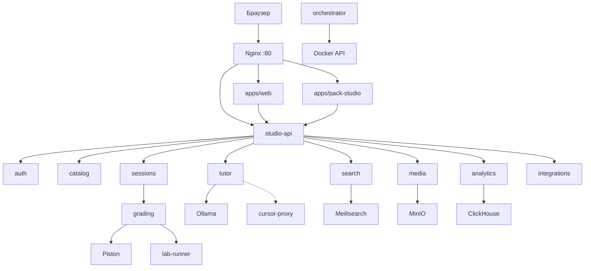
```mermaid
flowchart TB
  Browser[Браузер] --> Nginx[Nginx :80]
  Nginx --> Web[apps/web]
  Nginx --> Pack[apps/pack-studio]
  Nginx --> BFF[studio-api]
  Web --> BFF
  Pack --> BFF
  BFF --> Auth[auth]
  BFF --> Catalog[catalog]
  BFF --> Sessions[sessions]
  BFF --> Tutor[tutor]
  BFF --> Search[search]
  BFF --> Analytics[analytics]
  BFF --> Media[media]
  BFF --> Integrations[integrations]
  Sessions --> Grading[grading]
  Grading --> Piston[Piston]
  Grading --> Lab[lab-runner]
  Tutor --> Ollama[Ollama]
  Tutor -.-> Cursor[cursor-proxy]
  Search --> Meili[Meilisearch]
  Media --> MinIO[MinIO]
  Analytics --> CH[ClickHouse]
  Orchestrator[orchestrator] --> DockerAPI[Docker API]
```


### 5.2. Правила границ

1. Бизнес-логика не живёт в nginx или Traefik: там только маршруты, лимиты и заголовки.
2. Публичный HTTP для интерфейса идёт через `studio-api` (префикс `/api/` превращается во внутренний `/v1/…`).
3. Каждый сервис владеет своими таблицами. В Compose один `DATABASE_URL` указывает на общий Postgres, но JOIN «чужих» таблиц запрещён — обмен только через API и очереди.
4. Браузер не вызывает grading напрямую. Отправка ответа (`submit`) идёт в sessions, а sessions уже обращаются к grading.
5. Orchestrator — диспетчер ресурсов хоста (запуск и остановка контейнеров), а не балансировщик HTTP.
6. Подтверждение (ack) в RabbitMQ выдаётся только после успешной обработки; неустранимые ошибки уходят в DLQ.


### 5.3. Синхронное vs асинхронное

| Взаимодействие | Механизм |
|----------------|----------|
| UI ↔ studio-api | HTTP JSON |
| UI ↔ studio-api | WebSocket LSP |
| UI ↔ studio-api | SSE tutor / course stream |
| studio-api ↔ домен | HTTP `/internal/v1/…` |
| grading ↔ Piston | HTTP |
| Импорт, lab, индекс, analytics events | RabbitMQ |

<a id="section-6"></a>

## 6. Край: nginx, Traefik, маршруты

Конфигурация лежит в `deploy/nginx/nginx.conf`. Upstream-адреса в Docker-сети: `web:3000`, `pack-studio:3000`, `studio-api:8000`.

| Location | Куда | Заметки |
|----------|------|---------|
| `/api/` | `studio-api:8000` | Префикс `/api` срезается; дальше идёт `/v1/…` |
| `/` | `web:3000` | Клиентское приложение обучающегося |
| `/pack-studio/` | `pack-studio:3000` | Клиентское приложение автора пакетов |
| `/_nuxt/`, `/pack-studio/_nuxt/` | соответствующие приложения | Длинный срок кэширования статики |

В клиенте задано `NUXT_PUBLIC_API_BASE=/api` (`apps/web/nuxt.config.ts`). Браузер обращается к `/api/v1/...`. При серверном рендеринге внутри Compose можно ходить на `http://studio-api:8000` напрямую.

Traefik в Compose размечает сервисы через labels; для обычного локального входа через порт 80 достаточно nginx. Лимит тела запроса `client_max_body_size` на nginx равен 500m — это нужно для загрузки пакетов и медиа.

<a id="section-7"></a>

## 7. BFF studio-api

Сервис `services/studio-api` — единственная публичная HTTP-точка API для клиентских приложений. Своей доменной базы у него нет: он агрегирует ответы, проверяет JWT и cookie, проксирует запросы во внутренние сервисы, открывает шлюз LSP и проксирует SSE-поток тьютора.


### 7.1. Старт и проверка готовности

- В `app/main.py` собирается приложение и подключаются роутеры.
- Маршруты `GET /health`, `GET /ready` и `GET /metrics` приходят из `studio_common`.
- Uvicorn слушает порт 8000 внутри сети Compose.


### 7.2. Карта публичных префиксов и upstream

| Префикс | Upstream | Файлы |
|--------|----------|-------|
| `/v1/auth` | auth `/internal/v1/auth/…` | `app/api/auth_routes/` |
| `/v1/catalog` | catalog (+ side-effects на delete) | `app/api/catalog_routes/` |
| `/v1/media` | media | `app/api/media.py` |
| `/v1/sessions` | sessions | `app/api/session_routes/` |
| `/v1/integrations…` | integrations | `app/api/integrations_routes/` |
| `/v1/search` | search | `app/api/search.py` |
| `/v1/analytics` | analytics | `app/api/analytics_routes/` |
| `/v1/studio` validate/build | локально через contracts | `app/api/studio_routes/` |
| `/v1/studio/ai/*` | маршруты studio в tutor | `app/api/studio_routes/ai*.py` |
| `/v1/tutor` | tutor | `app/api/tutor_routes/` |
| `/v1/lsp/{language}` WS | LSP-контейнеры | `app/lsp_gateway/` |
| `/v1/editor/events` | orchestrator | lsp_gateway / editor events |


### 7.3. Важные переменные окружения BFF

- `AUTH_SERVICE_URL`, `CATALOG_SERVICE_URL`, `SESSIONS_SERVICE_URL`, `TUTOR_SERVICE_URL`, `INTEGRATIONS_SERVICE_URL`, `SEARCH_SERVICE_URL`, `ANALYTICS_SERVICE_URL`, `MEDIA_SERVICE_URL`, `ORCHESTRATOR_SERVICE_URL`.
- `JWT_SECRET`, `JWT_EXPIRE_HOURS`, `AUTH_COOKIE_NAME`, `COOKIE_SECURE`.
- `SECRETS_MASTER_KEY` — для операций, где BFF трогает шифрованные настройки.
- `LSP_PYRIGHT_HOST/PORT`, `LSP_TYPESCRIPT_*`, `LSP_GOPLS_*`, `LSP_SQLS_*`.


### 7.4. Аутентификация на краю BFF

После входа сервис auth выдаёт JWT. BFF ставит httpOnly-cookie (имя берётся из переменных окружения) и/или принимает заголовок Bearer. Во внутренние сервисы уходит идентификатор пользователя (например заголовок `X-User-Id`). Внутренние маршруты не доверяют «голым» запросам с хоста вне сети Compose.


### 7.5. Что BFF делает локально

Проверка и сборка пакета на маршрутах `/v1/studio` опираются на `packages/contracts` (разбор манифеста, сборка архива) и не обязаны ходить в отдельный «pack-service». Это сделано сознательно: контракт пакета один для Pack Studio, импорта и catalog.

<a id="section-8"></a>

## 8. Доменные сервисы по одному

Ниже — рабочая карточка каждого сервиса. Порты — договорённость Docker-сети. Точка входа везде `services/<name>/app/main.py`, если не сказано иное.


### 8.1. auth (порт 8001)

Сервис отвечает за регистрацию, вход, профиль, пользовательские настройки и шифрование учётных данных интеграций.


#### Код

- `app/domain/passwords.py`, `users.py`, `tutor_llm.py`
- `app/api/router.py`, `deps.py`, `user_views.py`


#### Переменные окружения (главное)

- `DATABASE_URL`
- `JWT_SECRET`, `JWT_EXPIRE_HOURS` (через common)
- `ALLOW_INSECURE_DEFAULTS`, `APP_ENV`


#### Фоновые процессы

Отдельного фонового процесса нет.


#### HTTP-маршруты

- `POST /internal/v1/auth/register`
- `POST …/login`
- `GET …/me`
- `PATCH …/me/settings`
- `GET …/tutor-llm/summary`

Есть Alembic (`services/auth/alembic/`).


### 8.2. catalog (порт 8002)

Сервис хранит метаданные пакетов и их версии, устанавливает пакет пользователю, принимает загрузку и регистрацию и держит файлы под `PACKS_ROOT`.


#### Код

- `app/domain/packs/`, `media/` (mirror/encode/io)
- `app/api/routes/` ingest, packs, packs_read


#### Переменные окружения (главное)

- `PACKS_ROOT`
- `PACK_MAX_UPLOAD_MB`
- `MEDIA_SERVICE_URL`


#### Фоновые процессы

Отдельного потребителя RabbitMQ нет; индексирование поиска инициируют другие сервисы.


#### HTTP-маршруты

- `GET /internal/v1/catalog/packs`
- `GET …/packs/{id}`
- `POST …/activate`
- `POST …/upload`
- `POST …/register`
- `DELETE …/packs/{id}`

Точка входа `docker-entrypoint.sh` сначала гоняет alembic, затем поднимает uvicorn от appuser после chown каталога packs.


### 8.3. sessions (порт 8003)

Сервис ведёт жизненный цикл занятия: старт сессии, текущий шаг, навигацию, ограничения перехода (gate), отправку ответа (`submit`), попытки и публикацию событий аналитики.


#### Код

- Много `app/domain/session_*.py`
- `app/api/routes/lifecycle.py`, `study.py`, `attempts.py`
- mappers step_view


#### Переменные окружения (главное)

- `CATALOG_SERVICE_URL`
- `GRADING_SERVICE_URL`
- `ANALYTICS_SERVICE_URL`
- `RABBITMQ_URL`, `ANALYTICS_EVENTS_QUEUE`
- `DATABASE_URL`


#### Фоновые процессы

Отдельного потребителя очереди нет; publisher + outbox flush в lifespan → `analytics.events` (fallback HTTP).


#### HTTP-маршруты

- `GET/POST /internal/v1/sessions`
- `GET …/{id}/step`
- `POST …/navigate`
- `POST …/submit`
- `POST …/attempts/{id}/complete`
- `POST …/abandon-by-pack-versions`

Миграции Alembic 001–005 добавляют индексы, уникальность активной сессии и outbox аналитики.


### 8.4. grading (порт 8004)

Сервис проверяет ответы типов quiz, code, sql, task и lab. Для кода использует Piston, лабораторные работы ставит в очередь, а при необходимости обращается к LLM через tutor как запасной стадии.


#### Код

- domain: check/, code/, quiz/, sql/, lab/, lab_jobs/, llm/, harness/, stepik_quiz/, piston/, pack/
- `app/api/check_route.py`, `router.py`


#### Переменные окружения (главное)

- `PISTON_URL`, `PISTON_TIMEOUT_SECONDS`
- `GRADING_JOBS_QUEUE`, `LAB_JOBS_QUEUE`
- `CATALOG/SESSIONS/AUTH/TUTOR/MEDIA_SERVICE_URL`
- `PACKS_ROOT`
- `LLM_GRADE_ENABLED`, `LLM_GRADE_MIN_CONFIDENCE`
- `SECRETS_MASTER_KEY`


#### Фоновые процессы

Фоновый обработчик читает `grading.jobs`; публикует сообщения в `lab.jobs`.


#### HTTP-маршруты

- `POST /internal/v1/grading/check`
- `POST …/lab`
- `POST …/lab/complete`

Каскад стадий берёт первый осмысленный исход (outcome); если ни одна стадия не смогла оценить ответ, результат помечается как ungradable. Подробности — в §14.


### 8.5. integrations (порт 8005)

Сервис держит реестр адаптеров внешних платформ, обслуживает discover, catalog, enroll и import, собирает pack и работает с зашифрованными учётными данными.


#### Код

- domain: cache/, jobs/, messaging/, pack/
- api routes: discover, catalog, enroll, jobs, jobs_upload


#### Переменные окружения (главное)

- `INTEGRATION_MODULES_ROOT`
- `PACKS_ROOT`
- `CATALOG_SERVICE_URL`, `AUTH_SERVICE_URL`
- `IMPORT_QUEUE`, `SEARCH_INDEX_QUEUE`
- `SECRETS_MASTER_KEY`


#### Фоновые процессы

Фоновый обработчик импорта читает очередь `import.jobs`, периодический sweeper подчищает зависшие задания, а после успешной сборки пакета публикуются сообщения в `search.index`.


#### HTTP-маршруты

- `GET /internal/v1/integrations`
- `GET …/discover`
- `GET …/{platform}/catalog`
- `POST …/enroll`
- `POST …/import`
- `GET …/jobs/{id}`

Адаптеры платформ лежат на диске в `integration_modules/<platform>/`.


### 8.6. tutor (порт 8006)

Сервис отвечает за чат и подсказки, оценку через LLM, прогрев Cursor, предложения в Pack Studio и сборку курса из статьи (в том числе потоком).


#### Код

- domain: chat/, course/, course_build/, course_from_article/, llm/, ollama/, prompt_compose/, grade/, …
- api routes learner* + studio


#### Переменные окружения (главное)

- `OLLAMA_URL`, `OLLAMA_MODEL`
- `TUTOR_DEFAULT_PROVIDER_URL`
- `TUTOR_RATE_LIMIT_PER_MINUTE`
- `AUTH_SERVICE_URL`, `SESSIONS_SERVICE_URL`
- `COURSE_BUILDS_ROOT`, `COURSE_BUILD_TTL_DAYS`
- `ARTICLE_FETCH_READER_URL`


#### Фоновые процессы

Фонового обработчика очереди RabbitMQ нет.


#### HTTP-маршруты

- `POST /internal/v1/tutor/chat`
- `GET …/hints/{step_id}`
- `POST …/grade`
- `POST …/warmup`
- `GET …/llm-status`
- `POST …/studio/course-from-article[/stream]`

Подсказки модели: `services/tutor/prompts/` — см. §19.


### 8.7. search (порт 8007)

Сервис строит индекс и выполняет гибридный поиск через Meilisearch; при необходимости подключает embeddings через Ollama.


#### Код

- domain: documents, indexing*, query, worker_handle
- api router + deps


#### Переменные окружения (главное)

- `MEILISEARCH_URL`, `MEILISEARCH_KEY`
- `SEARCH_INDEX_NAME`
- `SEARCH_INDEX_QUEUE`
- `CATALOG_SERVICE_URL`
- `OLLAMA_URL`


#### Фоновые процессы

Фоновый обработчик индексации слушает `search.index`.


#### HTTP-маршруты

- `GET /internal/v1/search`
- `POST …/unindex-pack`

Search не является источником правды по пакетам — это только индекс.


### 8.8. analytics (порт 8008)

Сервис принимает события обучения, пишет их в ClickHouse и отдаёт сводки progress, skips и attempts.


#### Код

- domain: aggregates/, queries/, events, progress_query, attempts_timeline
- api ingest + router


#### Переменные окружения (главное)

- `CLICKHOUSE_HOST/PORT/USER/PASSWORD/DATABASE`
- `ANALYTICS_EVENTS_QUEUE`
- `RABBITMQ_URL`


#### Фоновые процессы

Фоновый обработчик событий слушает `analytics.events`.


#### HTTP-маршруты

- `POST /internal/v1/analytics/events`
- `GET …/progress`
- `GET …/skips`
- `GET …/attempts`

При наличии сводок в Postgres у сервиса есть Alembic.


### 8.9. media (порт 8009)

Сервис загружает, отдаёт и удаляет объекты в MinIO; ключи объектов лежат в пространстве конкретного пользователя.


#### Код

- `app/storage.py`
- api: media_upload, router, asset_ids


#### Переменные окружения (главное)

- `MINIO_ENDPOINT`, `MINIO_ACCESS_KEY`, `MINIO_SECRET_KEY`
- `MINIO_BUCKET`
- `MINIO_SECURE`
- `MINIO_PRESIGN_TTL_SECONDS` (clamp 60–900)


#### Фоновые процессы

Фонового обработчика нет.


#### HTTP-маршруты

- `POST /internal/v1/media/upload`
- `GET/DELETE …/{asset_id}`

Объекты в хранилище лежат под префиксом `users/{user_id}/…`.


### 8.10. lab-runner (порт 8010)

Сервис исполняет Docker-лаборатории по сообщениям из очереди и вызывает обратный HTTP-запрос в grading по завершении.


#### Код

- domain: runner.py, runner_execute.py, compose_exec.py
- нет app/api — только операции готовности и фоновый обработчик


#### Переменные окружения (главное)

- `LAB_JOBS_QUEUE`
- `GRADING_SERVICE_URL`
- `LAB_RUNNER_DRY_RUN`
- `LAB_DEFAULT_TIMEOUT_SECONDS`
- docker.sock


#### Фоновые процессы

Потребитель очереди `lab.jobs` после исполнения вызывает HTTP complete на grading.


#### HTTP-маршруты

- Только `/health`, `/ready`, `/metrics`

Privileged-доступ к Docker на хосте — зона риска; см. §28.


### 8.11. orchestrator (порт 8011)

Сервис выбирает режимы ресурсов, опрашивает метрики, запускает и останавливает управляемые контейнеры и принимает события редактора.


#### Код

- domain: controller*, docker.py, policies, metrics*, redis_flags, state
- api router


#### Переменные окружения (главное)

- `ORCHESTRATOR_MODE`
- `ORCHESTRATOR_POLICIES_PATH`
- `COMPOSE_PROJECT_NAME`
- `DOCKER_SOCKET`
- `PROMETHEUS_URL`, `NODE_EXPORTER_URL`, `PYROSCOPE_URL`
- `REDIS_URL`
- `ORCHESTRATOR_SYSTEM_TOKEN`


#### Фоновые процессы

Управляющий цикл (не через RabbitMQ): периодический вызов `controller.tick`.


#### HTTP-маршруты

- `GET /internal/v1/orchestrator/status`
- `GET/PUT …/mode`
- `POST …/editor-events`

Режимы balancing, maximum и power_saving описаны в §22.


### 8.12. cursor-proxy (порт 8015)

Сервис предоставляет OpenAI-совместимый промежуточный слой над Cursor Cloud Agents: маршруты `/v1/models` и `/v1/chat/completions`.


#### Код

- domain: cursor/, openai/
- api openai_api/


#### Переменные окружения (главное)

- `CURSOR_API_BASE`
- `CURSOR_PROXY_TIMEOUT_SECONDS`
- `CURSOR_PROXY_CLEANUP_AGENTS`
- `PORT`


#### Фоновые процессы

Отдельного фонового обработчика очереди нет.


#### HTTP-маршруты

- `GET /v1/models`
- `POST /v1/chat/completions`

В настройках интерфейса base URL указывает на этот сервис, когда пользователь выбирает Cursor.


### 8.13. Сводная таблица портов

| Сервис | Порт |
|--------|------|
| auth | 8001 |
| catalog | 8002 |
| sessions | 8003 |
| grading | 8004 |
| integrations | 8005 |
| tutor | 8006 |
| search | 8007 |
| analytics | 8008 |
| media | 8009 |
| lab-runner | 8010 |
| orchestrator | 8011 |
| cursor-proxy | 8015 |
| studio-api | 8000 |

<a id="section-9"></a>

## 9. Общий Python: packages/python-common

Пакет `studio_common` подключают почти все сервисы. Сюда нельзя класть доменную логику конкретного сервиса — только поперечные утилиты, которыми пользуются несколько процессов.

| Модуль | Назначение |
|--------|------------|
| `app.py` | Фабрика FastAPI, порт сервиса |
| `ops_routes.py` | `/health`, `/ready` (+ проверка БД) |
| `db.py` | async SQLAlchemy engine/session из `DATABASE_URL` |
| `jwt_tokens.py` | выпуск/разбор access JWT |
| `internal.py` | `X-User-Id` → зависимость internal user |
| `crypto.py` / `secrets_*` | AES-GCM, merge credentials, platform secrets |
| `rabbitmq.py` | connect, declare+DLQ, publish/consume JSON |
| `logging.py` / `log_redact.py` | structlog + редакция секретов |
| `middleware.py` | `X-Request-Id` |
| `migrations.py` | `ensure_schema` / `upgrade_head` |
| `system_auth.py` | system token для межсервисных callback |
| `orchestrator_flags.py` | Redis-флаги паузы import/search |
| `otel.py` | OpenTelemetry wiring |
| `lsp_framing.py` | Content-Length framing LSP |

<a id="section-10"></a>

## 10. Контракты: packages/contracts

Любой новый публичный или экранный контракт начинают здесь, затем проводят через BFF и клиент. Идея простая: один источник схем и меньше расхождений вида «поле есть в клиенте, а в сервисе забыли».


### 10.1. `studio_contracts/api`

| Файл | Примеры моделей |
|------|-----------------|
| `api/analytics_schemas.py` | `AnalyticsEventMessage`, `ProgressResponse`, `AttemptsTimelineResponse` |
| `api/catalog_schemas.py` | `PackSummary`, `PackDetail`, `RegisterImportedPackRequest` |
| `api/session_schemas.py` | `StartSessionRequest`, `SessionState`, `StepContent`, `SubmitResult` |
| `api/grading_schemas.py` | `GradingCheckRequest/Response`, lab submit/complete |
| `api/integration_schemas.py` | `AdapterInfo`, `ImportJobResponse`, `StartImportRequest` |
| `api/tutor_schemas.py` | `TutorChatRequest`, `TutorHintResponse`, `TutorGradeRequest` |
| `api/studio_schemas.py` | validate/build, course-from-article, course build summaries |
| `api/search_schemas.py` | `SearchHit`, `SearchResponse` |
| `api/orchestrator_schemas.py` | status/mode, managed services |
| `api/editor_schemas.py` | autocomplete/LSP settings |


### 10.2. `studio_contracts/packs`

- `pack-schema-v1.json` — JSON Schema манифеста.
- `packs/pack.py` — parse/validate/build archive.
- `packs/pack_content.py`, `packs/pack_integrity.py`, `packs/step_dependencies.py`.
- `packs/manifest.py`, `packs/normalized_pack.py`.

Из корня репозитория схемы проверяют рецептами `just validate-pack`, `just validate-schemas` и `just validate-integrations`.


### 10.3. Типичное содержимое pack на диске

Пакет лежит по пути вида `data/packs/{user_id}/{pack_id}/{version}/`: рядом с `manifest.json` лежат материалы шагов. Крупные медиафайлы могут жить в MinIO, а в манифесте или контенте остаются только ссылки. Импортёр и Pack Studio обязаны сходиться в одной схеме — иначе catalog, search и интерфейс разъедутся.

<a id="section-11"></a>

## 11. Данные, тома, миграции


### 11.1. Кто чем пользуется

| Ресурс | Кто |
|--------|-----|
| PostgreSQL | Почти все серверные сервисы (общий URL) |
| Redis | Кэш и флаги; orchestrator |
| RabbitMQ | integrations, grading, lab-runner, search, analytics; sessions публикует события |
| MinIO | media |
| Meilisearch | search |
| ClickHouse | analytics |
| `data/packs` | catalog, grading, integrations, lab-runner |
| `data/course-builds` | tutor |
| Том Ollama | tutor и search |
| Пакеты Piston | grading |


### 11.2. Тома на хосте

Функция `ops_prepare_dirs` создаёт подкаталоги под `data/`. В Compose данные монтируются с хоста в `../data/postgres`, `redis`, `rabbitmq`, `packs`, `meilisearch`, `clickhouse`, `minio`, `ollama`, `piston/packages` и `course-builds`. Grafana и Prometheus часто используют именованные тома Docker. Каталог `data/` указан в `.gitignore` — его нельзя коммитить.


### 11.3. Сущности (логически)

**Auth:** таблицы `users`, `user_settings` (JSONB с URL тьютора, лимитами и LSP) и `encrypted_credentials` (AES-GCM по платформе).

**Catalog:** цепочка `packs` → `pack_versions` (manifest JSONB и disk_path) → `user_packs` (установленная версия).

**Sessions:** таблица `sessions` (фаза study|practice|assess и текущий шаг), `attempts`, phase progress и outbox аналитики.

**Grading/lab:** результаты проверок и lab_runs (см. модели сервисов).

**Analytics:** события живут в ClickHouse; сводки могут дублироваться в Postgres.

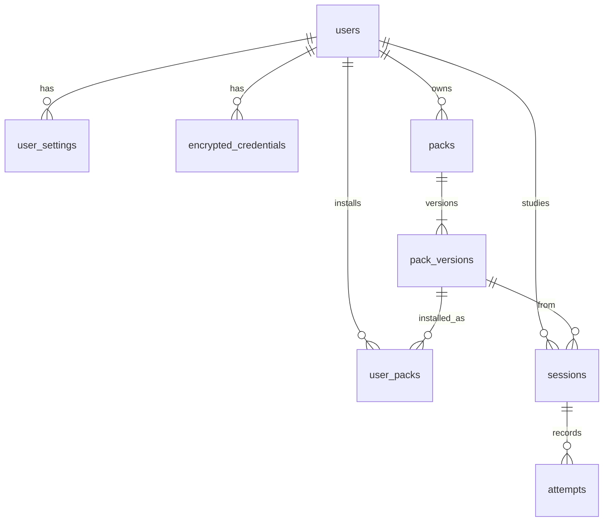
```mermaid
erDiagram
  users ||--o{ user_settings : has
  users ||--o{ encrypted_credentials : has
  users ||--o{ packs : owns
  packs ||--|{ pack_versions : versions
  users ||--o{ user_packs : installs
  pack_versions ||--o{ user_packs : installed_as
  users ||--o{ sessions : studies
  pack_versions ||--o{ sessions : from
  sessions ||--o{ attempts : records
```


### 11.4. Alembic

| Сервис | Путь |
|--------|------|
| auth | `services/auth/alembic/` |
| catalog | `services/catalog/alembic/` |
| sessions | `services/sessions/alembic/` |
| integrations | `services/integrations/alembic/` |
| grading | `services/grading/alembic/` |
| lab-runner | `services/lab-runner/alembic/` |
| analytics | `services/analytics/alembic/` |

У studio-api, tutor, search, media, orchestrator и cursor-proxy своих alembic-деревьев нет: либо нет ORM-схемы, либо состояние лежит вне Postgres.


### 11.5. Изоляция пользователя

- JWT несёт `user_id`; BFF прокидывает идентификатор во внутренние запросы.
- В MinIO объекты лежат под префиксом `users/{user_id}/`.
- Поиск и аналитика дополнительно фильтруют данные по пользователю на уровне сервиса.

<a id="section-12"></a>

## 12. Очереди RabbitMQ и события


### 12.1. Очереди

| Очередь | Producer | Consumer | Смысл |
|---------|----------|----------|-------|
| `import.jobs` | integrations API | integrations worker | Импорт курса |
| `grading.jobs` | grading | grading фоновый обработчик | Фоновая оценка |
| `lab.jobs` | grading | lab-runner | Поднять Docker-lab |
| `analytics.events` | sessions (outbox) и др. | analytics фоновый обработчик | События обучения |
| `search.index` | integrations/catalog path | search фоновый обработчик | Переиндекс |


### 12.2. Правила

1. Подтверждение (ack) отправляется только после успешной обработки сообщения.
2. Операции должны быть идемпотентными: импорт — по ключам платформы и внешнего идентификатора, аналитика — по `event_id`.
3. Неустранимые ошибки (битый JSON, нарушение схемы) уходят в DLQ с ack; временные ошибки повторяют с отступом (backoff).
4. В сообщении передают идентификаторы и пути, а не многомегабайтные двоичные вложения.
5. Prefetch ограничивает число неподтверждённых сообщений на одном потребителе.


### 12.3. Диаграмма

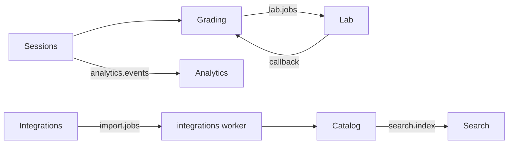
```mermaid
flowchart LR
  Sessions --> Grading
  Grading -->|lab.jobs| Lab
  Lab -->|callback| Grading
  Sessions -->|analytics.events| Analytics
  Integrations -->|import.jobs| IntW[integrations worker]
  IntW --> Catalog
  Catalog -->|search.index| Search
```

<a id="section-13"></a>

## 13. Потоки: сессия, submit, lab, импорт, tutor


### 13.1. Создание сессии

Клиент вызывает `useSessions().startSession`, запрос уходит как `POST /v1/sessions` через BFF в `sessions.start_session` / `create_new_session`. Если у пользователя уже есть активная сессия на этот pack, обычно возвращают её (дубликаты могут помечаться как abandoned). Иначе catalog отдаёт нужную версию пакета, берётся первая позиция манифеста, создаются записи Session и PhaseProgress.

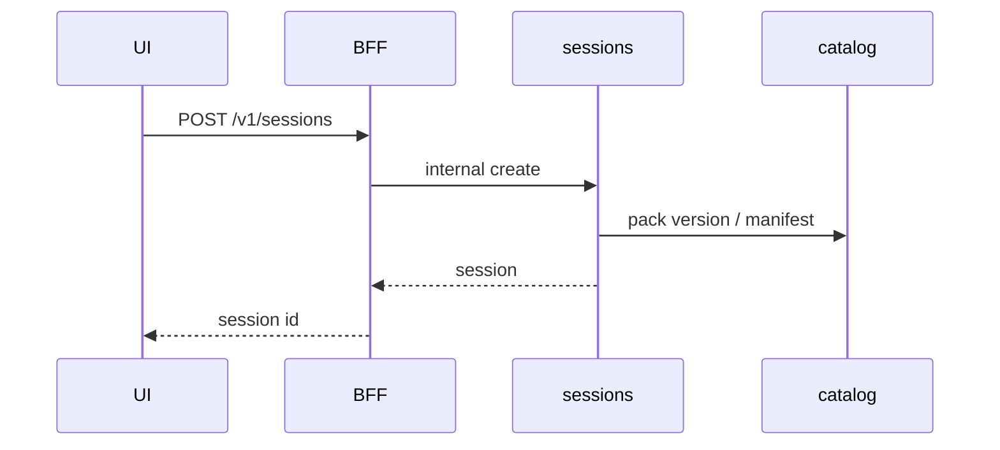
```mermaid
sequenceDiagram
  participant UI
  participant BFF
  participant S as sessions
  participant C as catalog
  UI->>BFF: POST /v1/sessions
  BFF->>S: internal create
  S->>C: pack version / manifest
  S-->>BFF: session
  BFF-->>UI: session id
```


### 13.2. Навигация и gate

Логика лежит в `session_navigation.py`, `session_gate_leave.py`, `session_gating.py` и API `routes/study.py`.

Правила в упрощённом виде такие. Фаза assess без пройденной practice может быть закрыта. Если в пакете включено `require_pass_to_advance`, нельзя уйти вперёд с шагов quiz, code, lab или task без успешной сдачи — клиент обычно получает 403. Исчерпанный лимит попыток в assess даёт 409. На клиенте это отражается через `canAdvanceToNext` и сообщения вроде `session.passToContinue`.


### 13.3. Отправка ответа обычного шага

Клиент собирает тело запроса по типу шага (выбор в quiz, исходник code, текст task) через `useSessionGradeSubmit`, отправляет `POST …/submit`, sessions вызывает `submit_step`, затем `call_grading` и `apply_grading_result`, после чего публикуется событие аналитики.

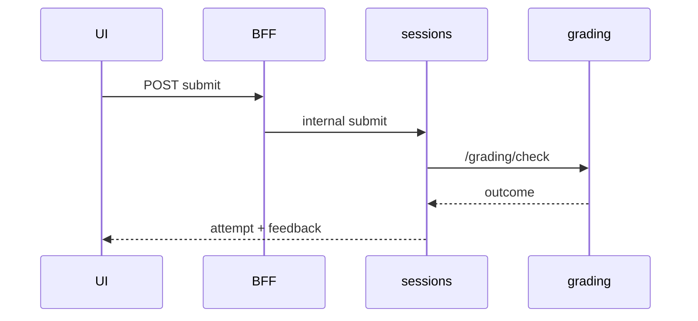
```mermaid
sequenceDiagram
  participant UI
  participant BFF
  participant S as sessions
  participant G as grading
  UI->>BFF: POST submit
  BFF->>S: internal submit
  S->>G: /grading/check
  G-->>S: outcome
  S-->>UI: attempt + feedback
```


### 13.4. Лабораторная работа

Лабораторная работа может идти синхронным LLM-путём (решение принимает sessions через `lab_should_sync_llm`) или асинхронно: sessions вызывает grading `/lab`, тот ставит задачу в `lab.jobs`, lab-runner выполняет `compose_exec`, затем приходит обратный вызов `/grading/lab/complete` и sessions закрывает попытку через `/attempts/{id}/complete`. Панель `SessionLabPanel` опрашивает attempt, пока статус остаётся pending.


### 13.5. Импорт курса

Клиент вызывает `/v1/integrations/…/import`. Сервис integrations создаёт задание и кладёт его в `import.jobs`. Фоновый обработчик вызывает адаптер (`import_course`), регистрирует пакет в catalog и публикует сообщение в `search.index`. Статус задания клиент читает по маршруту `jobs/{id}`.


### 13.6. Tutor

Чат и подсказки идут через `/v1/tutor/…`; где нужен поток, используется SSE. Прогрев Cursor — отдельный вызов со страницы сессии. Сборка курса из статьи идёт через маршруты studio AI, а прогресс на экране показывают `components/course/CourseBuildProgress.vue` и `utils/studio/courseStream.ts`. Успешный поток заканчивается сообщением `Course ready`; диагностические предупреждения остаются в логах и `quality_audit`, а не выводятся отдельным блоком на экране завершения.


### 13.7. Фазы занятия

Логические фазы занятия идут в порядке `study` → `practice` → `assess`. Тип шага в пакете может быть theory, video, quiz, code, lab или task. Страница `sessions/[id].vue` переключает панели по значению `step.kind`.

<a id="section-14"></a>

## 14. Проверка ответов (grading)

Входная точка — `services/grading/app/domain/check/service.py` и функция `check_submission(kind)`. Каскад стадий описан в `check/cascade.py`: `run_chain` берёт первый осмысленный outcome, отличный от `None`, иначе результат считается ungradable.


### 14.1. Quiz

`domain/quiz/grade.py` + `quiz/stages.py`: локальный answer key (`choice_index == step.answer`) → Stepik choice (`stepik_quiz/grade_choice.py`) → LLM → ungradable.


### 14.2. Code

`domain/code/grade.py`: наличие source → Stepik code → SQL local (если похоже на SQL) → local harness через Piston (`code/harness.py`, `harness/resolve.py`) → LLM → ungradable.


### 14.3. SQL

`domain/sql/grade.py` `stage_sql_local`: seed + query через Piston `language=sql`. Без oracle результат может не считаться финальным pass — цепочка идёт дальше.


### 14.4. Task (свободный текст)

`domain/check/task.py`: извлечь текст → LLM grade → ungradable.


### 14.5. LLM fallback

`domain/llm/grade.py` ходит в tutor `/internal/v1/tutor/grade`. Включается флагами `LLM_GRADE_ENABLED` и порогом `LLM_GRADE_MIN_CONFIDENCE`.


### 14.6. Stepik как внешний оракул

Пакет `domain/stepik_quiz/`: detect, auth, http, poll. Нужны расшифрованные credentials пользователя (SECRETS_MASTER_KEY на пути).


### 14.7. Piston

Контейнер `piston` в Compose, privileged. Grading шлёт HTTP на `PISTON_URL`. Таймауты — `PISTON_TIMEOUT_SECONDS`. Пакеты языков на томе `data/piston/packages`; удобная установка: `just piston-install`.

<a id="section-15"></a>

## 15. Клиентское приложение (`apps/web`)


### 15.1. Маршруты страниц

| Маршрут | Файл | Поведение |
|---------|------|-----------|
| `/` | `pages/index.vue` | Редирект на `/catalog` |
| `/search` | `pages/search.vue` | Редирект на `/catalog` |
| `/auth` | `pages/auth.vue` | Редирект на `/login` |
| `/register` | `pages/register.vue` | Редирект на `/login?mode=register` |
| `/login` | `pages/login.vue` | Login/register в одном UI |
| `/catalog` | `pages/catalog/index.vue` | Библиотека + external discover/import + create course |
| `/catalog/[id]` | `pages/catalog/[id].vue` | Карточка курса, старт сессии |
| `/sessions/[id]` | `pages/sessions/[id].vue` | Занятие |
| `/analytics` | `pages/analytics.vue` | Progress/skips/attempts |
| `/settings` | `pages/settings.vue` | Интеграции, tutor LLM, editor |


### 15.2. Страница занятия — анатомия

Экран состоит из трёх колонок: оглавление слева, основная область по центру и панель тьютора справа (если она включена).

Центральная область переключает `SessionStudyBody`, `SessionVideoPlayer`, `SessionCodeEditor`, `SessionLabPanel`, `SessionQuiz` или текстовое поле для task. В панели действий есть Prev, Skip study, Submit|Run и Next (`complete_current`).


### 15.3. Composables

Composables разложены по доменам: `api/useApi`, `auth/useAuth`, `session/useSessions`, `session/useSessionGradeSubmit`, `catalog/useCatalog`, `catalog/useCatalogDownloads`, `studio/useStudio`, `tutor/useTutor`, `settings/useSettingsPage` и соседние модули. Общие функции страницы и уведомлений лежат в `composables/app/`.


### 15.4. utils по доменам

`apps/web/utils/` также разбит по доменам. В крупных областях есть следующий уровень: каталог делит представление курсов, pack и outline, настройки — credentials, integrations, state и tutor. Study sanitize: `sanitizeHtml.ts` → исправление mojibake, удаление опасного, таблицы, markdown/mermaid → `purifyStudyHtml.ts` (белый список DOMPurify).


### 15.5. Стили и i18n

CSS: `assets/css/main.css` подключает `foundation/`, `domains/` и `visual/`. Локали: `i18n/locales/en.json`, `ru.json`.


### 15.6. Режим разработки интерфейса

- `just web-dev` поднимает горячую перезагрузку в Docker на http://localhost.
- `just web-local` запускает Nuxt на порту 3000, а API остаётся в Docker.
- Не запускайте полный `just up` на каждое мелкое изменение интерфейса.

<a id="section-16"></a>

## 16. Pack Studio

Приложение лежит в `apps/pack-studio` и открывается по публичному пути `/pack-studio/`. На `index.vue` автор редактирует manifest JSON, проверяет пакет, собирает zip, загружает его, запрашивает подсказки и запускает поток «статья → курс»; вход — на `login.vue`. Из composables используются `useApi`, `useAuth`, `useCatalog` и `useStudio`. Прогресс сборки показывает `CourseBuildProgress.vue`, а подписи стадий локализует `utils/studio/localizeProgress.ts`.

<a id="section-17"></a>

## 17. Снимки интерфейса

Ниже — кадры **живого** интерфейса Nuxt/Vue из `apps/web` и `apps/pack-studio` на поднятом стеке. Это не макет из [`PREVIEW.md`](PREVIEW.md). В каталоге документации остаются PNG автоматической проходки и WebP с актуальными русскими экранами.

Автоматическая проходка снята в английской локали, а новые WebP — в русской. Названия элементов в тексте даны так, как они видны на соответствующем кадре.

Перед сохранением кадра скрипт `scripts/docs/capture-ui.py` маскирует почту и инициалы в боковой панели, очищает поля паролей, токенов и секретов клиента и подменяет пользовательские названия курсов и тем на нейтральные (`Example course …`, `Example step …`). Для кадров, добавленных вручную, действует то же правило: не публикуйте пароли, токены, ключи и почту.

### 17.1. Вход и регистрация

**Экран входа** (`/login`)

Точка входа в учебное приложение: без сессии каталог, занятия и настройки недоступны. Пользователь вводит **Email** и **Password** (Пароль); после **SIGN IN** (Войти) сервис auth выдаёт токен, клиент сохраняет сессию и открывает каталог. Подзаголовок на кадре — «SIGN IN TO ACCESS YOUR COURSES AND SESSIONS» (в русской локали: «Войдите, чтобы открыть курсы и сессии.»). Ссылка **NEED AN ACCOUNT?** (Нет аккаунта?) ведёт к регистрации. На снимке поля пустые — пароль в документацию не попадает.

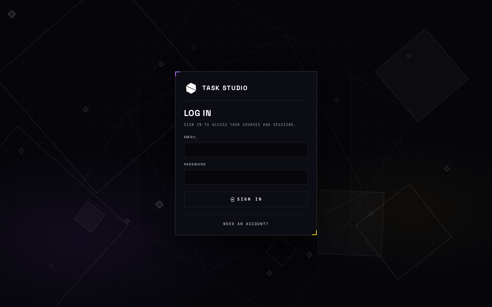

**Экран регистрации** (`/login?mode=register`)

Создание новой учётки через сервис auth: те же **Email** / **Password** (Пароль), кнопка создания аккаунта (**Создать аккаунт** в русской локали). После успеха пользователь сразу входит и может наполнять библиотеку. Подзаголовок в русской локали: «Создайте аккаунт, чтобы начать обучение.» Ссылка «Уже есть аккаунт?» возвращает на вход. На снимке нет заполненных секретов.

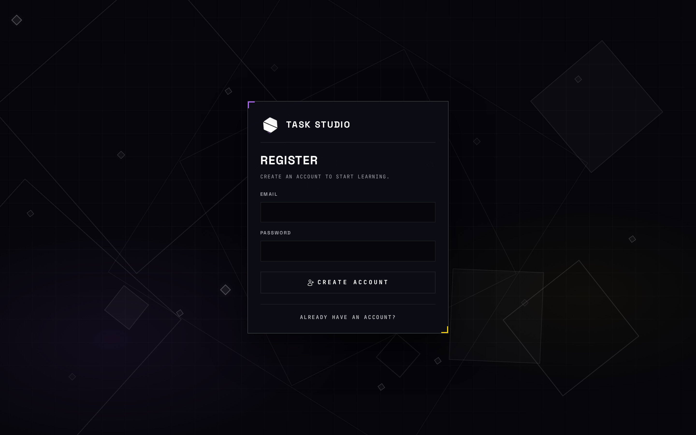

### 17.2. Каталог: библиотека, поиск и сборка курса

**Моя библиотека** (`/catalog`)

Домашний экран после входа: здесь лежат **уже скачанные или собранные локально** учебные пакеты (паки), с которыми можно учиться офлайн. Вкладка **MY LIBRARY** (Моя библиотека) показывает счётчик курсов; фильтр **SOURCES** (Источники) сужает список по происхождению — **ALL SOURCES** (Все источники), **LOCAL** (Локальные / «Созданные и собранные здесь»), **STEPIK** и др. («Скачано в библиотеку»).

Каждая карточка — один пак в каталоге: метки типа контента (**THEORY** / Теория, **QUESTIONS** / Вопросы, **VIDEO** / Видео, **TASKS** / Задания), прогресс прохождения в процентах (хранится в сессиях и отдаётся аналитикой), **CONTINUE** (Продолжить) — открыть или возобновить сессию, корзина — удалить пак из локальной библиотеки (не с внешней платформы). Автоматическая серия подменяет заголовки на `Example course N`; актуальный WebP показывает примеры курсов из рабочей установки. Слева в навигации: **Catalog** (Каталог), **Analytics** (Аналитика), **Settings** (Настройки).

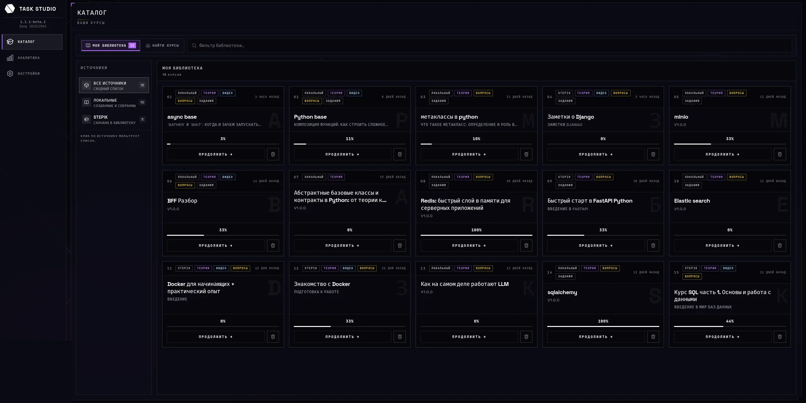

**Поиск внешних курсов** (`/catalog?tab=discover`)

Вкладка **FIND COURSES** (Найти курсы): не ваша библиотека, а **удалённые каталоги** Exercism, freeCodeCamp, Stepik. Цель — найти курс на платформе и **DOWNLOAD** (Скачать) его в локальную библиотеку; дальше он доступен офлайн (подзаголовок в русской локали: «Скачайте в библиотеку — дальше курс доступен офлайн.»).

Рельс **SOURCES** (Источники) показывает, сколько курсов отдаёт каждый адаптер и статус (**READY** / Готово; жёлтая/красная точка — нужна авторизация в настройках). Строка поиска и теги тем фильтруют выдачу. Кнопка **CREATE FROM ARTICLES** (Создать из статей) открывает мастер локальной сборки курса из URL/`.md` без импорта с платформы. Публичные каталоги Exercism/freeCodeCamp работают без ключей; Stepik без OAuth в настройках отдаст пусто или ошибку «нужен вход».

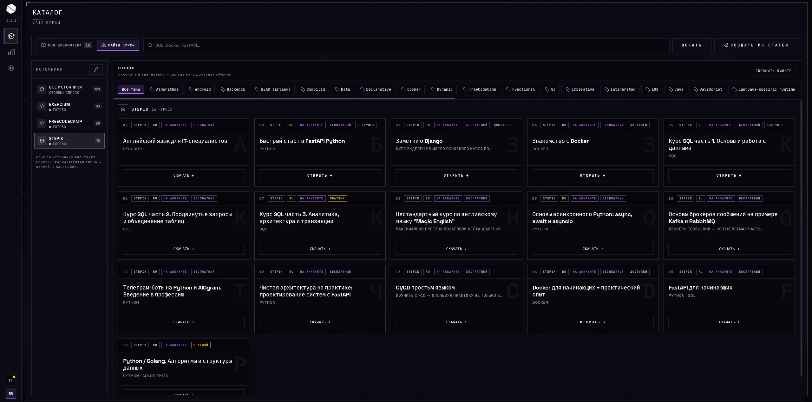

**Форма «создать курс из статей»**

Окно **AI COURSE AUTHOR** / **ARTICLES → LOCAL COURSE** (ИИ-автор курса / Статьи → локальный курс). Это не импорт Stepik, а **генерация локального пака** через studio и tutor: из одной или нескольких статей получается программа из теории, вопросов и заданий по коду.

Что заполняется и уходит в цепочку сборки:

| Поле на кадре | В русской локали | Зачем |
|---|---|---|
| **COURSE TITLE** | Название курса | Заголовок будущего пака в библиотеке |
| **AUDIENCE** | Аудитория | Уровень/профиль читателя для тона ИИ |
| **LOCALE** | Язык | Язык генерируемого контента (`ru` / `en` …) |
| URL / **ADD** (Добавить), перетаскивание `.md` | Ссылки на статьи / Выбрать .md | Источники текста (в интерфейсе есть лимит числа источников) |
| Заголовок и тело источника | — | Текст, по которому строится программа |

**NEXT** (Далее) запускает следующие шаги мастера/сборки, когда есть название и непустой источник. Результат после успешной генерации появляется в **Моей библиотеке** как локальный пак; незавершённую сборку можно возобновить оттуда. На снимке форма пустая — в docs нет чужих URL и черновиков.

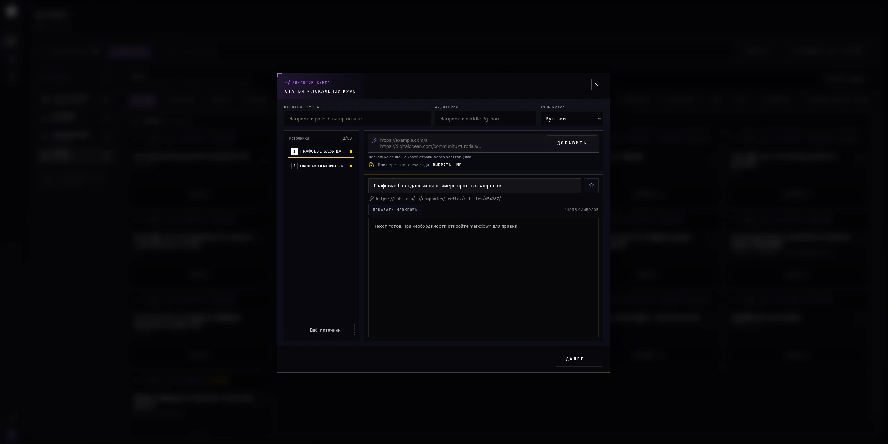

На следующем шаге автор выбирает состав курса, число вопросов и практических заданий на тему и глубину изложения. Эти значения определяют бюджет глав и ожидаемый объём проверочных материалов.

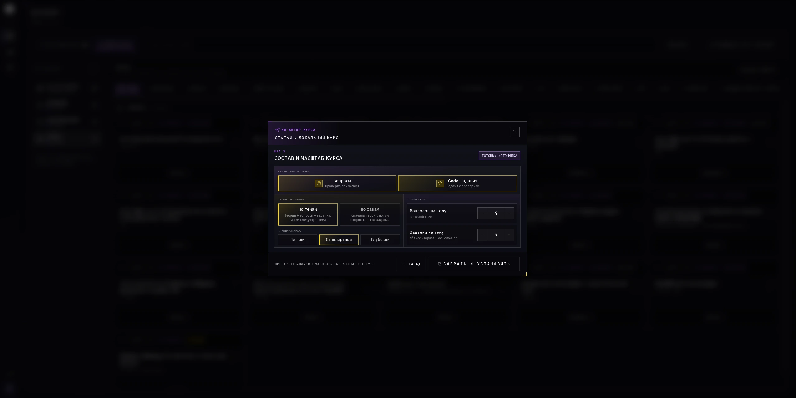

Во время сборки окно показывает текущую стадию и процент выполнения. После успешной проверки финальный статус меняется на **Курс готов**; предупреждения сборки нужно искать в логах и аудите качества.

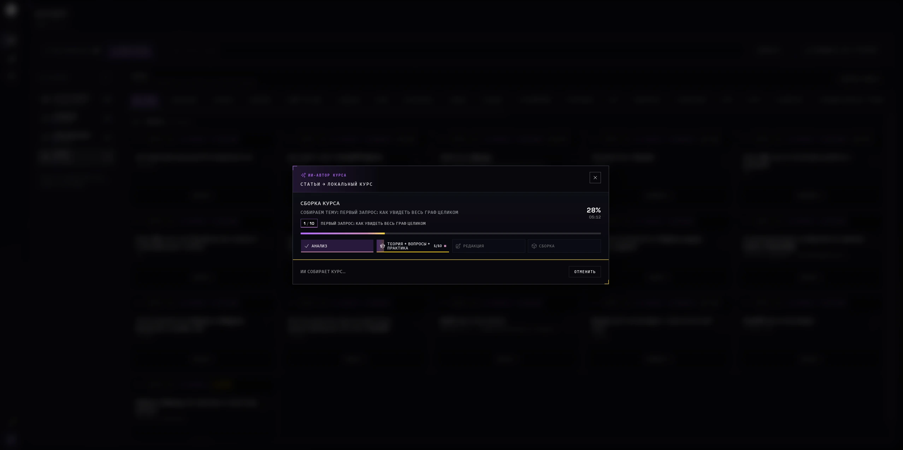

**Карточка курса** (`/catalog/{id}`)

Карточка **уже лежащего в библиотеке** пака: что внутри, прежде чем учиться. В шапке — идентификатор/версия пака; **REMOVE** (Удалить) стирает локальную копию; **BACK TO CATALOG** (Назад в каталог) возвращает к списку.

Блок программы курса (**Программа курса** в русской локали): краткое описание, метки источника (**LOCAL** / Локальный и т.п.), число тем и шагов. **START SESSION** (Начать сессию) создаёт или продолжает запись в сервисе sessions: текущий шаг, прогресс по темам, ответы. Ниже — оглавление модулей и уроков в форме, близкой к Stepik (иконки **T**/Теория, **Q**/Вопрос, **C**/Задания).

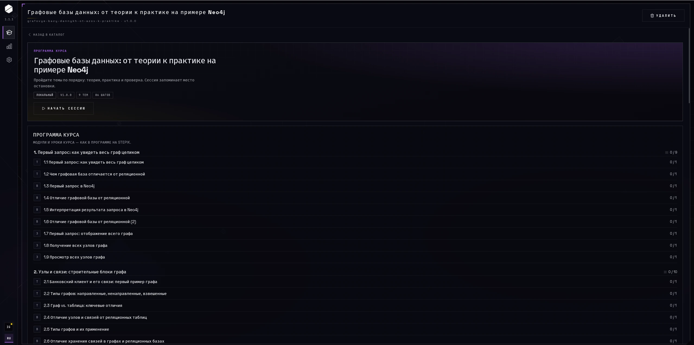

### 17.3. Занятие и аналитика

**Экран сессии** (`/sessions/{id}`)

Рабочее место обучения по одному паку. Слева **COURSE PROGRAM** (Программа курса) — дерево тем и шагов с прогрессом; клик меняет текущий шаг в сессии. Центр — содержимое шага: тип (**THEORY** / Теория, **QUIZ** / Вопрос, **CODE** / Задания и т.д.), текст, медиа или редактор кода; ответ уходит на проверку в сервис grading. Внизу — навигация по шагам (см. следующий кадр). Справа **ASSISTANT AI CHAT** (Помощник / ИИ чат): вопросы по текущему шагу уходят в tutor с контекстом курса; история чата привязана к сессии и шагу, ключи модели берутся из настроек, не с этого экрана.

Фаза в шапке (**STUDY** и др.) в русской локали: Теория / Задание / Вопрос. Прогресс и попытки пишутся в sessions и дальше попадают в аналитику.

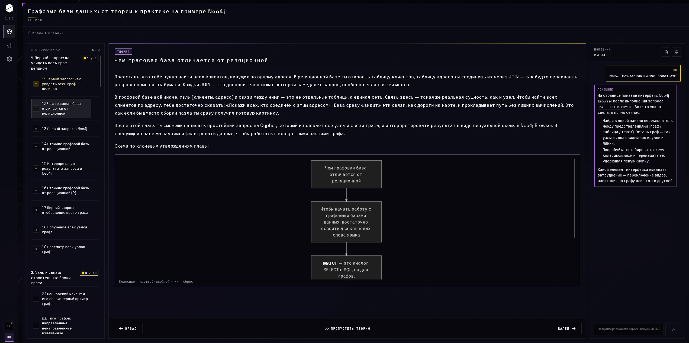

**Область действий на шаге**

Крупный кадр нижней панели шага — не отдельный экран, а те же действия сессии: **BACK** (Назад) — предыдущий шаг; **SKIP STUDY** (Пропустить теорию) — уйти с теоретической фазы без полного чтения (учитывается в аналитике пропусков); **NEXT** (Далее) — следующий шаг, когда шаг пройден или его можно пропустить. На фазах задания и вопроса вместо «далее» часто нужны **Запустить и проверить** / **Отправить ответ** — они сохраняют попытку и результат проверки.


**Вопрос и задание с кодом**

Вопрос показывает варианты ответа в центральной области и отправляет выбранный вариант через sessions в grading. На практическом шаге рядом с условием открывается редактор со стартовым шаблоном; кнопка **Запустить и проверить** создаёт попытку и возвращает результат проверки.

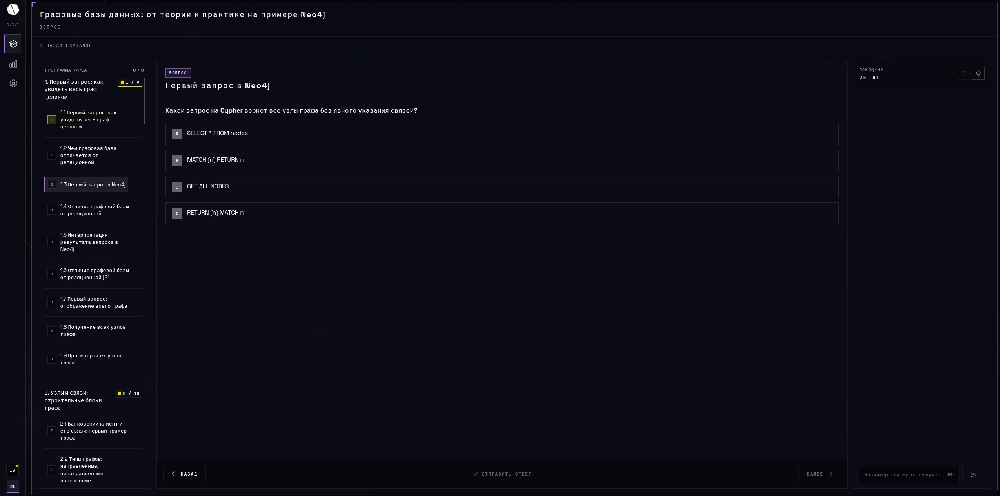

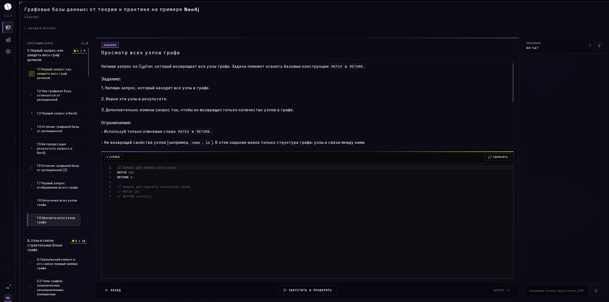

**Аналитика обучения** (`/analytics`)

Сводка **по попыткам и сессиям текущего пользователя** (не по чужим курсам и не по секретам интеграций). Откуда данные: события и агрегаты из sessions в сервис analytics (хранилище аналитики по плану сервиса).

| Блок на кадре | В русской локали | Что означает |
|---|---|---|
| **PASS RATE** | Доля зачётов | Доля успешных проверенных ответов |
| **STEPS COMPLETED** | Пройдено шагов | Сколько шагов закрыто за период |
| **DAY STREAK** | Серия дней | Подряд дней с активностью |
| **30-DAY RHYTHM** | Ритм за 30 дней | График сессий и шагов по дням |
| **PASSES VS MISSES** | Зачёты vs ошибки | Кольцо качества попыток |
| **WHERE YOU FAIL MOST** | Где чаще провал | Темы/курсы с наибольшим числом непройденных попыток |
| **RECENT ATTEMPTS** | Последние попытки | Лента с статусом **PASSED** (Зачёт) / не зачёт |

Автоматическая серия заменяет названия курсов и тем на `Example course …` / `TOPIC: EXAMPLE-…`; WebP показывает данные рабочей установки. Цифры на карточках — пример, не «эталон» для всех установок.

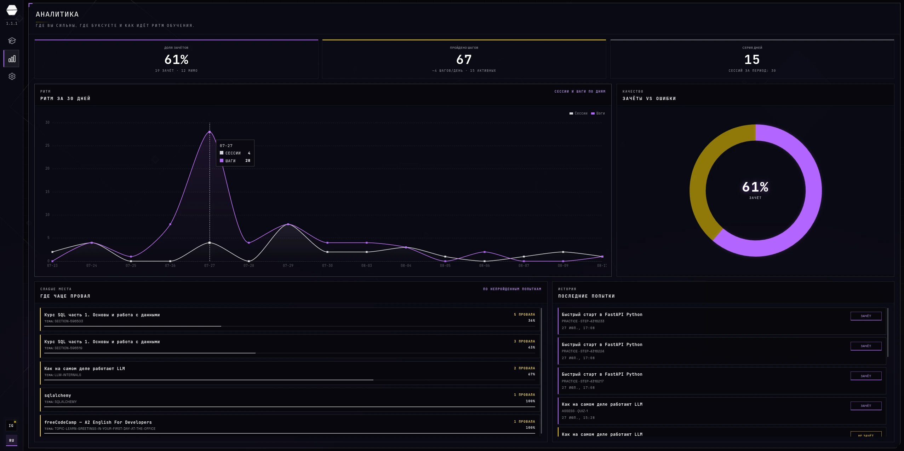

### 17.4. Настройки: интеграции, ИИ и редактор

**Общий экран настроек** (`/settings`)

Здесь хранятся **предпочтения рабочей области и доступы к внешним платформам**, не сами курсы. Левая колонка **PLATFORMS / COURSE INTEGRATIONS** (Платформы / Интеграции курсов): сводка подключений («N из M с учётками · K публичных»), карточки Exercism и freeCodeCamp как **PUBLIC CATALOG** (Публичный каталог — учётки не нужны), Stepik с **CREDENTIALS SAVED** (Учётные данные сохранены), когда OAuth уже записан. **BROWSE** / каталог (Каталог) открывает внешний сайт платформы.

Правая колонка **WORKSPACE / PREFERENCES** (Рабочая область / Параметры): раскрывающиеся блоки источников курсов и **TOOLS** (Инструменты) — **AI AGENT** (ИИ-агент) и **EDITOR** (Редактор). **SAVE CHANGES** (Сохранить изменения) / **CANCEL** (Отмена) записывают настройки пользователя на сервер. Без сохранённых ключей Stepik вкладка «Найти курсы» для Stepik не заработает полноценно.

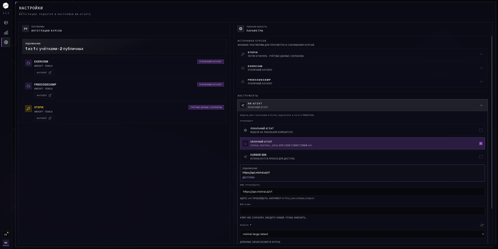

**Форма учётных данных интеграции**

Раскрытый блок платформы (на кадре — Stepik). Сюда вводят то, что сервис integrations использует для OAuth и входа при поиске и скачивании:

- **Client ID** — идентификатор OAuth-приложения на stepik.org;
- **Client Secret** (Секрет клиента) — секрет приложения; на сервере хранится скрыто, на снимке поле пустое, подсказка как в локали: «Секрет уже сохранён. Введите новый, чтобы заменить.»

Могут быть и другие поля в зависимости от способа входа (логин и пароль, API-токен) — см. `settings.integrations.fields` в локалях. Сохранение обновляет статус «Учётные данные сохранены» и разблокирует импорт частных курсов. Публичные Exercism и freeCodeCamp эту форму не требуют.

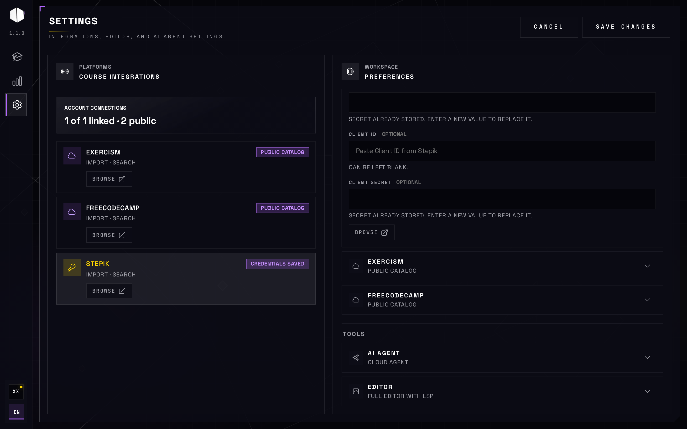

**Параметры ИИ-агента**

Блок **AI AGENT** (ИИ-агент): куда ходит tutor при генерации курсов, подсказках и чате в сессии. Выбор провайдера:

| На кадре | В русской локали | Смысл |
|---|---|---|
| **Local Agent** | Локальный агент | Модели на этой машине (например Ollama) |
| **Cloud Agent** | Облачный агент | OpenAI, Mistral, Groq или свой совместимый API |
| **Cursor SDK** | Cursor SDK | Доступ через прокси Cursor |

Ниже **CONNECTION** (Подключение): URL провайдера, API-ключ (на снимке пустой; «Ключ уже сохранён…»), модель, дневной лимит. Эти значения сохраняются в настройках пользователя и **не** показываются в каталоге/аналитике.

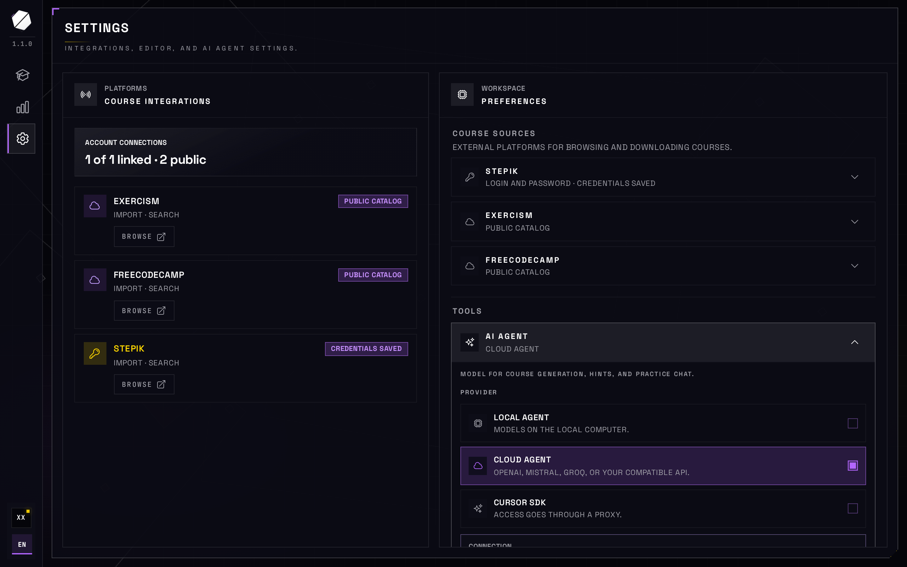

**Параметры редактора / LSP**

Блок **EDITOR** (Редактор): как выглядит редактор кода на шагах задания и вопроса.

- **FULL EDITOR WITH LSP** (Полный редактор с LSP) — language server, диагностика и автодополнение;
- **SYNTAX HIGHLIGHTING ONLY** (Только подсветка синтаксиса) — облегчённый режим без language server;
- **ENABLE AUTOCOMPLETE** (Включить автодополнение) и переключатели по языкам (Python, JavaScript, Go, SQL).

Это только вид редактора в сессии; проверка решений по-прежнему идёт через grading, а не через LSP.

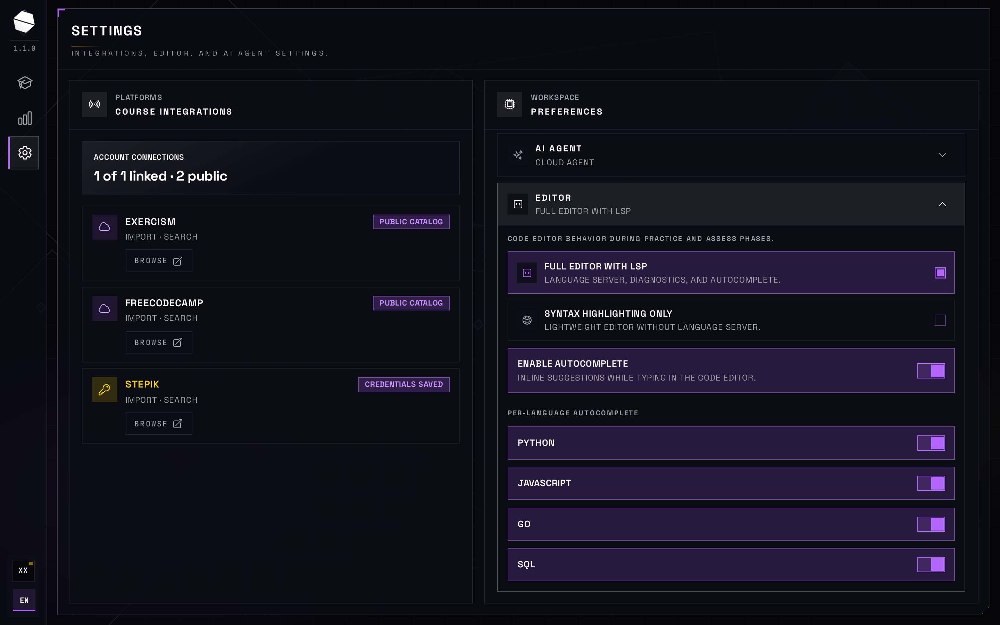

### 17.5. Pack Studio

**Вход в Pack Studio** (`/pack-studio/login`)

Отдельное мини-приложение автора паков (не учебный каталог). Та же учётка через auth: **Email**, **Password** (Пароль), **Войти**. Без входа нельзя проверить манифест и загрузить пак в каталог от имени пользователя. На снимке поля пустые.

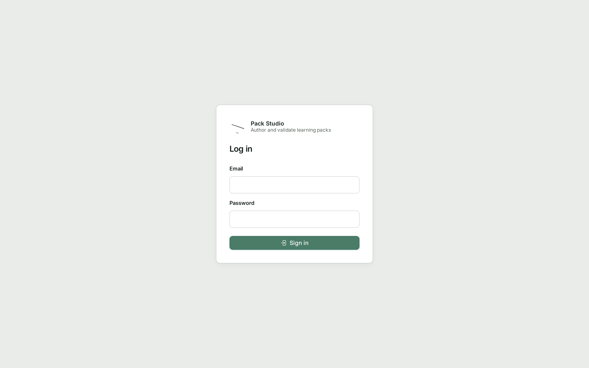

**Редактор пакета**

Рабочее место автора: собрать `.studio-pack` и положить его в каталог. Три зоны (подписи из русской локали Pack Studio):

1. **Статья → курс** (на английском кадре: Article → Course): название курса, аудитория, язык, файл `.md` или текст статьи → **Собрать курс через ИИ**. На выходе — заполненный манифест (теория, вопросы, задания по коду) в соседней панели.
2. **Manifest JSON**: ручное редактирование контракта пака (`id`, `version`, `title`, `topics`, `phases`, `steps`…). Это то, что реально уйдёт в сервис catalog после сборки.
3. **ИИ-подсказка** (на кадре: AI suggest): короткий запрос «Опишите нужный шаг» — фрагмент для вставки в манифест, без полной пересборки курса.

В шапке — маскированная почта и **Log out** (Выйти).

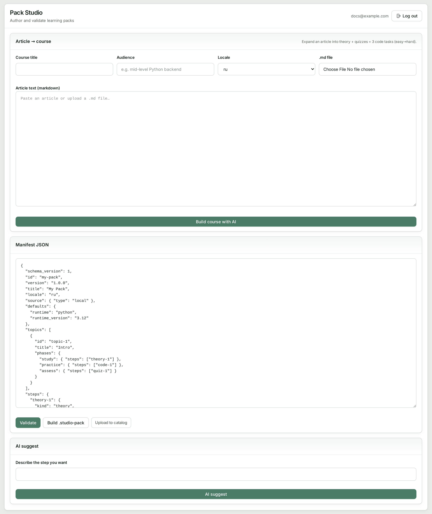

**Кнопки действий над манифестом**

Порядок работы с уже готовым JSON:

1. **Validate** (Проверить) — проверка контракта studio без записи в каталог; показывает ошибки манифеста.
2. **Build .studio-pack** (Собрать `.studio-pack`) — упаковка файла пака.
3. **Upload to catalog** (Загрузить в каталог) — отправка пака в сервис catalog; после успеха курс появляется в **Моей библиотеке** у этого пользователя (как локальный или загруженный пак).

Кнопка загрузки обычно неактивна, пока нет успешной проверки и сборки. На docs-кадре секреты и чужие манифесты не показываем — в редакторе виден нейтральный пример JSON.

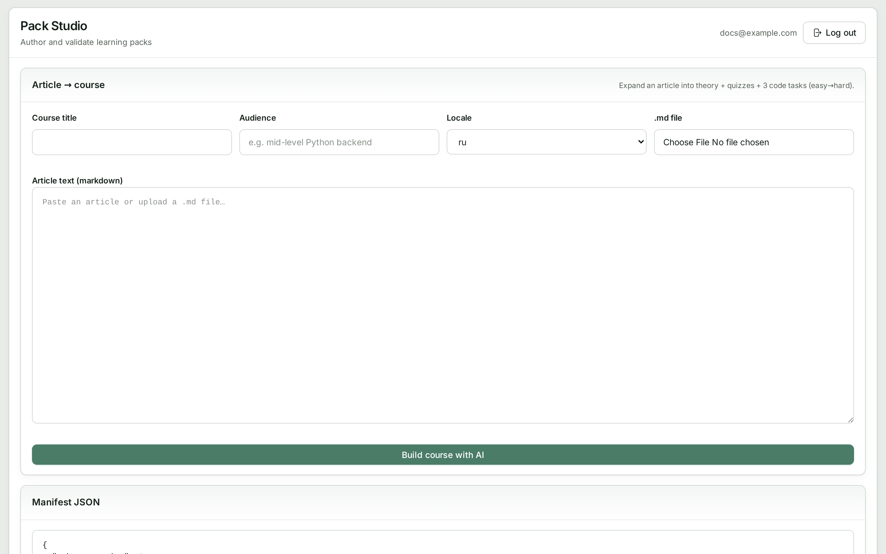

<a id="section-18"></a>

## 18. Интеграции и runtime_modules


### 18.1. Контракт адаптера

Типичный адаптер умеет `health`, `list_catalog`, `search_remote` и `import_course` с результатом `(pack, report)`. У каждой платформы есть каталог `integration_modules/<id>/` с `importer.py`, `integration.json` и наборами fixtures.


### 18.2. Stepik

1. Аутентификация идёт через OAuth или token, либо через fixture в тестах.
2. В живом импорте курс обходится сверху вниз: course → sections → units → lessons → steps (с лимитом глубины или числа шагов).
3. Шаг платформы преобразуется в theory, code, quiz или video и получает фазу study, practice или assess.
4. На выходе собирается pack с `platform=stepik` и отчёт (full, partial или truncated).
5. Запись на курс (enroll) выполняется отдельно через API enrollments.


### 18.3. freeCodeCamp

1. Каталог читается через GraphQL-поле `curriculum.superblocks`.
2. Импорт идёт по цепочке superblock → blocks → challenges.
3. Page-data подгружается параллельно.
4. Challenge преобразуется в asserts и starter; отдельно предупреждаем про проверки, завязанные на DOM или браузер.


### 18.4. Exercism

1. Каталог берётся из `/tracks`, затем читаются упражнения выбранного трека.
2. Файлы instructions, template и tests подтягиваются с GitHub параллельно.
3. Intro идёт в фазу study, код — в practice; на один трек обычно один topic.


### 18.5. runtime_modules

По `runtime_modules/README.md` сервисы пока не считают этот каталог единственным источником истины. Уже есть каркасы `python/`, `javascript/`, `go/`, `sql/` и `docker-lab/templates/minimal/`.

<a id="section-19"></a>

## 19. ИИ: tutor, Ollama, cursor-proxy


### 19.1. Подсказки модели tutor

```
services/tutor/prompts/
  shared/     core.md, chat_context.md
  roles/      study_chat, practice_chat, contextual_hints, pack_studio,
              grade_check, course_from_article, article_from_url
  skills/     socratic, kind-*, grade-*, domain-*, …
  provider/   ollama-quality.md, ollama-polish.md, external.md
```

Сборка системной подсказки модели — `app.domain.prompts`. Контуры ролей не должны смешивать историю чата как попало (см. `ROLES.md` в каталоге prompts).


### 19.2. Ollama

В Compose поднимается контейнер Ollama с томом `data/ollama`. Модель по умолчанию берётся из `OLLAMA_MODEL` (часто `qwen2.5:3b`). Сценарий `studio` умеет скачивать модель (pull) и подключать GPU-профиль из `deploy/docker-compose.ollama-gpu.yml`, если он доступен.


### 19.3. Внешний LLM и Cursor

Если `TUTOR_DEFAULT_PROVIDER_URL` пуст, тьютор ходит в Ollama. Иначе используется указанный OpenAI-совместимый base URL. Для Cursor в настройках интерфейса указывают URL `cursor-proxy`, который дальше говорит с Cloud Agents. Это нельзя путать с тьютором обучающегося на шаге занятия.


### 19.4. Ограничение роли

Тьютор в study/practice не заменяет grading как источник истины для «сдал/не сдал», хотя LLM-grade может быть стадией каскада при включённых флагах.


### 19.5. Стратегии курса

Стратегии курса живут в `services/tutor/prompts/strategies/`; программные ограничения сборки — в доменах `course_from_article` и `course_strategies`.

<a id="section-20"></a>

## 20. Установка пользователя и сценарии запуска


### 20.1. Первичная подготовка ≠ полный стек

Скрипты `scripts/install.sh` и `install.ps1` делают одноразовую первичную подготовку: скачивают дерево в `~/task-studio` (или `TASK_STUDIO_DIR`), ставят ярлыки и запускают сценарий `studio`. Полный Docker-стек они **сами** не поднимают.

Скрипты `scripts/studio.sh`, `studio.ps1` и `studio.cmd` — это консоль пользователя: меню зависит от состояния `missing`, `stopped` или `running`, а команды включают `install`, `start`, `heal`, `stop`, `restart`, `open`, `update` и `uninstall`.


### 20.2. Первичная установка стека

`ops_install` готовит каталоги, проверяет `.env`, собирает и поднимает Compose (профиль `full` и связанные), дожидается готовности UI, скачивает модель Ollama и создаёт ярлыки. Это долгий путь: образы, миграции и загрузка модели.


### 20.3. Самообновление consumer

Самообновление включается только при маркере `.studio-consumer` (или `TASK_STUDIO_ALLOW_SELF_UPDATE=1`). Сценарий читает манифест `studio-version.json` по HTTP с учётом TTL; при новой версии скачивает архив, проверяет content-sha256 и делает поэтапную замену с сохранением `data/` и `.env`. PET-checkout разработчика сценарии запуска сами не перетирают.


### 20.4. Ключевые ops_*

| Функция | Роль |
|---------|------|
| `ops_need_docker` / `ops_try_start_docker` | Docker |
| `ops_ensure_repo` / `ops_ensure_env` / `ops_prepare_dirs` | дерево и data |
| `ops_compose` / `ops_compose_up` | compose |
| `ops_install` / `ops_start` / `ops_stop` / `ops_restart` | жизненный цикл |
| `ops_update_check` / `ops_update_apply` | обновление |
| `ops_uninstall_*` | удаление |
| `ops_configure_ollama_profile` / `ops_pull_ollama` | модель/GPU |


### 20.5. Переменные установщика

| Переменная | По умолчанию |
|------------|--------------|
| `TASK_STUDIO_DIR` | `$HOME/task-studio` |
| `TASK_STUDIO_BRANCH` | `develop` |
| `TASK_STUDIO_MIN_RAM_GB` | `8` |
| `OLLAMA_MODEL` | `qwen2.5:3b` |
| `ORCHESTRATOR_MODE` | авто по RAM |
| `TASK_STUDIO_UI_URL` | `http://localhost` |
| `TASK_STUDIO_UPDATE_TTL_SEC` | `3600` |
| `TASK_STUDIO_ALLOW_SELF_UPDATE` | `0` |
| `TASK_STUDIO_UNINSTALL_YES` | `0` |


### 20.6. Язык консоли

Только по локали ОС (`ru*` → русский, иначе английский). Палитра близка к веб-токенам. Меню на стрелках без внешних TUI-зависимостей.

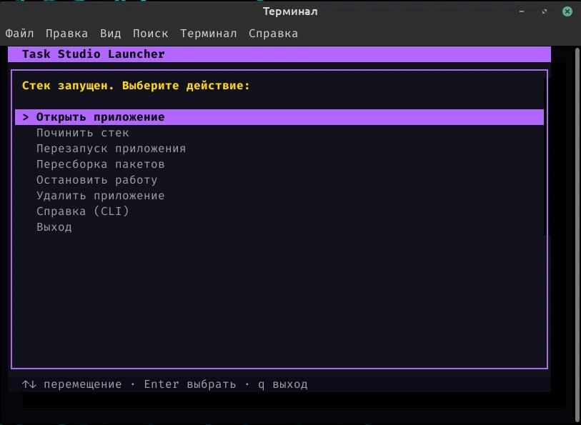

<a id="section-21"></a>

## 21. Разработка на клоне: just и Compose


### 21.1. Подготовка

```bash
cp .env.example .env
# SECRETS_MASTER_KEY: Base64 → ровно 32 байта
# JWT_SECRET: длинная случайная строка
just up   # или just start
```


### 21.2. Рецепты just

| Команда | Действие |
|---------|----------|
| `just up` | Пересборка + старт |
| `just start` | Старт без пересборки |
| `just down` | Остановка |
| `just rebuild` / `rebuild-svc` / `rebuild-svc-fresh` / `rebuild-web` | Пересборки |
| `just web-dev` / `web-local` | горячая перезагрузка UI |
| `just logs` | Логи |
| `just test` / `lint` / `fmt` / `ci` | Проверки |
| `just e2e` | Playwright |
| `just hooks` / `hooks-run` | pre-commit |
| `just validate-pack` / `validate-schemas` / `validate-integrations` | Контракты |
| `just piston-install` | Языки Piston |
| `just build-images` / `publish` | Registry |


### 21.3. Compose profiles

| Profile | Содержание |
|---------|------------|
| `full` | Ядро + данные + tutor/ollama + observability |
| `editor` | LSP pyright/typescript/gopls/sqls |
| `host-metrics` | node-exporter, cAdvisor |

Сценарий `studio` обычно включает всегда `--profile full`, + `editor` если не power_saving, + `host-metrics` на подходящем Linux (`scripts/lib/profiles/profiles.sh`).


### 21.4. depends_on (смысл)

- Серверная часть ждут healthy postgres/redis/rabbitmq.
- grading ждёт piston + tutor/media; lab-runner ждёт grading + docker.sock.
- tutor ждёт ollama; search — meilisearch; media — minio; analytics — clickhouse.
- nginx ждёт healthy web, pack-studio, studio-api.

<a id="section-22"></a>

## 22. Профили памяти и orchestrator


### 22.1. profiles.json ≠ compose profile

`deploy/profiles.json` задаёт классы памяти (`db`, `cache`, `heavy_ml`, …), `compose_env` лимиты и логические наборы `minimal` / `study` / `full`. Это SoT для матрицы/оркестрации (`scripts/launcher-matrix.json`), а не прямая замена `docker compose --profile`.


### 22.2. Режимы

| Режим | Идея |
|-------|------|
| `balancing` | Держать нужное, остальное можно снять |
| `maximum` | Максимум сервисов |
| `power_saving` | Экономия RAM: shed Ollama/LSP/lab |

При нехватке RAM orchestrator снимает тяжёлые контейнеры, стараясь сохранить ядро: auth, studio-api, sessions, grading и данные.

<a id="section-23"></a>

## 23. Секреты и переменные окружения

Полный справочник: `docs/env.md`. Шаблон: `.env.example`.


### 23.1. Обязательные

| Переменная | Требование |
|------------|------------|
| `SECRETS_MASTER_KEY` | Base64 → ровно 32 байта |
| `JWT_SECRET` | Непредсказуемая строка |
| `DATABASE_URL` | asyncpg URL |
| `REDIS_URL` | Redis |
| `RABBITMQ_URL` | RabbitMQ |


### 23.2. Cookies / JWT

- `JWT_EXPIRE_HOURS` — в `.env.example` обычно `12`; сессия продлевается на `/v1/auth/me` и refresh.
- `COOKIE_SECURE=true` только за HTTPS (сценарий `studio` выставляет это значение, если URL интерфейса начинается с https).


### 23.3. Группы из env.md

- ИИ/Tutor: `OLLAMA_*`, `TUTOR_*`, `LLM_GRADE_*`, `CURSOR_*`.
- Интеграции: `STEPIK_CLIENT_*`, URL integrations.
- Хранилище/поиск: `MINIO_*`, `MEILISEARCH_*`, `CLICKHOUSE_*`, `ANALYTICS_EVENTS_QUEUE`.
- Оркестрация/lab: `ORCHESTRATOR_MODE`, `DOCKER_GID`, `LAB_*`, `PISTON_URL`.
- CI publish: `DOCKER_REGISTRY`, `DOCKER_USERNAME`/`PASSWORD`.


### 23.4. Packs ownership

Catalog entrypoint делает chown `PACKS_ROOT` на appuser (uid 10001). Старые файлы на хосте иногда нужно поправить вручную.

<a id="section-24"></a>

## 24. Версии продукта и сценариев запуска

| Артефакт | Файл |
|----------|------|
| Web/продукт | `apps/web/app-version.json` |
| Сценарии запуска | `scripts/launcher-version.json` |
| Consumer update channel | `studio-version.json` |

Текущая версия web-продукта — `1.2.0-beta.1`, build `102002001`, канал `beta`. Каналы SemVer и формула integer build описаны в `docs/VERSIONING.md`. Скрипт: `scripts/maintenance/compute-build-number.py`.

<a id="section-25"></a>

## 25. Качество: тесты, линтеры, CI


### 25.1. Локально

```bash
just test
just lint
just e2e   # стек запущен; npx playwright install chromium
```


### 25.2. Слои тестов

- В `packages/contracts/tests` проверяют схемы и pack.
- В `services/*/tests` проверяют домен и API с имитацией внешних границ.
- В `apps/web` unit-тесты utils идут через vitest, сквозные сценарии — через Playwright.


### 25.3. CI: `.github/workflows/ci.yml`

- Задание `lint` гоняет ruff, mypy, basedpyright, shellcheck и проверки launcher/compose/modules.
- Задания `launcher-unix` и `launcher-windows` делают дымовую проверку первичной подготовки и обновления.
- Задание `test` валидирует fixtures и запускает pytest по packages и всем services.
- Задание `web` выполняет `npm ci`, lint и тесты.
- Задание `secrets-scan` ищет секреты через gitleaks.


### 25.4. publish-images.yml

На теги `v*` или ручной `workflow_dispatch` выполняется buildx bake по `deploy/docker-bake.hcl` с публикацией в GHCR. Пустой tag и значение `latest` при ручном запуске отвергаются.

<a id="section-26"></a>

## 26. Публикация образов

```bash
just build-images
just publish tag=v1.0.0
```

Bake собирает образы для amd64 и arm64. После публикации consumer можно перевести на compose только с `image:` без `build:` (имена образов bake — `task-studio-*`).

<a id="section-27"></a>

## 27. Мониторинг

| Сервис | Адрес |
|--------|-------|
| Сайт | http://localhost |
| Grafana | http://localhost:3001 |
| Prometheus | http://localhost:9090 |
| Pyroscope | в Compose (full) |

Orchestrator читает Prometheus, node-exporter и Pyroscope, чтобы решать, какие контейнеры снять или оставить. Сервисы отдают метрики на `/metrics`.

<a id="section-28"></a>

## 28. Безопасность при развёртывании у себя

- Не публикуйте `.env`, ключи и содержимое `data/`.
- Ограничьте доступ к Docker socket для orchestrator, lab-runner и Traefik.
- Контейнер Piston работает privileged — изолируйте хост.
- За обратным прокси включайте TLS и `COOKIE_SECURE=true`.
- Наружу открывайте только nginx на портах 80 и 443, а не порты внутренних сервисов.
- Системные обратные вызовы (например lab complete) должны идти с system token.
- HTML шагов проходит sanitize и DOMPurify на клиенте; не отключайте это без крайней нужды.

<a id="section-29"></a>

## 29. Типовые задачи разработчика


### 29.1. Добавить поле в ответ сессии

1. Добавьте поле в схему `packages/contracts` (`session_schemas`).
2. Обновите преобразователь в sessions (`app/api/mappers`).
3. Если BFF не агрегирует ответ, он проксирует поле как есть.
4. Обновите типы и utils в `apps/web`, затем страницу сессии.
5. Добавьте тест на sessions и при необходимости vitest для util.


### 29.2. Новый kind шага

1. Обновите pack schema и валидаторы.
2. При необходимости поправьте импортёры внешнего источника.
3. Добавьте step view в sessions и ветку проверки в grading.
4. Сделайте панель в интерфейсе и тело запроса для отправки ответа.


### 29.3. Новая интеграция

1. Создайте каталог `integration_modules/<id>/` с importer, `integration.json` и fixtures.
2. Зарегистрируйте адаптер в сервисе integrations.
3. Прогоните `just validate-integrations` и тесты конвейера.
4. Опишите адаптер в `docs/integrations/`.


### 29.4. Узкая пересборка

```bash
just rebuild-svc grading sessions
just rebuild-web
```


### 29.5. Только клиентское приложение

```bash
just start
just web-dev
```

<a id="section-30"></a>

## 30. Диагностика


### 30.1. Интерфейс не открывается

- Проверьте `docker compose … ps`: nginx, web и studio-api должны быть healthy.
- Смотрите логи nginx и studio-api.
- Откройте `http://localhost/api/…` (маршруты health/ready).


### 30.2. Отправка ответа всегда даёт ungradable

- Смотрите логи grading и Piston.
- Есть ли tests/harness внутри пакета?
- Включён ли LLM grade и доступны ли tutor/Ollama?
- Для Stepik проверьте учётные данные и сеть.


### 30.3. Импорт завис

- Проверьте очередь `import.jobs` и DLQ.
- Смотрите логи фонового обработчика integrations.
- Убедитесь, что orchestrator не поставил паузу импорта.


### 30.4. Лабораторная работа не завершается

- Смотрите логи lab-runner, доступ к docker.sock и флаг `LAB_RUNNER_DRY_RUN`.
- Доходит ли обратный вызов на grading complete?
- Опрашивает ли интерфейс attempt до терминального статуса?


### 30.5. Ollama медленный или модели нет

- Запустите `ops_pull_ollama` или вручную `docker exec … ollama pull`.
- Режим power_saving мог снять контейнер Ollama.
- При необходимости подключите GPU overlay Compose.

<a id="section-31"></a>

## 31. Типичные ошибки (чего избегать)

| Не делать | Почему |
|-----------|--------|
| Вызывать grading из клиентского приложения | Ломаются attempts, analytics и gate в sessions |
| Класть бизнес-правила в nginx | Край сети должен оставаться «тупым» |
| Делать JOIN чужих таблиц | Нарушается граница сервиса; позже больно при разделении БД |
| Класть большие файлы в RabbitMQ | В сообщениях должны быть только идентификаторы и пути |
| Делать ack до записи в БД | При рестарте возможны потеря или дубль |
| Путать compose profile `full` с `profiles.json` full | Это разные словари понятий |
| Переписывать tutor `shared/core` оптом | Ломаются все роли сразу |
| Считать, что `install.sh` уже значит «сайт готов» | Первичная подготовка ≠ установка стека |
| Коммитить `.env` и `data/` | Там секреты и пользовательские данные |
| Открывать порты auth/grading наружу | Обходится BFF и контроль доступа |

<a id="section-32"></a>

## 32. Глоссарий

| Термин | Смысл |
|--------|-------|
| Pack | Учебный пакет: манифест и материалы шагов |
| Session | Прохождение пакета конкретным пользователем |
| Attempt | Одна попытка сдачи шага |
| BFF | `studio-api`, публичный промежуточный слой API |
| Gate | Правило «нельзя идти дальше без успешной сдачи» |
| Cascaded grading | Цепочка стадий проверки до первого outcome |
| Consumer install | Установка через `install.sh` в `~/task-studio` |
| PET checkout | Рабочая копия разработчика с git |
| Lab | Шаг с практикой на Docker Compose |
| Piston | Песочница исполнения кода |

<a id="section-extra-a"></a>

## Приложение A. Подробности sessions

Доменный вход лежит в `services/sessions/app/domain/sessions.py`. Создание сессии идёт через `session_lifecycle.py` → `session_create.py`. Отправка ответа (`submit`) — в `session_submission.py`; ветка лабораторной работы — в `session_lab_route.py` и `session_lab_submit.py`. Оценка завязана на `session_grade_submit.py` и `session_grading_client.py`. Аналитика живёт в `analytics_events.py` и `messaging.py`; сброс outbox выполняется в lifespan `main`.

Представление шага для интерфейса собирают преобразователи в `app/api/mappers/step_view.py` с учётом содержимого catalog и media URL.

Уникальность активной сессии и индексы описаны в миграциях 003–005. При удалении пакета catalog инициирует abandon связанных сессий через BFF и sessions.


### A.1. Состояния сессии

Типичные статусы — `active`, `completed`, `abandoned` (точные enum смотрите в моделях и схемах). Phase progress хранит прохождение фаз study, practice и assess. Идентификаторы текущего шага и топика задают позицию оглавления в интерфейсе.


### A.2. Клиентский composable

`useSessions` обращается к `/v1/sessions` для list, start, get, step, navigate, submit и attempts. Метод `listPackProgress` питает карточки каталога. Ошибки gate и лимита попыток всплывают через `useToasts` и ключи i18n.

<a id="section-extra-b"></a>

## Приложение B. Подробности catalog и media

Размер загружаемого пакета ограничен `PACK_MAX_UPLOAD_MB`. После сборки integrations вызывает register imported pack. Activate переключает активную версию для пользователя. Delete чистит метаданные и запускает побочные действия (abandon sessions, unindex search) через оркестрацию BFF в `catalog_routes`.

Модули media mirror/encode в домене catalog при необходимости готовят медиа внутри пакета; байты пользователю отдаёт media service через MinIO. TTL presigned URL ограничен сверху (900 секунд), чтобы не раздавать вечные ссылки.


### B.1. Карточка курса в интерфейсе

Страница `catalog/[id].vue` читает detail, строит оглавление из manifest, стартует сессию, умеет удалять пакет и перекачивать сломанный external. Кэш discover держит `useDiscoverCache`.

<a id="section-extra-c"></a>

## Приложение C. Подробности фонового обработчика integrations

Жизненный цикл задания: создать запись, опубликовать сообщение, выполнить конвейер в фоновом обработчике, обновить статус и отчёт. Конвейер идёт так: credentials → `adapter.import_course` → normalize pack → `catalog.register` → сообщение в `search.index`. Sweeper подбирает зависшие задания. Orchestrator может выставлять Redis-флаги паузы импорта, когда не хватает RAM.


### C. Платформа stepik

Самый тяжёлый importer: дерево курса Stepik, лимиты шагов, partial reports, video steps, enroll.


### C. Платформа freecodecamp

GraphQL curriculum; browser/DOM asserts могут не переноситься 1:1 в Piston — report предупреждает.


### C. Платформа Exercism

Импорт идёт от track к exercises, обогащает материалы с GitHub, держит один topic на трек и использует fixture fallback для id=1.

<a id="section-extra-d"></a>

## Приложение D. Подробности lab-runner

Модуль `compose_exec.py` поднимает compose-проект лаборатории по спецификации из сообщения. `runner_execute.py` управляет сроками ожидания и сбором результата. Режим dry-run (`LAB_RUNNER_DRY_RUN`) удобен в CI и отладке без реального Docker. После завершения lab-runner шлёт HTTP-обратный вызов в grading с идентификаторами lab_run и attempt. Ошибку сети на обратном вызове нужно видеть в логах — иначе интерфейс будет опрашивать attempt бесконечно.

<a id="section-extra-e"></a>

## Приложение E. Подробности управляющего цикла orchestrator

`controller.tick` читает метрики Prometheus, node-exporter и Pyroscope, сверяет их с политикой и режимом и решает, какие управляемые сервисы оставить или снять (ollama, lsp-*, lab-runner и другие). События редактора с BFF сообщают, что пользователю нужен LSP — в режиме balancing orchestrator может поднять нужный контейнер. Управляющие вызовы защищает `ORCHESTRATOR_SYSTEM_TOKEN`.

<a id="section-extra-f"></a>

## Приложение F. Подробности analytics

Ingest принимает пакеты и сообщения событий. Фоновый обработчик пишет их в ClickHouse. Query API отдаёт агрегаты для страницы `analytics.vue`: progress, skips и timeline попыток. Sessions предпочитает outbox и очередь, чтобы не терять события при падении analytics. В ClickHouse нельзя хранить секреты и сырые JWT.

<a id="section-extra-g"></a>

## Приложение G. Подробности search

Документы индекса строятся из метаданных и содержимого пакета (модули indexing*). Запрос может быть гибридным: текст Meilisearch плюс сигнал embeddings. Unindex вызывается при удалении пакета. Индекс не заменяет catalog: при расхождении источником правды остаётся Postgres catalog.

<a id="section-extra-h"></a>

## Приложение H. Страница settings

`useSettingsPage` держит форму интеграций (Stepik client id/secret и другие поля), URL и ключ провайдера тьютора, лимиты, а также настройки autocomplete и LSP по языкам. Секреты уходят в зашифрованные настройки auth и после сохранения не должны возвращаться клиенту в открытом виде — только маски или флаги «задан». `useCredentialAutofill` помогает не ломать работу браузерного менеджера паролей.

<a id="section-extra-i"></a>

## Приложение I. Каталог в интерфейсе (library и external)

Страница `catalog/index.vue` совмещает локальную библиотеку пакетов и внешний поиск. Есть вкладки library и external, создание курса из статьи (`LibraryCourseCreate`), прогресс AI-сборки, скачивания (`useCatalogDownloads`), удаление и отмена сборок. Строки и отображение собирают `utils/catalog/courseRows.ts`, `display.ts` и `learning.ts`.

<a id="section-extra-j"></a>

## Приложение J. Путь LSP

Клиент редактора открывает WebSocket `/api/v1/lsp/{language}`; запрос идёт через nginx в lsp_gateway studio-api и дальше в TCP/stdio контейнера lsp-*. В профиле editor доступны pyright, typescript, gopls и sqls. Без профиля editor WebSocket не к чему подключить — в режиме power_saving это ожидаемо.


## Приложение K. Как устроен submit на клиенте

Файл `useSessionGradeSubmit.ts` централизует ветвление по kind, чтобы страница сессии не разрасталась копипастой.

Для quiz передаётся choice_index из SessionQuiz; для code — актуальный source из SessionCodeEditor; для task — текст textarea.

Лабораторная работа не отправляет тело решения так же: `SessionLabPanel` инициирует submit с пустым payload и дальше опрашивает `getAttempt` до терминального статуса.

Ошибки сети и 4xx/5xx превращаются в toast; 403 gate показывает ключ про необходимость сдать шаг.

Next с complete_current сообщает sessions, что можно зафиксировать прогресс текущего шага при уходе вперёд — точная семантика на сервере в session_navigation.


## Приложение L. Санитизация учебного HTML

Конвейер `studyBodyToHtml` нормализует содержимое в форматах markdown, html и plain в одну HTML-строку.

sanitizeStudyHtml чинит mojibake, вырезает script и обработчики on*, javascript: URL, нормализует pre/code, помогает с таблицами.

purifyStudyHtml — финальный DOMPurify с белым списком тегов/атрибутов; это последний рубеж XSS в SessionStudyBody.

Mermaid fences и подсветка кода живут рядом (mermaid.ts, highlightCode.ts) и не должны исполнять пользовательский JS.

Сервер тоже не должен отдавать «сырой» HTML из недоверенных импортов без осознания риска — sanitize на клиенте обязателен, но не единственная линия защиты.


## Приложение M. Course-from-article

Пользователь передаёт URL или текст; запрос идёт через BFF `/v1/studio/ai/...` в tutor, тот загружает и собирает материал, пишет сборку на диск под `COURSE_BUILDS_ROOT` и стримит прогресс в интерфейс.

TTL сборок (`COURSE_BUILD_TTL_DAYS`) чистит старые артефакты.

Перед генерацией `chapter_budget` вычисляет нижнюю границу числа глав из объёма корпуса и выбранной глубины. Слишком короткий план расширяется; близкие по заголовку и содержанию главы схлопываются. Заголовки с техническими суффиксами вроде `part 2`, обрывом слова или фрагментом разметки не проходят gate и заменяются безопасным вариантом.

Сборщик обязан получить запрошенное число вопросов: недобор quiz завершает сборку ошибкой, а не тихим предупреждением. Для курсов, ориентированных на команды и инструменты, практика остаётся исполняемой; пустой или однострочный шаблон кода отвергается. Если слабое упражнение не удалось усилить, оно превращается в открытое задание и снижает оценку аудита.

Финальный `quality_audit` сохраняет числовую оценку, уровень, пройденные проверки и коды `must_fix`. Среди проверок — качество заголовков, недобор вопросов, отсутствие визуальных материалов и неполноценный шаблон практики.

На web и pack-studio компонент `CourseBuildProgress` показывает стадии, а `localizeProgress` переводит сообщения. После успеха интерфейс показывает `Course ready`; подробные предупреждения остаются в логах и `quality_audit`.

Готовый результат регистрируется как pack в catalog и появляется в библиотеке.

Это нагрузка на Ollama и CPU: на слабых машинах включайте адекватный `ORCHESTRATOR_MODE` и меньшую модель.


## Приложение N. Docker socket и угрозы

lab-runner, orchestrator и иногда traefik видят docker.sock — фактически root на хосте с точки зрения контейнерной изоляции.

Развёртывание у себя рассчитано на доверенных пользователей машины; не выставляйте эти сервисы в открытый интернет.

LAB_RUNNER_DRY_RUN снижает риск в отладке, но не заменяет изоляцию.

Piston privileged нужен движку исполнения; держите его во внутренней сети Compose.


## Приложение O. Логирование и request id

Middleware проставляет `X-Request-Id`; по возможности передавайте его дальше во внутренних вызовах httpx.

`log_redact` вычищает секреты из логов — не обходите его отладочным `print` токенов.

`LOG_FORMAT` выбирает JSON или console; в Compose удобнее JSON для сбора логов.

При расследовании отправки ответа сначала сверьте request id между studio-api, sessions и grading.


## Приложение P. Идемпотентность импорта

Повторная доставка сообщений RabbitMQ — нормальное явление. Импорт должен ключиться так, чтобы второй проход не плодил дубликаты pack без нужды.

Отчёт partial/truncated помогает интерфейсу объяснить, почему курс обрезан лимитом шагов.

Fixture-режимы в тестах (`course_id=1` и подобные) не должны попадать в продакшен-конфиг как единственный рабочий путь.


## Приложение Q. Работа с pack schema

Любое новое поле манифеста сначала появляется в `pack-schema-v1.json` и тестах `validate_pack`.

Затем обновляют importers, ожидания редактора Pack Studio, преобразователь шага в sessions и клиентский интерфейс.

`step_dependencies` описывает зависимости шагов; не реализуйте вторую произвольную графовую схему в интерфейсе.

Рецепт `just validate-pack` должен быть зелёным до слияния изменений.


## Приложение R. Редактор кода в сессии

`SessionCodeEditor` использует политики `packages/editor-core` и настройки из user settings.

Autocomplete и LSP включаются по языку; без профиля editor LSP просто недоступен.

Beacon и editor events сообщают orchestrator об активности — не отправляйте событие на каждое нажатие клавиши без debounce на клиенте.

Сброс кода возвращает starter из шага pack, а не «последний успешный attempt», если иное не реализовано явно.


## Приложение S. Видео и media URL

`SessionVideoPlayer` получает URL через media API, а не через прямой публичный endpoint MinIO с ключами.

Срок жизни presign конечен: длинное видео на медленной сети может упереться в истечение ссылки; при жалобах смотрите `MINIO_PRESIGN_TTL_SECONDS`.

Модули catalog `media_pack_*` при импорте могут перекладывать и кодировать ассеты.


## Приложение T. Интерфейс аналитики

Страница `analytics.vue` использует `useAnalytics` для progress, skips и attempts за выбранный период.

Компоненты `AnalyticsProgressChart` и `AnalyticsPassRing` — только визуализация, не источник правды.

Пустая аналитика на свежей установке нормальна: нет событий — нет графиков.

Если сессии есть, а графики пусты, проверяйте outbox sessions и потребителя analytics.


## Приложение U. Проходка: логин

Пользователь открывает `/login`, вводит email и пароль, `useAuth.login` отправляет `POST /api/v1/auth/login` через BFF в auth, тот выставляет cookie, затем следует редирект на `/catalog`. Регистрация устроена так же с `mode=register`. Ошибки валидации и 401 показываются через toast и i18n. На `http://localhost` значение `COOKIE_SECURE` должно быть false, иначе браузер не сохранит cookie.


## Приложение V. Проходка: старт курса

Из каталога пользователь открывает карточку, вызывает `startSession`, sessions создаёт сессию, клиент переходит на `/sessions/{id}`. Оглавление строится из topics, lessons и steps манифеста. Первый шаг загружается через GET step; значение kind определяет панель. Если пакет повреждён (нет файлов), интерфейс предлагает redownload для external.


## Приложение W. Проходка: сдача quiz

В `SessionQuiz` пользователь выбирает вариант и нажимает Submit; sessions передаёт ответ в каскад quiz grading (локальный ключ, Stepik или LLM), сохраняет attempt и возвращает обратную связь в интерфейс. При `require_pass_to_advance` кнопка Next блокируется до успешной сдачи.


## Приложение X. Проходка: code и Piston

Пользователь отправляет исходник из редактора; grading проходит каскад code через harness и Piston, кладёт stdout/stderr в outcome, sessions сохраняет attempt, интерфейс показывает результат. Если Piston не прогрет или нет нужного языка, ошибка видна в логах grading — помогает `just piston-install`.


## Приложение Y. Проходка: lab

`SessionLabPanel` инициирует submit, создаётся асинхронное lab-задание, lab-runner поднимает compose, внутри лаборатории проходят проверки, приходит обратный вызов, attempt завершается, интерфейс успешно дочитывает статус. Срок ожидания задаёт `LAB_DEFAULT_TIMEOUT_SECONDS`; превышение должно давать terminal failure, а не вечный pending.


## Приложение Z. Почему BFF, а не прямые вызовы из Nuxt

Браузерный код не должен знать внутренние URL вроде auth:8001 и sessions:8003: это утечка топологии и усложнение CORS и cookie. BFF держит одну cookie-сессию, один JWT secret на краю, единый request id и точку для будущих экранных агрегаций. Доменные сервисы остаются узкими и тестируемыми. Исключение — форма OpenAI API у cursor-proxy для клиентов, которые ждут `/v1/chat/completions`; даже тогда доступ обычно остаётся во внутренней сети.


## Приложение AA. Почему отправка ответа только через sessions

Attempt — сущность sessions. Если клиент ударит в grading напрямую, легко потерять запись попытки, события analytics, лимиты assess и gate. Sessions применяет результат grading атомарно с точки зрения учебного прогресса. Завершение lab тоже возвращается в sessions, а не «теряется» в grading.


## Приложение AB. Почему один Postgres URL сейчас

Логически сервисы владеют таблицами отдельно; физически один инстанс упрощает локальный Compose и резервное копирование. Не используйте это как разрешение на SQL между доменами. При будущем разделении миграции пойдут по границам, которые код уже соблюдает.


## Приложение AC. Почему RabbitMQ, а не только HTTP

Импорт и лабораторные работы длятся дольше HTTP-тайм-аута интерфейса. Очередь даёт буфер, повторы, DLQ и независимое масштабирование фоновых обработчиков. События analytics не должны блокировать отправку ответа: outbox и очередь отделяют этот путь.


## Приложение AD. Соглашения по ошибкам API

Ориентир — JSON в духе RFC7807: type, title, status, code, detail. Интерфейс показывает пользователю безопасное сообщение; детали остаются в логах с request id. Не протаскивайте внутренний stack trace в ответ BFF.


## Приложение AE. Тестирование каскада grading

Пишите юнит-тесты стадий с имитацией Piston, Stepik и tutor. Проверяйте порядок cascade: более дешёвая и локальная стадия раньше LLM. Отдельно тестируйте ungradable, когда все стадии вернули None. В CI без Ollama ставьте `LLM_GRADE_ENABLED=false`, чтобы тесты не мигали.


## Приложение AF. Тестирование gate в sessions

Соберите фикстуру сессии с `require_pass_to_advance`. Переход вперёд без успешной сдачи должен давать 403; после pass — 200. Assess без practice должен блокироваться. Лимит попыток даёт 409. Не завязывайте тест на точные строки detail — проверяйте code и status.


## Приложение AG. Стратегия тестов клиентского приложения

Через vitest проверяйте чистые utils (catalog rows, sanitize, courseStream mapStage). Сквозные e2e держите на критичных путях: login и открытие каталога (нужен поднятый стек). Не подменяйте внутренности composable хрупкими spy без нужды — проверяйте поведение.


## Приложение AH. Работа с i18n

Ключи в `en.json` и `ru.json` нужно держать синхронно. Консоль сценария `studio` переводит сообщения отдельно (`scripts/lib/i18n`). Сообщения прогресса studio локализуются через `localizeProgress`, а не хардкодом в компоненте.


## Приложение AI. Производительность каталога в интерфейсе

На крупных списках пакетов не тащите полный manifest в list-маршрут без нужды. Кэш discover снижает повторные удары в integrations. Переходы фильтра library оформляйте через Transition с ключом фильтра (уже есть переход page-cyber).


## Приложение AJ. Резервное копирование при развёртывании у себя

Минимум нужно сохранить том Postgres, `data/packs`, `data/minio` и `.env` (секреты храните отдельно). ClickHouse и Meilisearch можно пересобрать ценой пересчёта и переиндексации. Модели Ollama качаются долго — включайте их в резервную копию, если сеть дорогая.

<a id="section-33"></a>

## 33. Лицензия и куда смотреть дальше

- Код: GNU AGPL-3.0 (`LICENSE`)
- Доп. условия: `LICENSE-SUPPLEMENT.md`


### Куда смотреть

| Вопрос | Куда |
|--------|------|
| Контракты | `packages/contracts` |
| Env | `docs/env.md` |
| Версии | `docs/VERSIONING.md` |
| Интеграции | `docs/integrations/` |
| Превью | [`PREVIEW.md`](PREVIEW.md) |
| Код сервиса | `services/<name>/app/` |
| Compose | `deploy/docker-compose.yml` |

Конец руководства разработчика. Обновляйте этот файл вместе с архитектурными изменениями кода.
