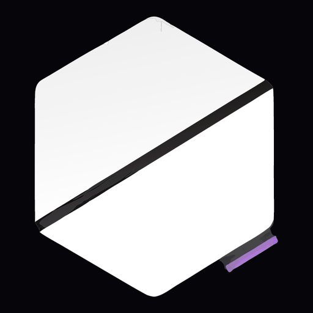

<table width="100%" cellspacing="0" cellpadding="0" style="border-collapse:collapse;background:#05050a;border-radius:0">
<tr>

<td width="220" valign="top" style="width:220px;background:rgba(8,8,14,0.92);border-right:1px solid rgba(255,255,255,0.1);padding:14px 12px 18px;border-radius:0">

  
  
    Task Studio
    v1.1.1-beta.1
  

  <a href="#o-proekte" style="display:block;position:relative;padding:11px 12px 11px 14px;background:rgba(255,255,255,0.08);color:#ffffff;text-decoration:none;font-size:13px;font-weight:600;letter-spacing:0.06em;text-transform:uppercase;border:0;border-left:3px solid #ffffff;border-radius:0">О проекте</a>

  <a href="#vozmozhnosti" style="display:block;padding:11px 12px;color:#a0a0a8;text-decoration:none;font-size:13px;font-weight:500;letter-spacing:0.06em;text-transform:uppercase;border-radius:0">Возможности</a>

  <a href="#bystriy-start" style="display:block;padding:11px 12px;color:#a0a0a8;text-decoration:none;font-size:13px;font-weight:500;letter-spacing:0.06em;text-transform:uppercase;border-radius:0">Быстрый старт</a>

  <a href="#harakteristiki" style="display:block;padding:11px 12px;color:#a0a0a8;text-decoration:none;font-size:13px;font-weight:500;letter-spacing:0.06em;text-transform:uppercase;border-radius:0">Характеристики</a>

  <a href="#okruzhenie" style="display:block;padding:11px 12px;color:#a0a0a8;text-decoration:none;font-size:13px;font-weight:500;letter-spacing:0.06em;text-transform:uppercase;border-radius:0">Окружение</a>

  
Стек

  <table width="100%" cellspacing="0" cellpadding="0" style="border-collapse:collapse;font-size:10px;line-height:1.2;color:#a0a0a8">
    <tr>
      <td style="padding:3px 6px 3px 0;width:18px;vertical-align:middle"></td>
      <td style="padding:3px 0;color:#ffffff;vertical-align:middle">Nuxt</td>
      <td style="padding:3px 0;color:#737373;text-align:right;vertical-align:middle;white-space:nowrap">3.21</td>
    </tr>
    <tr>
      <td style="padding:3px 6px 3px 0;vertical-align:middle"></td>
      <td style="padding:3px 0;color:#ffffff;vertical-align:middle">Vue</td>
      <td style="padding:3px 0;color:#737373;text-align:right;vertical-align:middle">3.5</td>
    </tr>
    <tr>
      <td style="padding:3px 6px 3px 0;vertical-align:middle"></td>
      <td style="padding:3px 0;color:#ffffff;vertical-align:middle">TypeScript</td>
      <td style="padding:3px 0;color:#737373;text-align:right;vertical-align:middle">5.9</td>
    </tr>
    <tr>
      <td style="padding:3px 6px 3px 0;vertical-align:middle"></td>
      <td style="padding:3px 0;color:#ffffff;vertical-align:middle">FastAPI</td>
      <td style="padding:3px 0;color:#737373;text-align:right;vertical-align:middle">0.139</td>
    </tr>
    <tr>
      <td style="padding:3px 6px 3px 0;vertical-align:middle"></td>
      <td style="padding:3px 0;color:#ffffff;vertical-align:middle">Python</td>
      <td style="padding:3px 0;color:#737373;text-align:right;vertical-align:middle">3.12</td>
    </tr>
    <tr>
      <td style="padding:3px 6px 3px 0;vertical-align:middle"></td>
      <td style="padding:3px 0;vertical-align:middle">Monaco</td>
      <td style="padding:3px 0;color:#737373;text-align:right;vertical-align:middle">0.52</td>
    </tr>
    <tr>
      <td style="padding:3px 6px 3px 0;vertical-align:middle"></td>
      <td style="padding:3px 0;vertical-align:middle">Tailwind</td>
      <td style="padding:3px 0;color:#737373;text-align:right;vertical-align:middle">4.3</td>
    </tr>
    <tr>
      <td style="padding:3px 6px 3px 0;vertical-align:middle"></td>
      <td style="padding:3px 0;vertical-align:middle">uv</td>
      <td style="padding:3px 0;color:#737373;text-align:right;vertical-align:middle">lock</td>
    </tr>
    <tr>
      <td style="padding:3px 6px 3px 0;vertical-align:middle"></td>
      <td style="padding:3px 0;vertical-align:middle">Compose</td>
      <td style="padding:3px 0;color:#737373;text-align:right;vertical-align:middle">v2</td>
    </tr>
    <tr>
      <td style="padding:3px 6px 3px 0;vertical-align:middle"></td>
      <td style="padding:3px 0;vertical-align:middle">nginx</td>
      <td style="padding:3px 0;color:#737373;text-align:right;vertical-align:middle">alpine</td>
    </tr>
    <tr>
      <td style="padding:3px 6px 3px 0;vertical-align:middle"></td>
      <td style="padding:3px 0;vertical-align:middle">Traefik</td>
      <td style="padding:3px 0;color:#737373;text-align:right;vertical-align:middle">3.4</td>
    </tr>
  </table>

  
Внешние · контейнеры

  <table width="100%" cellspacing="0" cellpadding="0" style="border-collapse:collapse;font-size:10px;line-height:1.2;color:#a0a0a8">
    <tr>
      <td style="padding:3px 6px 3px 0;width:18px;vertical-align:middle"></td>
      <td style="padding:3px 0;color:#ffffff;vertical-align:middle">PostgreSQL</td>
      <td style="padding:3px 0;color:#737373;text-align:right;vertical-align:middle">16</td>
    </tr>
    <tr>
      <td style="padding:3px 6px 3px 0;vertical-align:middle"></td>
      <td style="padding:3px 0;color:#ffffff;vertical-align:middle">Redis</td>
      <td style="padding:3px 0;color:#737373;text-align:right;vertical-align:middle">7</td>
    </tr>
    <tr>
      <td style="padding:3px 6px 3px 0;vertical-align:middle"></td>
      <td style="padding:3px 0;color:#ffffff;vertical-align:middle">RabbitMQ</td>
      <td style="padding:3px 0;color:#737373;text-align:right;vertical-align:middle">3</td>
    </tr>
    <tr>
      <td style="padding:3px 6px 3px 0;vertical-align:middle"></td>
      <td style="padding:3px 0;color:#ffffff;vertical-align:middle">MinIO</td>
      <td style="padding:3px 0;color:#737373;text-align:right;vertical-align:middle">2025.04</td>
    </tr>
    <tr>
      <td style="padding:3px 6px 3px 0;vertical-align:middle"></td>
      <td style="padding:3px 0;color:#ffffff;vertical-align:middle">Meilisearch</td>
      <td style="padding:3px 0;color:#737373;text-align:right;vertical-align:middle">1.12</td>
    </tr>
    <tr>
      <td style="padding:3px 6px 3px 0;vertical-align:middle"></td>
      <td style="padding:3px 0;color:#ffffff;vertical-align:middle">ClickHouse</td>
      <td style="padding:3px 0;color:#737373;text-align:right;vertical-align:middle">24.8</td>
    </tr>
    <tr>
      <td style="padding:3px 6px 3px 0;vertical-align:middle"></td>
      <td style="padding:3px 0;color:#ffffff;vertical-align:middle">Ollama</td>
      <td style="padding:3px 0;color:#737373;text-align:right;vertical-align:middle">0.11</td>
    </tr>
    <tr>
      <td style="padding:3px 6px 3px 0;vertical-align:middle"></td>
      <td style="padding:3px 0;color:#ffffff;vertical-align:middle">Piston</td>
      <td style="padding:3px 0;color:#737373;text-align:right;vertical-align:middle">ghcr</td>
    </tr>
    <tr>
      <td style="padding:3px 6px 3px 0;vertical-align:middle"></td>
      <td style="padding:3px 0;color:#ffffff;vertical-align:middle">Prometheus</td>
      <td style="padding:3px 0;color:#737373;text-align:right;vertical-align:middle">3.2</td>
    </tr>
    <tr>
      <td style="padding:3px 6px 3px 0;vertical-align:middle"></td>
      <td style="padding:3px 0;color:#ffffff;vertical-align:middle">Grafana</td>
      <td style="padding:3px 0;color:#737373;text-align:right;vertical-align:middle">11.5</td>
    </tr>
    <tr>
      <td style="padding:3px 6px 3px 0;vertical-align:middle"></td>
      <td style="padding:3px 0;vertical-align:middle">node-exporter</td>
      <td style="padding:3px 0;color:#737373;text-align:right;vertical-align:middle">1.9</td>
    </tr>
    <tr>
      <td style="padding:3px 6px 3px 0;vertical-align:middle"></td>
      <td style="padding:3px 0;vertical-align:middle">cAdvisor</td>
      <td style="padding:3px 0;color:#737373;text-align:right;vertical-align:middle">0.51</td>
    </tr>
    <tr>
      <td style="padding:3px 6px 3px 0;vertical-align:middle"></td>
      <td style="padding:3px 0;vertical-align:middle">Pyroscope</td>
      <td style="padding:3px 0;color:#737373;text-align:right;vertical-align:middle">1.12</td>
    </tr>
  </table>
  
v1.1.1-beta.1 · AGPL-3.0

</td>

<!-- ===== WORKSPACE ===== -->
<td valign="top" style="padding:0;background:#05050a;border-radius:0">

<!-- ABOUT -->

  <h1 style="margin:0;font-size:28px;font-weight:700;letter-spacing:0.06em;text-transform:uppercase;color:#ffffff;border-radius:0">О проекте</h1>
  
Учёба у себя на машине

  

    <strong style="color:#ffffff">Task Studio</strong> — это учебная платформа, которая крутится у вас локально.
    Курсы, занятия, практика и чат с репетитором. Ничего не уезжает в чужой сервис, если вы сами этого не настроите.
  

  

    Имеет смысл, когда хочется вести обучение по своим материалам и не зависеть от чужой LMS.
  

<!-- FEATURES -->

  <h2 style="margin:0;font-size:28px;font-weight:700;letter-spacing:0.06em;text-transform:uppercase;color:#ffffff;border-radius:0">Возможности</h2>
  
Коротко о том, что внутри

<table width="100%" cellspacing="0" cellpadding="0" style="border-collapse:separate;border-spacing:10px;table-layout:fixed;margin:-10px">
  <tr>
    <td width="33.33%" valign="top" style="padding:0">
      

        
01 · СВОИ КУРСЫ

        
Из статьи или из .md

        
Кидаете ссылку или файл — на выходе главы, теория и задания, которые уже можно проходить.

      

    </td>
    <td width="33.33%" valign="top" style="padding:0">
      

        
02 · ГОТОВЫЕ КУРСЫ

        
Stepik, freeCodeCamp, Exercism

        
Можно стянуть курс с этих площадок к себе и дальше заниматься уже в Task Studio.

      

    </td>
    <td width="33.33%" valign="top" style="padding:0">
      

        
03 · РЕПЕТИТОР

        
Спросить, когда застряли

        
Помогает и при сборке курса, и при проверке, и в чате. Локально через Ollama или со своим ключом к модели.

      

    </td>
  </tr>
  <tr>
    <td width="33.33%" valign="top" style="padding:0">
      

        
04 · ПРОГРЕСС

        
Где вы сейчас

        
Сколько пройдено, сколько попыток, где чаще ошибаетесь. Без отдельной таблицы в Excel.

      

    </td>
    <td width="33.33%" valign="top" style="padding:0">
      

        
05 · РЕДАКТОР

        
Нормальный редактор кода

        
В практике код с подсветкой (поддержка до 90+ языков разработки).

      

    </td>
    <td width="33.33%" valign="top" style="padding:0">
      

        
06 · ПОДСКАЗКИ

        
Автодополнение

        
Для Python, SQL, JavaScript и Go подсказывает по ходу набора.

      

    </td>
  </tr>
  <tr>
    <td width="33.33%" valign="top" style="padding:0">
      

        
07 · ПРОВЕРКА

        
Сдал — увидел ответ

        
Квизы и код проверяются сами. Не надо ждать, пока кто-то посмотрит руками.

      

    </td>
    <td width="33.33%" valign="top" style="padding:0">
      

        
08 · ВИДЕО

        
Ролики в занятии

        
Если в курсе есть видео, его можно смотреть прямо там же, не уходя на YouTube в соседней вкладке.

      

    </td>
    <td width="33.33%" valign="top" style="padding:0">
      

        
09 · УПРАВЛЕНИЕ

        
Меню в терминале

        
Простой и компактый консольный лаунчер для управления проектом.

      

    </td>
  </tr>
</table>

<!-- QUICK START -->

  <h2 style="margin:0;font-size:28px;font-weight:700;letter-spacing:0.06em;text-transform:uppercase;color:#ffffff;border-radius:0">Быстрый старт</h2>
  
Docker · ваш компьютер

  Нужен включенный
  <a href="https://www.docker.com/products/docker-desktop/" style="color:#b366ff">Docker Desktop</a>
  (на Linux — Docker Engine с Compose v2).

<table width="100%" cellspacing="0" cellpadding="0" style="border-collapse:collapse;margin-bottom:14px">
  <tr>
    <td width="50%" valign="top" style="padding:0 8px 0 0">
      

        
Linux · macOS · WSL

        <pre style="margin:0;padding:12px;background:rgba(8,8,14,0.94);border:1px solid rgba(255,255,255,0.06);color:#e5e5e5;font-size:11px;line-height:1.5;overflow:auto;border-radius:0;white-space:pre-wrap">curl -fsSL https://raw.githubusercontent.com/DDoSKudya/task-studio/develop/scripts/install.sh | bash</pre>
      

    </td>
    <td width="50%" valign="top" style="padding:0 0 0 8px">
      

        
Windows · PowerShell

        <pre style="margin:0;padding:12px;background:rgba(8,8,14,0.94);border:1px solid rgba(255,255,255,0.06);color:#e5e5e5;font-size:11px;line-height:1.5;overflow:auto;border-radius:0;white-space:pre-wrap">irm https://raw.githubusercontent.com/DDoSKudya/task-studio/develop/scripts/install-bootstrap.ps1 | iex</pre>
      

    </td>
  </tr>
</table>

  Команда кладёт проект в
  <code style="background:rgba(255,255,255,0.08);border:1px solid rgba(255,255,255,0.06);padding:1px 6px;border-radius:0;color:#ffffff">~/task-studio</code>,
  делает ярлык и открывает меню в терминале.

  Выбираете <strong style="color:#ffffff">«Первичная установка»</strong>.
  Первая сборка долгая: качаются образы, поднимается стек, сайт появляется, когда всё готово.
  Потом удобнее заходить с ярлыка на рабочем столе или так:
  <code style="background:rgba(255,255,255,0.08);border:1px solid rgba(255,255,255,0.06);padding:1px 6px;border-radius:0;color:#ffffff">bash ~/task-studio/scripts/studio.sh</code>.

<table width="100%" cellspacing="0" cellpadding="0" style="border-collapse:collapse;margin-bottom:18px">
  <tr>
    <td width="33%" style="padding:0 6px 0 0">
      

        
Сайт

        <a href="http://localhost" style="color:#b366ff;text-decoration:none;font-weight:600">http://localhost</a>
      

    </td>
    <td width="33%" style="padding:0 6px">
      

        
Папка

        <code style="color:#ffffff;background:transparent;border:0;padding:0">~/task-studio</code>
      

    </td>
    <td width="34%" style="padding:0 0 0 6px">
      

        
Дальше

        зарегистрироваться на сайте
      

    </td>
  </tr>
</table>

<!-- SPECS -->

  <h2 style="margin:0;font-size:28px;font-weight:700;letter-spacing:0.06em;text-transform:uppercase;color:#ffffff;border-radius:0">Характеристики</h2>
  
Системы · требования · ресурсы

<table width="100%" cellspacing="0" cellpadding="0" style="border-collapse:collapse;margin-bottom:16px">
  <tr>
    <td width="33%" style="padding:0 6px 0 0">
      

        
8 ГБ

        
Минимум

        
~40 ГБ диска · экономия

      

    </td>
    <td width="33%" style="padding:0 6px">
      

        
16 ГБ

        
Рекомендуется

        
~60 ГБ · полный набор

      

    </td>
    <td width="34%" style="padding:0 0 0 6px">
      

        
32 ГБ

        
Комфортно

        
~80 ГБ · крупные модели

      

    </td>
  </tr>
</table>

Системы

<table width="100%" cellspacing="0" cellpadding="0" style="border-collapse:collapse;margin-bottom:16px">
  <tr>
    <td width="33%" style="padding:0 6px 0 0">

Linux

Docker Engine + Compose

</td>
    <td width="33%" style="padding:0 6px">

macOS

Docker Desktop · Apple Silicon

</td>
    <td width="34%" style="padding:0 0 0 6px">

Windows

Docker Desktop + WSL2

</td>
  </tr>
</table>

  
Проверено на

  

    Linux x86_64 · AMD Ryzen 7 4700U (8 потоков) · 27 ГБ ОЗУ · NVMe ≥ 50 ГБ свободно под образы и <code style="color:#ffffff">data/</code>
  

<!-- ENV -->

  <h2 style="margin:0;font-size:28px;font-weight:700;letter-spacing:0.06em;text-transform:uppercase;color:#ffffff;border-radius:0">Окружение</h2>
  
Переменные · ссылки

  
Переменные окружения

  
Список ключей — в <a href=".env.example" style="color:#b366ff">.env.example</a>. Сам <code style="color:#ffffff">.env</code> появится при первичной установке.

  <table width="100%" style="border-collapse:collapse;font-size:12px;color:#a0a0a8">
    <tr><td style="padding:6px 0;border-bottom:1px solid rgba(255,255,255,0.06);width:42%"><code style="color:#ffffff">SECRETS_MASTER_KEY</code></td><td style="padding:6px 0;border-bottom:1px solid rgba(255,255,255,0.06)">шифрование интеграций</td></tr>
    <tr><td style="padding:6px 0;border-bottom:1px solid rgba(255,255,255,0.06)"><code style="color:#ffffff">JWT_SECRET</code></td><td style="padding:6px 0;border-bottom:1px solid rgba(255,255,255,0.06)">подпись сессий</td></tr>
    <tr><td style="padding:6px 0;border-bottom:1px solid rgba(255,255,255,0.06)"><code style="color:#ffffff">DATABASE_URL</code></td><td style="padding:6px 0;border-bottom:1px solid rgba(255,255,255,0.06)">PostgreSQL</td></tr>
    <tr><td style="padding:6px 0;border-bottom:1px solid rgba(255,255,255,0.06)"><code style="color:#ffffff">OLLAMA_MODEL</code></td><td style="padding:6px 0;border-bottom:1px solid rgba(255,255,255,0.06)">qwen2.5:3b</td></tr>
    <tr><td style="padding:6px 0;border-bottom:1px solid rgba(255,255,255,0.06)"><code style="color:#ffffff">ORCHESTRATOR_MODE</code></td><td style="padding:6px 0;border-bottom:1px solid rgba(255,255,255,0.06)">экономия / баланс / максимум</td></tr>
    <tr><td style="padding:6px 0"><code style="color:#ffffff">COOKIE_SECURE</code></td><td style="padding:6px 0">true только для HTTPS</td></tr>
  </table>
  

    Не коммитьте <code style="color:#ffffff">.env</code>. Полный список — в <a href="docs/DEVELOPERS.md" style="color:#b366ff">docs/DEVELOPERS.md</a>.
  

<table width="100%" cellspacing="0" cellpadding="0" style="border-collapse:collapse">
  <tr>
    <td width="33%" style="padding:0 6px 0 0">
      <a href="docs/DEVELOPERS.md" style="display:block;padding:12px;border:1px solid rgba(179,102,255,0.55);color:#ffffff;text-decoration:none;text-align:center;font-size:11px;letter-spacing:0.08em;text-transform:uppercase;font-weight:700;border-radius:0;box-shadow:0 0 14px rgba(179,102,255,0.2)">Для разработчиков</a>
    </td>
    <td width="33%" style="padding:0 6px">
      <a href="docs/integrations/authoring.md" style="display:block;padding:12px;border:1px solid rgba(179,102,255,0.55);color:#ffffff;text-decoration:none;text-align:center;font-size:11px;letter-spacing:0.08em;text-transform:uppercase;font-weight:700;border-radius:0;box-shadow:0 0 14px rgba(179,102,255,0.2)">Интеграции</a>
    </td>
    <td width="34%" style="padding:0 0 0 6px">
      <a href="LICENSE" style="display:block;padding:12px;border:1px solid rgba(179,102,255,0.55);color:#ffffff;text-decoration:none;text-align:center;font-size:11px;letter-spacing:0.08em;text-transform:uppercase;font-weight:700;border-radius:0;box-shadow:0 0 14px rgba(179,102,255,0.2)">Лицензия AGPL-3.0</a>
    </td>
  </tr>
</table>

  Task Studio · v1.1.1-beta.1 · Docker · Nuxt · FastAPI · AGPL-3.0

</td>
</tr>
</table>

