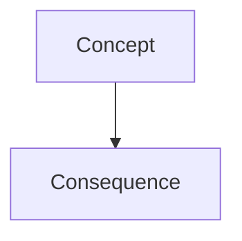

# Skill: diagram craft (Mermaid)

When a chapter explains structure, flow, or a comparison that benefits from a picture,
include **one** Mermaid fence — not decorative, not duplicate of the prose.

## When to draw

- Foundation / architecture / pipeline / state / request-flow chapters → usually yes
- Pure API trivia or a short tip → usually no
- Never invent product logos or fake metrics; only relationships stated or implied by the source

## Format

Allowed: `flowchart`, `sequenceDiagram`, `classDiagram`, `stateDiagram-v2`.
Keep ≤12 nodes. Labels in the course locale. No HTML in labels.
One diagram per chapter max unless the chapter is explicitly about comparing two models.

## Placement

Put the diagram after the mental model section, before deep traps — so the reader can
see the shape, then read the edges.
