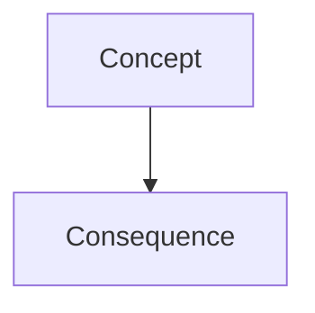

# Skill: diagram craft (Mermaid)

When a chapter explains structure, flow, or a comparison that benefits from a picture,
include **one** Mermaid fence — not decorative, not duplicate of the prose.

## When to draw

- Structure / pipeline / state / request-flow chapters **in technical or science
  sources** → usually yes when the source implies parts and relations.
- Two-sided contrast → prefer a markdown **table**, not mermaid.
- Pure definition tip, short tip, or trivia → usually no.
- **Humanities / language / most business essays** → rarely; only if the source itself
  is about a process, timeline, or structure worth drawing.
- Never invent product logos or fake metrics; only relationships stated or implied by the source.
- Do not draw a diagram and a table for the same idea.

## Format

Allowed: `flowchart`, `sequenceDiagram`, `classDiagram`, `stateDiagram-v2`.
Keep ≤12 nodes. Labels in the course locale. No HTML in labels.
One diagram per chapter max unless the chapter is explicitly about comparing two models.

## Placement

Put the diagram immediately after the paragraph that names the parts. The next sentence
is the caption (what to look at). Do not park the figure in its own "Diagram" section.
